\newpage

# PAGE DE TITRE

**RÉPUBLIQUE DU CAMEROUN**
*Paix — Travail — Patrie*

**REPUBLIC OF CAMEROON**
*Peace — Work — Fatherland*

---

**MINISTÈRE DE L'ENSEIGNEMENT SUPÉRIEUR**

**ÉCOLE SUPÉRIEURE TECHNIQUE LASALLE**
*(ESTL)*

**Département de Génie Industriel et Maintenance**

---

**Mémoire rédigé en vue de l'obtention d'un Master Professionnel**

**OPTION : MAINTENANCE INDUSTRIELLE ET PRODUCTIQUE**

---

**Thème :**

**MAINTENANCE PRÉDICTIVE DE LA CORROSION : UNE TRANSITION INDUSTRIE 3.0 → 4.0 PAR SONDE CONNECTÉE ET APPRENTISSAGE AUTOMATIQUE**

---

| | |
|---|---|
| **Rédigé par :** | BATOUMBI IKOND Ricky Parfait |
| **Matricule :** | 0111 II17 |
| **Sous encadrement académique de :** | M. FEZEU |
| **Sous la supervision de :** | Dr. TCHAWE |
| **Année académique :** | 2025 — 2026 |

\newpage

# DÉDICACE

*À mes chers parents,*

*pour leur soutien sans faille tout au long de ce parcours.*

\newpage

# REMERCIEMENTS

Au terme de notre formation pour l'obtention du Master II en Maintenance Industrielle, nous tenons à exprimer notre sincère reconnaissance à l'ensemble du corps professoral de l'École Supérieure Technique La Salle, qui par la qualité de leur enseignement et de leur encadrement, nous a permis de terminer avec succès cette formation en ingénierie. En l'occurrence :

- À notre **encadreur académique**, pour ses conseils éclairés, sa rigueur scientifique et sa disponibilité tout au long de la rédaction de ce mémoire ;
- À notre **superviseur**, pour son approche méthodologique et la qualité de ses remarques structurantes ;
- À l'ensemble du **corps enseignant du Département de Génie Industriel et Maintenance** pour la formation théorique et pratique de qualité ;
- À mes **camarades de promotion** pour les échanges intellectuels stimulants ;
- À mes **parents** pour leur soutien moral et matériel constant.

Que tous ceux qui, de près ou de loin, ont contribué à la réussite de ce mémoire et dont les noms n'ont pu être cités, trouvent ici l'expression de mes sincères remerciements.

\newpage

# AVANT-PROPOS

L'**École Supérieure Technique La Salle (ESTL)** de Douala est un établissement d'enseignement supérieur privé catholique de la Fondation La Salle, dont la vocation est de former des ingénieurs et techniciens supérieurs ancrés dans les réalités industrielles de l'Afrique centrale. Le département de **Génie Industriel et Maintenance** propose, au niveau Master II, l'option **Maintenance Industrielle et Productique**, qui forme des ingénieurs capables d'assurer la fiabilité des systèmes de production, d'implémenter des stratégies de maintenance conditionnelle et prédictive, et d'intégrer les outils numériques au service de la performance industrielle.

Dans le cadre de notre cursus, la formation en Master II s'achève par la rédaction d'un mémoire de fin d'études. Notre travail prend pour cas d'étude la **Cameroon Oil Transportation Company (COTCO)**, opérateur du pipeline Tchad-Cameroun, infrastructure pétrolière stratégique de 1 070 km qui représente l'un des défis de maintenance les plus exigeants du pays. La problématique de la corrosion — première cause de dégradation des pipelines au niveau mondial — constitue le cœur de notre étude, dans un contexte industriel où les outils de maintenance prédictive restent largement sous-exploités.

C'est de cette expérience terrain, conjuguée aux enseignements reçus à l'ESTL, qu'est né le projet présenté dans ce mémoire : la conception et le développement d'un **système intégré de prédiction du taux de corrosion par apprentissage automatique**, couvrant l'ensemble de la chaîne depuis la mesure physique par sonde à résistance électrique (ER) jusqu'à la création automatique d'ordres de travail dans un CMMS open-source. Ce travail s'inscrit dans une démarche de transition **Industrie 3.0 → 4.0** adaptée aux contraintes des entreprises industrielles africaines : budget limité, dépendance aux solutions propriétaires, et besoin de maîtrise locale de la chaîne de données.

Ce mémoire est le fruit d'un apprentissage pluridisciplinaire mêlant électronique embarquée, traitement du signal, apprentissage automatique et intégration système. Nous espérons qu'il contribuera, modestement, à montrer que les outils de l'Industrie 4.0 sont accessibles aux acteurs industriels africains, à condition de les adapter à leur contexte.

\newpage

# RÉSUMÉ

La corrosion constitue le premier poste de coût de dégradation du secteur Oil & Gas et la principale menace pesant sur les pipelines, tel celui exploité par la **COTCO** (Tchad-Cameroun), aujourd'hui surveillé par sondes à résistance électrique (ER) exploitées à un niveau Industrie 3.0 (seuils fixes, sans pronostic). Ce mémoire conçoit, développe et valide expérimentalement un **système intégré de maintenance prédictive de la corrosion** réalisant une transition **Industrie 3.0 → 4.0** sur l'ensemble de la chaîne *détection → diagnostic → pronostic → décision → action* (ISO 13381-1), au moyen de quatre briques : (OS1) une sonde ER instrumentée IoT (ESP32 + HX711 24 bits + DS18B20) ; (OS2) un modèle d'apprentissage automatique **XGBoost** prédisant le taux de corrosion (CR), interprété par analyse SHAP et validé par une procédure inter-essais *leave-one-run-out* (LORO) ; (OS3) un module de diagnostic des régimes de corrosion et d'identification des facteurs de variabilité ; (OS4) une application web Streamlit dotée d'un **module GMAO maison** transposable par API REST à un CMMS open-source. Une campagne d'essais accélérés *run-to-failure* (fil de fer en milieu HCl) a alimenté le modèle. Les résultats établissent que la chaîne d'acquisition suit fidèlement la dégradation jusqu'à la rupture (OS1) ; que XGBoost surpasse les références et atteint un R² LORO moyen positif (+0,29), **à condition que les conditions de l'essai testé soient couvertes et répétées à l'entraînement** — la performance s'effondrant sinon (R² ≈ −1,77) (OS2) ; que la **température** est la variable dominante et que la **répétabilité des conditions** gouverne la fiabilité, deux contre-exemples l'établissant expérimentalement (OS3) ; et que l'écran de supervision et le module GMAO (génération automatique d'ordres de travail, KPIs) sont opérationnels (OS4). L'apport méthodologique central est la lecture de la **structure** du R² — positif là où les conditions sont couvertes et répétées, négatif sinon —, rarement explicitée dans la littérature, et la démonstration qu'une couche I4.0 est accessible à coût marginal aux opérateurs et PME industrielles africaines. Au vu de l'état d'avancement, les objectifs sont **partiellement atteints et en voie de consolidation**, la campagne expérimentale se poursuivant.

**Mots-clés :** maintenance prédictive, corrosion, sonde à résistance électrique (ER), apprentissage automatique, XGBoost, durée de vie résiduelle (RUL), Industrie 4.0, GMAO, pipeline, COTCO.

\newpage

# ABSTRACT

Corrosion is the leading degradation-cost driver in the Oil & Gas sector and the main threat to pipelines such as the **COTCO** line (Chad-Cameroon), currently monitored by electrical-resistance (ER) probes operated at an Industry 3.0 level (fixed thresholds, no prognosis). This thesis designs, develops and experimentally validates an **integrated predictive-maintenance system for corrosion**, achieving an **Industry 3.0 → 4.0** transition across the full *detection → diagnosis → prognosis → decision → action* chain (ISO 13381-1) through four building blocks: (SO1) an IoT-instrumented ER probe (ESP32 + 24-bit HX711 + DS18B20); (SO2) an **XGBoost** machine-learning model predicting the corrosion rate (CR), interpreted with SHAP and validated through a *leave-one-run-out* (LORO) cross-run procedure; (SO3) a module diagnosing corrosion regimes and identifying variability factors; and (SO4) a Streamlit web application embedding an in-house **CMMS module**, portable via REST API to an open-source CMMS. An accelerated *run-to-failure* test campaign (iron wire in HCl) fed the model. The results show that the acquisition chain faithfully tracks degradation up to rupture (SO1); that XGBoost outperforms the baselines and reaches a positive mean LORO R² (+0.29) **provided the tested run's conditions are covered and repeated in training** — collapsing otherwise (R² ≈ −1.77) (SO2); that **temperature** is the dominant variable and that **condition repeatability** governs reliability, as two counter-examples establish experimentally (SO3); and that the supervision dashboard and CMMS module (automatic work-order generation, KPIs) are operational (SO4). The core methodological contribution is reading the **structure** of R² — positive where conditions are covered and repeated, negative otherwise —, rarely made explicit in the literature, together with the demonstration that an Industry 4.0 layer is attainable at marginal cost for African industrial operators and SMEs. Given the current progress, the objectives are **partially met and undergoing consolidation**, as the experimental campaign continues.

**Keywords:** predictive maintenance, corrosion, electrical-resistance (ER) probe, machine learning, XGBoost, remaining useful life (RUL), Industry 4.0, CMMS, pipeline, COTCO.

\newpage

# LISTE DES ABRÉVIATIONS

| Abréviation | Signification |
|---|---|
| ADC | Analog-to-Digital Converter (Convertisseur Analogique-Numérique) |
| AI | Artificial Intelligence (Intelligence Artificielle) |
| AMPP | Association for Materials Protection and Performance (ex-NACE) |
| API | American Petroleum Institute / Application Programming Interface |
| ASTM | American Society for Testing and Materials |
| CMMS | Computerized Maintenance Management System (équivalent anglais de GMAO) |
| REST | REpresentational State Transfer |
| CMRR | Common-Mode Rejection Ratio |
| COTCO | Cameroon Oil Transportation Company |
| CR | Corrosion Rate (Taux de corrosion, mm/an) |
| CV | Cross-Validation (validation croisée) |
| DS18B20 | Capteur numérique de température, bus 1-Wire |
| EIS | Electrochemical Impedance Spectroscopy |
| EN | Norme Européenne |
| ER | Electrical Resistance (Résistance Électrique) |
| ESTL | École Supérieure Technique La Salle |
| ESP32 | Microcontrôleur bi-cœur Wi-Fi + Bluetooth (Espressif) |
| FBE | Fusion-Bonded Epoxy (revêtement pipeline) |
| FSO | Floating Storage and Offloading unit |
| GMAO | Gestion de Maintenance Assistée par Ordinateur |
| GPIO | General-Purpose Input/Output |
| HCl | Acide chlorhydrique |
| HX711 | Amplificateur d'instrumentation et ADC 24 bits |
| IMPACT | International Measures of Prevention, Application and Economics of Corrosion Technology |
| IoT | Internet of Things (Internet des Objets) |
| IQR | Interquartile Range |
| KPI | Key Performance Indicator |
| ISO | International Organization for Standardization |
| LPR | Linear Polarization Resistance |
| MAE | Mean Absolute Error |
| MIC | Microbiologically Influenced Corrosion |
| ML | Machine Learning (apprentissage automatique) |
| MTBF | Mean Time Between Failures |
| MTTR | Mean Time To Repair |
| NACE | National Association of Corrosion Engineers |
| NDT | Non-Destructive Testing |
| OS | Objectif Spécifique |
| OT | Ordre de Travail (work order) |
| PHMSA | Pipeline and Hazardous Materials Safety Administration |
| PME | Petite et Moyenne Entreprise |
| PIB | Produit Intérieur Brut |
| QR | Question de Recherche |
| R² | Coefficient de détermination |
| RBI | Risk-Based Inspection |
| RMSE | Root Mean Square Error |
| RTC | Real-Time Clock |
| RTF | Run-To-Failure |
| RUL | Remaining Useful Life (Durée de Vie Résiduelle) |
| SHAP | SHapley Additive exPlanations |
| SRB | Sulfate-Reducing Bacteria |
| SSC | Sulfide Stress Cracking |
| UT | Ultrasonic Testing |
| XGBoost | eXtreme Gradient Boosting |

\newpage

# LISTE DES FIGURES

*(générée automatiquement par Word)*

\newpage

# LISTE DES TABLEAUX

*(générée automatiquement par Word)*

\newpage

# SOMMAIRE

DÉDICACE
REMERCIEMENTS
AVANT-PROPOS
RÉSUMÉ
ABSTRACT
LISTE DES ABRÉVIATIONS
LISTE DES FIGURES
LISTE DES TABLEAUX
SOMMAIRE
INTRODUCTION GÉNÉRALE
CHAPITRE I : CONTEXTE ET PROBLÉMATIQUE
CHAPITRE II : OUTILS ET MÉTHODES
CHAPITRE III : RÉSULTATS ET DISCUSSIONS
CONCLUSION GÉNÉRALE
RÉFÉRENCES BIBLIOGRAPHIQUES
ANNEXES
TABLE DES MATIÈRES

\newpage

<!-- ═══════════════════════════════════════════════════════════ -->

# INTRODUCTION GÉNÉRALE

Dans un environnement industriel concurrentiel, la maîtrise de la dégradation des équipements conditionne la compétitivité, la sécurité et la soutenabilité. Les stratégies de maintenance évoluent de l'approche corrective et préventive systématique vers la maintenance **prédictive**, qui anticipe la défaillance à partir des données de surveillance (EN 13306 ; ISO 13381-1). Parmi les modes de dégradation, la **corrosion** est prépondérante dans le secteur Oil & Gas — premier poste de coût mondial avec 2,5 billions USD par an, soit ~3,4 % du PIB (Koch et al., 2016) — et frappe particulièrement les pipelines, soumis à des milieux agressifs et difficiles à inspecter en continu.

Au Cameroun, l'opérateur **COTCO** (pipeline Tchad-Cameroun) surveille déjà la corrosion par sondes ER commerciales câblées au DCS, mais exploite ces données à un niveau **Industrie 3.0** (seuils fixes, analyse silotée), sans pronostic. Ce mémoire fait l'hypothèse qu'à partir de ces données déjà disponibles, il est possible de franchir le pas vers une couche **Industrie 4.0**. Il propose un prototype maison, **doublement transposable** (branché sur l'instrumentation existante, ou autonome pour les PME), couvrant la chaîne **détection → diagnostic → pronostic → décision → action** (ISO 13381-1) via quatre composants : une sonde ER instrumentée (OS1) ; un modèle XGBoost prédisant le taux de corrosion et la durée de vie résiduelle (OS2) ; un module de diagnostic des régimes et des facteurs de variabilité (OS3) ; et l'intégration à un CMMS open-source (OS4).

Le mémoire s'organise en trois chapitres : contexte, problématique et revue de littérature (**Chapitre I**) ; outils, choix technologiques et méthodologie (**Chapitre II**) ; résultats et discussion (**Chapitre III**).

\newpage

<!-- ═══════════════════════════════════════════════════════════ -->

# CHAPITRE I : CONTEXTE ET PROBLÉMATIQUE

**Sommaire du Chapitre I**

- I.0. Introduction
- I.1. Contexte et justification (suivant les six approches du protocole de recherche)
- I.2. Problématique
- I.3. Objectifs de l'étude
- I.4. Questions de recherche
- I.5. Importance de cette étude
- I.6. Organisation du travail
- I.7. Revue de la littérature
- I.8. Conclusion

---

## I.0. Introduction

Dans ce chapitre, nous allons d'abord cadrer le contexte et la justification de la recherche selon les six approches recommandées par le protocole de recherche (approche définitionnelle, contexte international et national, état des recherches scientifiques et leurs limites, justificatif normatif et réglementaire, concept dans la zone d'étude, énoncé du sujet). Nous formulerons ensuite la problématique, les objectifs et les questions de recherche associées, puis nous présenterons l'importance de l'étude pour les différentes parties prenantes. Le chapitre se clôt par une revue détaillée de la littérature couvrant les mécanismes de corrosion, les méthodes de surveillance, les modèles prédictifs classiques et les approches récentes par apprentissage automatique.

---

## I.1. Contexte et justification

### I.1.1. Approche définitionnelle et historique de la corrosion

La corrosion est définie par la norme **ISO 8044 :2024** comme « une interaction physico-chimique entre un métal et son environnement qui entraîne des modifications des propriétés du métal et qui peut conduire à une dégradation significative de la fonction du métal, de l'environnement ou du système technique dont ils font partie » (ISO, 2024). Ce phénomène naturel et thermodynamiquement spontané traduit la tendance des métaux à retourner à leur état d'oxyde stable — l'état sous lequel ils existent dans la croûte terrestre avant tout traitement métallurgique (Schweitzer, 2010).

L'étude scientifique de la corrosion remonte aux travaux fondateurs de **Michael Faraday (1834)**, qui établit la relation quantitative entre le courant électrique et la masse de métal dissous, posant ainsi les bases de l'électrochimie de la corrosion (Faraday, 1834). Au XXᵉ siècle, **Wagner et Traud (1938)** formalisent la théorie des électrodes mixtes et de la cinétique électrochimique, permettant de modéliser quantitativement la vitesse de corrosion à partir des courbes de polarisation. Le modèle semi-empirique de **de Waard et Milliams (1975)**, développé pour la prédiction de la corrosion CO₂ dans les pipelines pétroliers, devient la référence industrielle mondiale (de Waard et Milliams, 1975 ; de Waard, Lotz et Milliams, 1991).

La maintenance industrielle, quant à elle, a connu une évolution parallèle. La norme **EN 13306 :2017** définit la maintenance prédictive comme une « maintenance conditionnelle effectuée en suivant les prévisions extrapolées de l'analyse et de l'évaluation de paramètres significatifs de la dégradation du bien » (CEN, 2017). La norme **ISO 13381-1 :2025** précise quant à elle les principes du pronostic et de l'estimation de la durée de vie résiduelle (RUL) à partir des données de surveillance (ISO, 2025). C'est précisément à l'intersection de ces deux normes que se positionne ce travail : instrumenter pour mesurer, mesurer pour prédire, prédire pour intervenir.

### I.1.2. Contexte international et national

À l'échelle mondiale, l'étude **IMPACT (International Measures of Prevention, Application and Economics of Corrosion Technology)** publiée par la NACE en 2016 estime le coût annuel global de la corrosion à **2,5 billions USD**, soit environ **3,4 % du PIB mondial** (Koch et al., 2016 ; NACE, 2016). L'étude conclut également que la mise en œuvre de bonnes pratiques de gestion de la corrosion permettrait d'économiser entre 15 % et 35 % de ce montant, soit 375 à 875 milliards USD par an. Dans le seul secteur Oil & Gas, les pertes annuelles imputables à la corrosion sont estimées entre 1,3 et 1,8 milliard USD (Koch et al., 2016 ; Inspectioneering, 2016). Ces chiffres représentent une opportunité directe d'économies si des stratégies de surveillance et de prédiction efficaces sont déployées.

En **Afrique subsaharienne**, la problématique est amplifiée par plusieurs facteurs : (i) des conditions climatiques tropicales (humidité élevée, températures > 28 °C) qui accélèrent la corrosion atmosphérique ; (ii) la difficulté d'accès à certains équipements (forêt équatoriale, zones marécageuses, sections offshore) ; (iii) l'instabilité politique et le vandalisme dans certaines régions (Pumps Africa, 2024). Les opérateurs africains du secteur Oil & Gas doivent ainsi composer avec des budgets contraints et des chaînes d'approvisionnement plus longues que leurs homologues occidentaux pour les pièces de rechange et les équipements d'inspection (Egbule et al., 2018 ; Onyebuchi et al., 2018).

Au **Cameroun**, le secteur pétrolier représente une part significative des recettes publiques et du PIB national. La **Cameroon Oil Transportation Company (COTCO)** exploite depuis 2003 le **Système d'Exportation Tchadien (SET)**, composé d'un pipeline de 1 070 km au total dont 903 km en territoire camerounais, d'une station de tête à Komé, et d'un terminal offshore à Kribi (Kome Kribi 1 FSO) relié à la côte par un pipeline sous-marin de 11 km (COTCO, 2024 ; Chad-Cameroon Pipeline Project, 2024 ; ExxonMobil, 2011). La capacité nominale est de 225 000 barils par jour. Cette infrastructure traverse des zones de forêt équatoriale dense, franchit de nombreux cours d'eau et longe des zones habitées, rendant toute défaillance non anticipée potentiellement catastrophique sur les plans humain, environnemental et économique.

### I.1.3. État de la recherche scientifique et limites identifiées

La recherche sur la prédiction de la corrosion par apprentissage automatique a connu une accélération significative depuis 2018, avec une production scientifique en croissance exponentielle (Coelho, 2022 ; npj Materials Degradation, 2022). Les approches les plus utilisées dans la littérature récente incluent :

- **Les méthodes d'ensemble** : forêts aléatoires, **XGBoost** (Chen et Guestrin, 2016), LightGBM, AdaBoost et Gradient Boosting (Kuang et Long, 2024). Ces méthodes obtiennent typiquement des erreurs RMSE comprises entre 0,031 et 0,052 mm/an avec des coefficients de détermination R² supérieurs à 0,95 sur des jeux de données de pipelines (Wei et al., 2024).
- **Les réseaux de neurones** : MLP (Ossai, Boswell et Davies, 2017), réseaux de neurones convolutifs et LSTM pour les séries temporelles, réseaux résiduels (ResNet) avec analyse d'interprétabilité (Zheng et al., 2025), et architectures Transformer pour la prédiction de corrosion interne (Tan et al., 2025).
- **Les approches interprétables** : utilisation de **SHAP (SHapley Additive exPlanations)** pour quantifier la contribution de chaque variable d'entrée aux prédictions (Hu et al., 2024 ; Kuang et Long, 2024). Ces analyses identifient typiquement la température, la pression partielle de CO₂ et la pression totale comme les trois variables dominantes pour la corrosion interne des pipelines O&G.

Cependant, plusieurs **lacunes critiques** persistent dans la littérature :

- **Absence quasi-totale de données africaines** : les jeux de données utilisés proviennent presque exclusivement des États-Unis (PHMSA), de Chine ou d'Europe. Aucune étude publiée n'intègre de données expérimentales issues de pipelines subsahariens (Pumps Africa, 2024 ; Onyebuchi et al., 2018).
- **Coût prohibitif des sondes commerciales** : les sondes ER industrielles (Cosasco, Permasense, Emerson Roxar) ont un coût unitaire de 500 à 5 000 USD, hors installation et maintenance, ce qui est incompatible avec un déploiement étendu sur un réseau de plusieurs milliers de kilomètres (Cosasco, 2024 ; Hassanzadeh et al., 2024).
- **Circularité des évaluations sur données synthétiques** : la majorité des modèles ML sont entraînés et évalués sur des données générées par les modèles physiques eux-mêmes (de Waard et Milliams), ce qui invalide la portée scientifique des métriques rapportées. Un modèle XGBoost entraîné sur des données de Waard apprend à reproduire de Waard, sans capacité démontrée de généralisation (Coelho, 2022).
- **Absence de prédiction simultanée CR + RUL** : la majorité des travaux se limitent à la prédiction du taux de corrosion instantané, sans extrapolation vers le temps avant défaillance — information pourtant décisive pour la planification industrielle (Akash, 2024 ; Liu et al., 2022).
- **Environnements multi-composants peu modélisés** : les milieux industriels réels combinent souvent plusieurs acides ou agents agressifs dont l'interaction n'est pas modélisable analytiquement par les approches classiques (Ma et al., 2024). C'est typiquement le cas des détartrants industriels qui mélangent HCl et H₃PO₄, créant une cinétique multi-mécanismes attaque/passivation difficile à prédire (Persian Utab, 2023 ; Schweitzer, 2010).

### I.1.4. Justificatif normatif et réglementaire

La gestion de la corrosion dans les infrastructures pétrolières est encadrée par un corpus normatif international et national complet :

**Au niveau international :**

- **ISO 8044 :2024** — Corrosion des métaux et alliages — Vocabulaire (ISO, 2024) ;
- **ASTM G1-03** — Préparation, nettoyage et évaluation des éprouvettes de corrosion (ASTM, 2017) ;
- **ASTM G31-12a** — Essais d'immersion en laboratoire (ASTM, 2012) ;
- **ASTM G96-90(2018)** — Surveillance en service de la corrosion par méthodes électriques et électrochimiques (ER, LPR) (ASTM, 2018) ;
- **NACE/AMPP SP0775-2023** — Préparation, installation, analyse et interprétation des coupons de corrosion en exploitation des hydrocarbures (AMPP, 2023) ;
- **NACE MR0175 / ISO 15156** — Matériaux résistant à la corrosion sous H₂S (ISO, 2020) ;
- **API 570** — Inspection des systèmes de tuyauteries en service (API, 2024) ;
- **API 580 / 581** — Inspection basée sur le risque (RBI) (API, 2023 ; API, 2025) ;
- **ISO 13381-1 :2025** — Surveillance et diagnostic d'état des systèmes de machines — Pronostic — Partie 1 : Lignes directrices générales et exigences (ISO, 2025) ;
- **EN 13306 :2017** — Terminologie de la maintenance (CEN, 2017) ;
- **NORSOK M-506** — Calcul du taux de corrosion CO₂ (Standards Norway, 2017).

**Au niveau national camerounais :**

- **Loi n° 2019/008 du 25 avril 2019** portant Code Pétrolier (abrogeant la loi n° 99/013 du 22 décembre 1999), qui impose aux opérateurs de maintenir leurs installations dans un état de sécurité conforme aux normes internationales (République du Cameroun, 2019) ;
- **Décret n° 2023/232 du 4 mai 2023** fixant les modalités d'application de la loi n° 2019/008 portant Code Pétrolier, prévoyant des obligations de surveillance et de contrôle (République du Cameroun, 2023) ;
- **Loi-cadre sur l'environnement** (loi n° 96/12 du 5 août 1996) imposant des études d'impact et des plans de prévention des pollutions (République du Cameroun, 1996).

L'ensemble de ce corpus normatif établit le cadre dans lequel s'inscrit toute démarche de surveillance de la corrosion sur le territoire camerounais. Le présent travail contribue à ce cadre en proposant un outil aligné sur les principes de l'**ASTM G96** (mesure ER continue) et de l'**ISO 13381-1** (pronostic et RUL).

### I.1.5. Le concept dans la zone d'étude — COTCO et le pipeline Tchad-Cameroun

La **Cameroon Oil Transportation Company (COTCO)** opère le pipeline Tchad-Cameroun depuis 2003 (COTCO, 2024). Le système comprend les éléments suivants (ExxonMobil, 2011 ; Chad-Cameroon Pipeline Project, 2024) :

- Un **pipeline enterré** de 1 070 km de longueur totale (903 km en territoire camerounais), de diamètre nominal 30 pouces, en acier API 5L Grade B revêtu de FBE (Fusion-Bonded Epoxy) ;
- Une **station de pompage de tête (PS-1)** à Komé (Tchad) ;
- Un **terminal d'exportation offshore** à 18 km au large de Kribi (Cameroun), constitué de l'unité **Kome Kribi 1 FSO** (Floating Storage and Offloading) reliée à la côte par un pipeline sous-marin de 11 km ;
- Une **capacité nominale de 225 000 barils par jour**.

Ce réseau est soumis à plusieurs **mécanismes de corrosion** simultanés (Egbule et al., 2018 ; Aniobi, 2018) :

1. **Corrosion externe atmosphérique et galvanique** sur les sections aériennes ou semi-aériennes, accélérée par l'humidité tropicale ;
2. **Corrosion sous revêtement (CUI)** dans les zones où le revêtement FBE est endommagé ;
3. **Corrosion interne** par les hydrocarbures bruts contenant des traces résiduelles de CO₂, H₂S et eau de formation ;
4. **Corrosion microbienne (MIC)** liée à l'activité de bactéries sulfato-réductrices (SRB) dans les fonds de réservoirs et bas de conduites ;
5. **Corrosion par piqûres** dans les zones où des chlorures sont présents.

**Important : COTCO dispose déjà d'une surveillance ER active.** Sur les sections critiques du SET, des **sondes ER commerciales** (Cosasco, Emerson Roxar) ainsi que des sondes LPR sont câblées vers le DCS (*Distributed Control System*) de la station de Komé et vers la salle de contrôle de Kribi. Ces sondes produisent un flux continu de mesures de résistance et de variables de procédé associées (température, pression, débit). Cependant, **l'exploitation de ces données reste à un niveau Industrie 3.0**, dont les caractéristiques sont les suivantes (Lasi et al., 2014 ; Lu, 2017 ; Xu et al., 2018) :

- **Acquisition** : sondes ER + LPR câblées (4-20 mA, HART) vers automates et DCS — données centralisées en salle de contrôle ;
- **Analyse silotée** : l'ingénieur corrosion examine les courbes de chaque sonde de manière isolée, sans corrélation algorithmique avec les variables de procédé ;
- **Alertes** : seuils fixes (alarmes haute / très haute) sans gradation prédictive ; l'opérateur reçoit une notification quand un seuil est franchi mais sans estimation du temps avant défaillance ;
- **Décision** : l'ajustement du débit de la pompe à inhibiteur est **manuel**, sur jugement d'expert ;
- **Maintenance des sondes** : remplacement préventif selon calendrier ou à la défaillance.

Au-delà de la surveillance ER continue, la politique actuelle de maintenance chez COTCO comprend également (Pumps Africa, 2024 ; HSPublishing, 2023) :

- Des **inspections périodiques par ultrasons (UT)** à intervalles de 6 à 24 mois selon la criticité de la section, en complément de la surveillance ER ;
- Des **coupons gravimétriques** placés en certains points stratégiques pour validation indépendante ;
- Une **injection préventive d'inhibiteurs** dans le brut (filmants à base d'imidazoline ou d'amines), pilotée manuellement.

Cette approche I3.0 présente plusieurs **limites structurelles** que la transition I4.0 vise précisément à lever :

- **Absence de corrélation algorithmique multi-variables** : la dérive du taux de corrosion peut résulter d'une élévation thermique, d'un changement de composition du fluide ou d'une défaillance de l'injection inhibiteur — ces causes ne sont pas distinguées en temps réel ;
- **Absence d'estimation explicite du RUL** (durée de vie résiduelle) : les seuils fixes informent que le système est en alerte, mais pas dans combien d'heures la défaillance est probable ;
- **Absence de boucle décision → action *prédictive* structurée** : l'opérateur trace certes ses interventions dans une GMAO (chez COTCO, via SAP), mais les sorties prédictives (CR, RUL) n'y sont **pas reliées automatiquement** — aucun ordre de travail n'est généré directement à partir d'une dérive *prédite*, et la chaîne prédiction → intervention demeure manuelle ;
- **Sous-exploitation du flux de données** : les historiques des sondes ER constituent un actif informationnel non valorisé.

**Le verrou n'est donc plus l'instrumentation** (déjà en place et performante), **mais l'intelligence applicative** : ajouter au-dessus du flux ER existant une couche d'apprentissage automatique capable de corréler résistance / température / temps, de prédire CR + RUL, et d'orchestrer les ordres de travail via une GMAO interconnectée. C'est précisément la transition **Industrie 3.0 → Industrie 4.0** que ce mémoire propose d'opérer.

### I.1.6. Énoncé du sujet

Sur la base du contexte exposé — ampleur économique mondiale de la corrosion, lacunes scientifiques persistantes (sous-exploitation des historiques ER, absence de prédiction CR + RUL combinée, absence de chaîne décision → action structurée), maturité numérique limitée à l'Industrie 3.0 chez la plupart des opérateurs subsahariens dont COTCO, cadre normatif et réglementaire — le sujet de ce mémoire est formulé comme suit :

> **« Maintenance prédictive de la corrosion : une transition Industrie 3.0 → 4.0 par sonde connectée et apprentissage automatique. »**

Ce sujet articule **quatre axes** :
1. **Axe instrumental** — conception d'une chaîne de mesure ER + IoT autonome (ESP32 + HX711 + DS18B20), démontrant qu'une chaîne d'acquisition I4.0 (déconnectée du DCS, déployable sur points isolés) est réalisable à partir de composants accessibles localement ;
2. **Axe algorithmique** — apprentissage automatique XGBoost à double sortie CR + RUL avec interprétabilité SHAP, **applicable indifféremment aux flux de données du prototype maison ou aux flux des sondes ER commerciales déjà en place chez COTCO** ;
3. **Axe intégration** — structuration de la boucle décision → action par un **module GMAO maison** intégré à l'application Streamlit (persistance Supabase) qui génère automatiquement les ordres de travail, transposable à un CMMS open-source ;
4. **Axe applicatif et de transposabilité** — démonstration que l'ensemble de la chaîne est doublement transposable : (a) en industrie chez COTCO, où le saut I3.0 → I4.0 est essentiellement logiciel et n'exige pas le remplacement des sondes ; (b) en autonomie chez les PME industrielles africaines à budget réduit.

---

## I.2. Problématique

La maintenance des infrastructures de transport pétrolier au Cameroun, et plus particulièrement chez COTCO, fait face à un **paradoxe fondamental** : les opérateurs disposent déjà d'un flux **continu** de données de surveillance produit par les sondes ER et LPR commerciales câblées au DCS (Cosasco, Emerson Roxar), complété par des inspections UT périodiques, des rapports de laboratoire et des journaux d'injection d'inhibiteurs. Pourtant, ces données — d'une grande richesse informationnelle — ne sont ni corrélées algorithmiquement aux variables de procédé (température, pression, débit), ni exploitées par des modèles prédictifs de durée de vie résiduelle, ni reliées à la GMAO de l'opérateur (SAP chez COTCO) pour déclencher et tracer automatiquement les actions correctives issues d'une prédiction. Le verrou n'est donc plus l'instrumentation, mais bien l'**intelligence applicative** au-dessus du flux existant. Ce paradoxe correspond exactement à la **frontière Industrie 3.0 / Industrie 4.0** identifiée dans la littérature de la transformation numérique industrielle (Lasi et al., 2014 ; Lu, 2017 ; Xu et al., 2018) : les machines mesurent, mais les données ne « parlent » pas entre elles, et la chaîne décision-action reste à dominante humaine.

Sur le plan **scientifique**, les modèles physiques classiques de prédiction de la corrosion (modèle de de Waard et Milliams, modèle NORSOK M-506) ont montré des limites importantes en conditions d'exploitation réelle, avec des erreurs systématiques de 40 à 60 % attribuables à la non-prise en compte des interactions complexes entre les multiples composants des fluides de procédé (de Waard et Milliams, 1975 ; Coelho, 2022). Les approches par apprentissage automatique offrent une alternative prometteuse, capable de capturer ces non-linéarités, mais leur déploiement en contexte africain se heurte à plusieurs verrous : (i) l'**absence de données d'entraînement locales**, (ii) l'**absence de protocoles *run-to-failure* publiés** permettant la prédiction conjointe CR + RUL, et (iii) la **rareté des plateformes intégrées** prouvant la chaîne complète de la mesure jusqu'à l'ordre de travail.

Sur le plan **algorithmique**, la grande majorité des travaux ML sur la corrosion se limitent à la prédiction instantanée du taux de corrosion, sans extrapolation explicite vers la durée de vie résiduelle (RUL), pourtant définie de manière claire par la norme ISO 13381-1 (ISO, 2025 ; Akash, 2024). Cette absence de double prédiction CR + RUL prive les opérateurs d'une information essentielle à la planification optimisée des interventions.

Sur le plan **applicatif**, l'opérateur COTCO et la plupart des PME industrielles africaines partagent un même besoin : se doter d'une **boucle décision → action structurée** qui exploite les sorties prédictives pour générer automatiquement les ordres de travail, tracer les interventions et calculer les KPIs maintenance (MTBF, MTTR, disponibilité). Le marché GMAO est dominé par des solutions propriétaires (SAP PM, IBM Maximo, Mainpac) dont les coûts de licence (souvent supérieurs à 10 000 USD par site et par an) sont incompatibles avec les budgets de la plupart des opérateurs subsahariens et de l'ensemble des PME industrielles. Une **alternative open-source intégrée** est donc à construire.

Enfin, sur le plan **expérimental**, peu d'études disposent d'un protocole *run-to-failure* (RTF) complet permettant de couvrir l'intégralité du cycle de dégradation depuis l'état initial jusqu'à la rupture mécanique. Or seul un protocole RTF permet de constituer un jeu d'apprentissage statistiquement représentatif pour une prédiction RUL fiable.

La **question centrale** de ce travail est donc :

> **Dans quelle mesure un système intégré associant (i) une sonde ER instrumentée IoT à autonomie d'acquisition (ESP32 + HX711 + DS18B20), (ii) un modèle XGBoost à double sortie CR + RUL entraîné en protocole *run-to-failure* sur des données expérimentales de corrosion en milieu acide (HCl), et (iii) une chaîne d'intégration via API REST vers un CMMS open-source pour la génération automatique d'ordres de travail, permet-il d'opérer une transition Industrie 3.0 → Industrie 4.0 transposable à la fois (a) aux opérateurs industriels disposant déjà d'une instrumentation ER commerciale (cas COTCO, saut I3.0 → I4.0 essentiellement logiciel) et (b) aux PME industrielles africaines en autonomie complète à budget réduit ?**

---

## I.3. Objectifs de l'étude

### I.3.1. Objectif général

Concevoir, développer et valider expérimentalement un **système intégré de maintenance prédictive de la corrosion** matérialisant une transition **Industrie 3.0 → Industrie 4.0**, couvrant la chaîne complète **détection → diagnostic → pronostic → décision → action** définie par la norme ISO 13381-1, et combinant une sonde ER instrumentée IoT (ESP32 + HX711 + DS18B20), un modèle d'apprentissage automatique XGBoost à double sortie (CR + RUL) avec module de diagnostic des régimes de corrosion, un système d'alertes calibrées sur les régimes de corrosion et les facteurs de variabilité identifiés, et une **application web Streamlit dotée d'un module de gestion des ordres de travail (GMAO maison), dont l'architecture est transposable par API REST à un CMMS open-source existant**, pour la génération automatique des ordres de travail, le tout doublement transposable (a) aux opérateurs disposant déjà d'une instrumentation ER commerciale (cas COTCO) et (b) aux PME industrielles africaines en déploiement autonome.

### I.3.2. Objectifs spécifiques

Quatre objectifs spécifiques (OS), chronologiquement ordonnés et logiquement articulés, structurent ce travail. Ils correspondent respectivement aux étapes **détection**, **pronostic**, **diagnostic + décision** et **action** de la chaîne ISO 13381-1.

- **OS1 — Concevoir et valider métrologiquement la chaîne d'acquisition ER instrumentée IoT (étape *Détection*).** Il s'agit de réaliser un capteur de résistance électrique (ER) basé sur un montage de mesure de résistance, un amplificateur HX711 24 bits et un microcontrôleur ESP32 en acquisition continue, capable de suivre finement les variations de résistance d'un fil de fer dans un milieu acide concentré (pH ≈ 1), avec une période de mesure de 30 secondes adaptée à la cinétique rapide des essais accélérés. Cette chaîne illustre la **brique d'acquisition I4.0** (interconnexion IoT, déploiement sans contrainte de câblage DCS) et fournit le format standardisé de données exploitable indifféremment par le pipeline ML maison ou par le flux des sondes ER commerciales déjà en place chez COTCO.

- **OS2 — Entraîner et valider un modèle XGBoost à double sortie CR + RUL (étape *Pronostic*).** Il s'agit, à partir des séries temporelles collectées en protocole *run-to-failure* sur une série d'essais répétés de corrosion, de construire un modèle d'apprentissage automatique XGBoost prédisant à la fois le taux de corrosion instantané (en mm/an) et la durée de vie résiduelle (en heures), validé par une procédure de validation inter-essais *leave-one-run-out* (LORO) mesurant la généralisation à un essai nouveau, et interprété par analyse SHAP. Le modèle est conçu pour être **agnostique à la source des mesures** : il consomme des séries temporelles (résistance, température, temps) qu'elles proviennent du prototype maison ou d'un export DCS de sondes commerciales.

- **OS3 — Diagnostiquer les régimes de corrosion, identifier les facteurs de variabilité conditionnant la fiabilité de la prédiction et définir un système d'alertes graduées (étapes *Diagnostic* et *Décision*).** Il s'agit (i) de classifier le régime de corrosion observé (induction, croissance, emballement, pré-rupture) à partir des sorties du modèle ; (ii) d'identifier et de quantifier les **facteurs expérimentaux qui conditionnent la reproductibilité des essais et donc la fiabilité de la prédiction** — au premier rang desquels la **température**, identifiée comme variable dominante, ainsi que la concentration du milieu ; (iii) de démontrer, par une stratégie de validation inter-essais, que la **répétabilité des conditions** est la condition d'une prédiction fiable ; et (iv) de définir un système d'alertes à trois niveaux (vert / orange / rouge) fondé sur les seuils de taux de corrosion (CR) et de durée de vie résiduelle (RUL).

- **OS4 — Structurer la boucle décision → action par un module GMAO intégré, transposable à un CMMS open-source (étape *Action*).** Il s'agit (i) de réaliser une application web Streamlit servant de frontend ML et de dashboard temps réel des sondes, hébergée sur Streamlit Community Cloud ; (ii) d'y intégrer un **module de gestion des ordres de travail (GMAO maison)** générant et traçant automatiquement les OT à partir des alertes prédictives (création, assignation, clôture) ; (iii) de définir le mapping prédiction ML → ordre de travail (asset, sévérité, description, régime diagnostiqué), **directement transposable à un CMMS open-source existant** via API REST, GLPI étant retenu comme cible de référence après matrice comparative ; (iv) de calculer les KPIs maintenance (MTBF, MTTR, disponibilité, taux de fausses alertes) à partir de l'historique des OT. Cette approche démontre qu'un opérateur ou une PME peut structurer sa boucle décision → action **sans licence propriétaire** (SAP PM, IBM Maximo), au moyen d'un module léger ou d'un CMMS open-source.

---

## I.4. Questions de recherche

À chaque objectif spécifique correspond une question de recherche (QR) :

- **QR1 :** Dans quelle mesure une sonde ER à fil de fer, mesurée par injection de courant et instrumentée par un amplificateur HX711 24 bits et un microcontrôleur ESP32, permet-elle de mesurer des variations de résistance au dixième de milliohm, avec une stabilité et une résolution suffisantes pour quantifier le taux de corrosion en mm/an dans un milieu acide concentré ?

- **QR2 :** Dans quelle mesure un modèle XGBoost entraîné sur des séries temporelles de résistance et de température collectées en protocole *run-to-failure* permet-il de prédire simultanément le taux de corrosion (CR) et la durée de vie résiduelle (RUL) avec une erreur relative inférieure à 15 % (RMSE) — **objectif de conception fixé a priori**, non une exigence normative —, tout en restant interprétable par analyse SHAP ?

- **QR3 :** Dans quelle mesure les sorties du modèle XGBoost permettent-elles de diagnostiquer le régime de corrosion en cours (induction, croissance, emballement, pré-rupture), et dans quelle mesure l'identification des facteurs de variabilité expérimentale — en particulier la température — et la répétabilité des conditions conditionnent-elles la fiabilité de la prédiction et la calibration d'un système d'alertes graduées (vert / orange / rouge) ?

- **QR4 :** Dans quelle mesure une **application Streamlit dotée d'un module GMAO intégré (transposable par API REST à un CMMS open-source existant, type GLPI)** peut-elle exploiter les alertes et les recommandations issues du système prédictif pour générer automatiquement les ordres de travail, tracer les interventions et calculer les KPIs de maintenance (MTBF, MTTR, disponibilité), sans coût de licence propriétaire (SAP PM, IBM Maximo) ?

---

## I.5. Importance de cette étude

Ce travail revêt un intérêt à plusieurs niveaux et pour plusieurs catégories de parties prenantes :

**Pour le lecteur académique :** ce mémoire propose une démarche reproductible combinant instrumentation IoT, protocole expérimental rigoureux *run-to-failure*, apprentissage automatique interprétable (SHAP) et structuration de la boucle décision → action par un module GMAO transposable à un CMMS open-source. Il s'inscrit dans le cadre théorique de la transformation numérique industrielle (Industrie 4.0) et comble un vide bibliographique sur la maintenance prédictive de la corrosion en contexte africain.

**Pour l'auteur :** ce travail constitue l'aboutissement académique du Master 2 et la matérialisation concrète de l'intégration de compétences pluridisciplinaires (corrosion, électronique embarquée, apprentissage automatique, méthodologie scientifique). Il prépare directement à l'insertion professionnelle dans le secteur industriel, et plus particulièrement dans les métiers de la maintenance prédictive.

**Pour l'École Supérieure Technique La Salle (ESTL) :** le mémoire contribue au rayonnement scientifique de l'institution en démontrant la capacité de ses étudiants à produire des prototypes intégrés et fonctionnels mobilisant des outils numériques avancés à partir de composants accessibles localement. Il s'inscrit pleinement dans la mission de formation d'ingénieurs adaptés aux contextes africains.

**Pour la recherche :** ce travail constitue l'une des premières études publiées (à notre connaissance) intégrant explicitement la prédiction CR + RUL par XGBoost avec interprétabilité SHAP, sur des données expérimentales originales collectées en protocole *run-to-failure*, avec une validation inter-essais (LORO) mettant en évidence le rôle de la couverture des conditions. Il complète la littérature dominée par les approches mono-cible (CR seul) et les jeux de données nord-américains.

**Pour COTCO et les opérateurs pétroliers camerounais :** le mémoire fournit une **preuve de concept industriellement transposable** dont la valeur principale n'est pas le coût matériel mais la **chaîne de valeur logicielle I3.0 → I4.0**. Le pipeline ML développé est applicable directement aux flux des sondes ER commerciales déjà en place (Cosasco, Roxar) via export DCS, sans remplacement matériel. La chaîne d'acquisition autonome ESP32 développée constitue par ailleurs une option d'extension pour les sections où le câblage DCS est absent ou indisponible.

**Pour les PME industrielles africaines :** au-delà du contexte pétrolier, l'architecture **module GMAO ↔ CMMS open-source** démontrée dans ce travail est directement transposable à toutes les PME confrontées à des coûts de licence prohibitifs des GMAO industrielles (SAP PM, IBM Maximo, Mainpac), dont les tarifs annuels (souvent supérieurs à 10 000 USD par site) sont incompatibles avec les budgets de la majorité des PME subsahariennes. Un module GMAO léger — ou un CMMS open-source mature (GLPI ou équivalent) vers lequel il est directement transposable — permet une **démocratisation effective de la maintenance assistée par ordinateur** sans licence propriétaire.

**Pour la société et l'environnement :** la prévention des ruptures de pipeline par prédiction précoce de la dégradation réduit le risque de déversement d'hydrocarbures aux conséquences écologiques potentiellement irréversibles dans une zone de forêt équatoriale et de cours d'eau. C'est un apport indirect mais réel à la protection des écosystèmes et des populations riveraines.

---

## I.6. Organisation du travail

Ce mémoire est organisé en trois chapitres principaux, encadrés par une introduction générale et une conclusion générale.

Le **Chapitre I (Contexte et problématique)** établit le cadre théorique, normatif et industriel de la recherche selon les six approches du protocole de recherche, formule la problématique, les objectifs et les questions de recherche, expose l'importance de l'étude, et présente une revue détaillée de la littérature sur la corrosion, ses mécanismes, ses méthodes de surveillance, ses modèles prédictifs, le diagnostic en maintenance industrielle et les systèmes de Gestion de Maintenance Assistée par Ordinateur (GMAO).

Le **Chapitre II (Outils et méthodes)** présente le prototype développé (sonde ER + acquisition IoT ESP32 + pipeline ML + module GMAO maison), s'ouvre sur une **§II.0 dédiée à la justification des choix technologiques** (matrice de décision pour chaque brique : ESP32, HX711, DS18B20, XGBoost, stratégie de validation, Streamlit, GMAO maison), puis détaille l'ensemble des matériels mobilisés, les méthodes d'acquisition et de traitement des données, la méthodologie d'entraînement du modèle XGBoost (validation *leave-one-run-out*, hyperparamètres, interprétabilité SHAP), le module de diagnostic des régimes de corrosion, le protocole expérimental *run-to-failure* en série répétée, la **boucle décision → action par un module GMAO maison** (mapping prédiction ML → ordre de travail, KPIs maintenance ; transposable à un CMMS open-source), et le tableau synoptique de la démarche méthodologique.

Le **Chapitre III (Résultats et discussions)** présente les résultats expérimentaux issus du prototype, les performances métrologiques de la sonde ER, les résultats de la série d'essais RTF, les métriques de validation inter-essais du modèle XGBoost, l'analyse des variables d'influence, le diagnostic des régimes observés, l'effet de la température et des facteurs de variabilité sur la fiabilité de la prédiction, la fonctionnalité du prototype GMAO et ses KPIs, et la discussion comparative des résultats au regard de la littérature.

La **Conclusion générale** synthétise les résultats des quatre objectifs spécifiques, dresse le bilan des contributions, identifie les limites du travail et formule des recommandations pour COTCO, pour les PME industrielles africaines, et pour les travaux futurs.

---

## I.7. Revue de la littérature

### I.7.1. Mécanismes électrochimiques de la corrosion

Dans un milieu électrolytique, la corrosion procède par un mécanisme de **pile galvanique** dans lequel deux réactions électrochimiques couplées se produisent simultanément à la surface du métal (Schweitzer, 2010 ; Roberge, 2008).

**Réaction anodique** (oxydation) :

$$\text{Fe} \rightarrow \text{Fe}^{2+} + 2e^-$$

**Réaction cathodique** (réduction) — en milieu acide (pH < 4) :

$$2\text{H}^+ + 2e^- \rightarrow \text{H}_2 \uparrow$$

La **loi de Faraday (1834)** établit la relation quantitative entre le courant échangé et la masse dissoute :

$$m = \frac{M \cdot I \cdot t}{n \cdot F}$$

où *m* est la masse de métal dissous (g), *M* la masse molaire (55,85 g/mol pour le fer), *I* le courant (A), *t* la durée (s), *n* le nombre d'électrons échangés (2 pour Fe²⁺), et *F* la constante de Faraday (96 485 C/mol).

Le **taux de corrosion (CR)** en mm/an est calculé selon la norme **ASTM G1** par :

$$CR \ (\text{mm/an}) = \frac{87{,}6 \cdot \Delta m}{\rho \cdot A \cdot t}$$

où Δ*m* est la perte de masse (mg), ρ la densité (g/cm³), *A* l'aire exposée (cm²), et *t* la durée (heures) (ASTM, 2017).

L'équation de **Butler-Volmer** décrit la cinétique électrochimique complète à l'interface métal-électrolyte (Bard et Faulkner, 2001) :

$$i = i_{corr} \cdot \left[ e^{\frac{\alpha_a F \eta}{RT}} - e^{\frac{-\alpha_c F \eta}{RT}} \right]$$

Cette équation justifie l'influence de la température comme facteur cinétique aggravant — paramètre directement intégré comme variable d'entrée dans le modèle XGBoost (chapitre II).

### I.7.2. Formes de corrosion et classification

La classification internationale de référence est établie par l'**AMPP (ex-NACE International)** et reprise dans la norme NACE SP0775 (AMPP, 2023).

**Tableau I.1 — Classification des formes de corrosion**

| Forme | Mécanisme | Localisation typique | Norme |
|---|---|---|---|
| Généralisée (uniforme) | Dissolution uniforme | Pipelines acier au carbone | ASTM G1 |
| Par piqûres | Attaque localisée (Cl⁻) | Acier inox milieu chloruré | ASTM G46 |
| Galvanique | Couplage entre métaux | Raccords bimétalliques | ASTM G82 |
| Sous contrainte (SCC) | Contrainte + environnement | Tubes pression, soudures | NACE TM0177 |
| Érosion-corrosion | Écoulement + corrosion | Coudes, vannes, pompes | ASTM G76 |
| Sweet (CO₂) | H₂CO₃ → attaque acide | Pipelines O&G | de Waard & Milliams (1975) |
| Sour (H₂S) | Fragilisation H, SSC, HIC | Puits gaz acide | NACE MR0175 / ISO 15156 |
| MIC | Bactéries SRB, IRB | Fonds réservoirs | NACE TM0212 |

Source : AMPP (2023), ASTM (2017), ISO (2020).

### I.7.3. Méthodes de surveillance de la corrosion

Plusieurs techniques coexistent dans l'industrie (Roberge, 2008 ; Mansfeld, 2014 ; Cosasco, 2024) :

**Tableau I.2 — Comparaison des méthodes de surveillance de la corrosion**

| Méthode | Principe | Mesure | Résolution | Coût unitaire |
|---|---|---|---|---|
| Coupon gravimétrique | Perte de masse | Intégrée sur durée | ±0,1 mg/cm² | Très faible (< 100 USD) |
| Sonde ER | Augmentation de R fil corrodé | Continue | ±0,01 mΩ | Faible (DIY) à élevé (COTS) |
| LPR | Résistance polarisation | Continue | ±5 % | Moyen |
| EIS | Spectre d'impédance | Discontinue | Très haute | Élevé |
| UT | Épaisseur paroi par écho | Ponctuelle | ±0,1 mm | Moyen |
| Émission acoustique | Détection fissures | Continue | Variable | Élevé |

Source : Roberge (2008), Mansfeld (2014), Hassanzadeh et al. (2024).

La **sonde à résistance électrique (ER)**, normalisée par l'ASTM G96, exploite la relation entre la résistance d'un fil métallique et sa section transversale. Lorsque le fil se corrode, son rayon *r* diminue et sa résistance *R* augmente selon (ASTM, 2018) :

$$R = \frac{\rho_{Fe} \cdot L}{\pi r^2}$$

La variation Δ*R* = *R*(t) − *R*(t₀) est directement proportionnelle à la perte de matière. C'est ce principe que reproduisent les sondes commerciales (Cosasco CW-20, Emerson Roxar, Permasense WT) et que reprend le prototype développé dans ce travail.

### I.7.4. Modèles prédictifs classiques

Le **modèle de de Waard et Milliams (1975)**, révisé en 1991 et 1995, constitue la référence industrielle pour la prédiction de la corrosion CO₂ (de Waard et Milliams, 1975 ; de Waard, Lotz et Milliams, 1991). Il exprime le taux de corrosion en fonction de la pression partielle de CO₂ et de la température :

$$\log_{10} CR = 5{,}8 - \frac{1710}{T + 273} + 0{,}67 \log_{10} P_{CO_2}$$

Ce modèle a été progressivement étendu pour inclure le pH, le débit, la composition de l'acier et la teneur en glycol. Cependant, ses **limites sont bien documentées** (Coelho, 2022 ; Hu et al., 2024) :

- Erreurs systématiques de 40 à 60 % en conditions réelles ;
- Domaine de validité limité à *P*(CO₂) ∈ [0 ; 2 MPa] ;
- Recalibration complète nécessaire pour intégrer toute nouvelle donnée ;
- Ignorance des interactions complexes entre constituants du milieu (multiples espèces agressives, bactéries SRB, etc.).

La **norme NORSOK M-506** (Standards Norway, 2017) propose une formulation alternative également limitée par les mêmes contraintes.

### I.7.5. Modèles prédictifs par apprentissage automatique

L'apprentissage automatique offre une alternative capable de capturer les non-linéarités complexes que les modèles physiques ignorent. Les méthodes les plus utilisées dans la littérature récente sur la corrosion incluent :

**XGBoost (eXtreme Gradient Boosting)** — introduit par **Chen et Guestrin (2016)** — est aujourd'hui l'algorithme dominant pour les problèmes de régression tabulaire. Il combine plusieurs centaines d'arbres de décision faibles via une procédure de gradient boosting régularisée. Ses avantages :

- Gestion native des variables hétérogènes ;
- Robustesse aux valeurs manquantes ;
- Régularisation L1 et L2 limitant le surapprentissage ;
- Interprétabilité élevée (feature importance, SHAP).

Les performances rapportées dans la littérature récente sur la corrosion sont remarquables (Wei et al., 2024 ; Kuang et Long, 2024) :

- **Wei et al. (2024)** : XGBoost atteint *RMSE* = 0,031 mm/an et *R²* = 0,99 sur la prédiction de corrosion en pipeline d'eau de refroidissement ;
- **Kuang et Long (2024)** : XGBoost obtient *RMSE* = 0,052 sur la corrosion atmosphérique d'aciers faiblement alliés ;
- **Hu et al. (2024)** : modèle d'ensemble interprétable atteignant *RMSE* = 0,005876 et *R²* = 0,9648 sur la corrosion interne O&G.

**SHAP (SHapley Additive exPlanations)**, introduit par **Lundberg et Lee (2017)**, permet d'interpréter chaque prédiction individuelle en quantifiant la contribution de chaque variable d'entrée. Les analyses SHAP appliquées à la corrosion identifient typiquement la **température**, la **pression partielle de CO₂** et la **pression totale** comme les trois variables dominantes (Hu et al., 2024). Le présent travail mobilise SHAP pour identifier les variables dominantes dans le contexte de la corrosion du fer en milieu HCl, où la température joue un rôle de premier plan.

### I.7.6. Pronostic et durée de vie résiduelle (RUL)

La **norme ISO 13381-1 :2025** définit le pronostic comme « l'estimation du temps avant défaillance et le risque d'existence ou d'apparition d'un ou plusieurs modes de défaillance » (ISO, 2025). La **durée de vie résiduelle (RUL — Remaining Useful Life)** est définie comme « la durée pendant laquelle un système peut continuer à fonctionner avant que sa santé ne tombe sous un seuil prédéfini » (Akash, 2024 ; Liu et al., 2022).

Quatre familles d'approches existent (Liu et al., 2022) :

1. **Modèles physiques** : extrapolation par lois de propagation (fissure, corrosion, fatigue) ;
2. **Modèles statistiques** : analyse de survie (Weibull, AFT) ;
3. **Modèles par apprentissage automatique** : XGBoost, LSTM, Transformers ;
4. **Approches hybrides** : combinaison physique + ML.

Pour la corrosion spécifiquement, les approches par **apprentissage automatique** *run-to-failure* sont les mieux adaptées car elles exploitent l'intégralité du cycle de dégradation (état initial → rupture) : c'est la voie **principale** retenue dans ce travail, via le modèle **XGBoost (famille 3)**. En complément, la perspective d'un **jumeau numérique** (§III.6) mobilise les **familles 1 et 2** — une loi de cinétique de corrosion (sigmoïde d'Avrami) couplée à une simulation statistique de type Monte-Carlo —, relevant ainsi d'une **approche hybride (famille 4)** pour borner la durée de vie. Le présent travail se positionne donc explicitement dans cette taxonomie, l'apprentissage automatique en constituant le cœur et le jumeau numérique le prolongement physico-statistique.

### I.7.7. Facteurs influençant la cinétique de corrosion — rôle de la température

La vitesse de corrosion d'un métal en milieu acide dépend de nombreux facteurs : concentration et nature de l'acide, pH, **température**, hydrodynamique, état de surface et présence éventuelle d'inhibiteurs (Schweitzer, 2010 ; Roberge, 2000). Parmi ces facteurs, la température occupe une place déterminante.

La dépendance de la vitesse de corrosion à la température suit typiquement une loi de type **Arrhenius** :

$$v_{corr}(T) = A \cdot \exp\!\left(-\frac{E_a}{R\,T}\right)$$

où *A* est un facteur pré-exponentiel, *E_a* l'énergie d'activation de la réaction et *R* la constante des gaz parfaits. Cette relation traduit une **croissance exponentielle** de la vitesse de corrosion avec la température ; une règle empirique fréquemment citée indique qu'une élévation de 10 °C peut approximativement doubler la vitesse de réaction (Schweitzer, 2010).

Cette sensibilité a une conséquence directe pour la **modélisation prédictive** : dans une campagne d'essais, toute variation non maîtrisée de la température introduit une variabilité importante entre essais, susceptible de masquer ou de fausser les relations apprises par un modèle. Dans le cadre de ce travail, ce constat justifie deux leviers complémentaires : (i) intégrer la température comme **variable explicative** du modèle, et (ii) **contrôler la température** par un chauffe-eau d'aquarium étanche immergé directement dans la cellule afin d'isoler les autres facteurs et garantir la répétabilité des essais — démarche dont le Chapitre III démontre la nécessité.

### I.7.8. Diagnostic en maintenance industrielle

Le **diagnostic** est l'étape de la chaîne de maintenance prédictive (ISO 13381-1) consistant à *identifier la nature, la localisation et la cause d'une défaillance ou d'une dérive*, à partir des informations issues de la phase de détection (Akash, 2024 ; ISO, 2025). Il se distingue du **pronostic** — qui prédit le moment de la défaillance future — et précède la **décision** — qui choisit l'action corrective appropriée. La chaîne complète est ainsi :

> **Détection → Diagnostic → Pronostic → Décision → Action**

Pour la corrosion spécifiquement, plusieurs approches de diagnostic coexistent dans la littérature (Coelho, 2022 ; Tan et al., 2025) :

- **Approches par règles métier** : seuils sur les variables physiques (dérivée temporelle de R, accélération, niveaux d'agression) — simples et explicables, adaptées aux PME ;
- **Approches par classification ML** : forêts aléatoires, XGBoost classifieur, SVM — performantes mais nécessitent des données labélisées ;
- **Approches non-supervisées** : Isolation Forest, One-Class SVM — adaptées à la détection d'anomalies sans labélisation préalable.

Dans le contexte de la corrosion d'un fil de fer en milieu acide, plusieurs régimes se succèdent au cours d'un essai et peuvent être diagnostiqués à partir des signatures temporelles du signal ER : (i) induction (dR/dt quasi nul en début d'immersion), (ii) croissance (dR/dt positif et régulier), (iii) emballement (accélération marquée du dR/dt), et (iv) pré-rupture (divergence du dR/dt, RUL faible). Le présent travail mobilise une approche hybride règles métier + sortie XGBoost, simple et explicable pour un déploiement industriel léger.

### I.7.9. Systèmes de gestion de la maintenance — GMAO et CMMS

Une **GMAO (Gestion de Maintenance Assistée par Ordinateur)**, ou en anglais **CMMS (Computerized Maintenance Management System)**, est une application logicielle dédiée à la planification, au suivi et à l'optimisation des activités de maintenance d'une organisation industrielle (Lopes et al., 2016 ; Roda et Macchi, 2018). Une GMAO moderne intègre typiquement les fonctions suivantes (ISO 14224, 2016 ; Bagheri et al., 2015) :

- **Gestion des actifs** : inventaire des équipements, hiérarchie fonctionnelle, données techniques, criticité ;
- **Gestion des ordres de travail (OT)** : création, assignation, planification, exécution, clôture ;
- **Historique des interventions** : traçabilité complète (qui, quand, quoi, durée, coût) ;
- **Gestion du stock de pièces de rechange** : références, niveaux, mouvements, fournisseurs ;
- **Indicateurs de performance (KPIs)** : MTBF, MTTR, taux de disponibilité, taux de panne, coût total de maintenance ;
- **Plans de maintenance préventive** : déclencheurs temporels ou conditionnels ;
- **Intégration avec les systèmes de surveillance** : ingestion d'alertes, création automatique d'OT.

Les **GMAO industrielles propriétaires** (SAP Plant Maintenance, IBM Maximo, Oracle eAM, Infor EAM) dominent le marché des grandes entreprises mais présentent un coût de licence prohibitif (10 000 à 100 000 USD/an par site selon le périmètre), une complexité d'implémentation élevée (consultants spécialisés requis), et une dépendance à l'éditeur. Selon Roda et Macchi (2018), moins de 15 % des PME industrielles dans les pays émergents disposent d'une GMAO professionnelle, contre plus de 80 % des grandes entreprises.

Plusieurs **alternatives open-source** existent (CMMS Wikipedia, 2024) : GLPI, OpenMaint (CMDBuild), Snipe-IT, Fiix Free, MaintainX, Hippo CMMS Free, Limble. Ces solutions offrent un périmètre fonctionnel comparable aux GMAO propriétaires (gestion d'actifs, ordres de travail, ITIL) avec des API REST documentées qui permettent une intégration tierce. Néanmoins, leur adoption dans le contexte africain présente quelques limites résiduelles : (i) absence de modules de prédiction par apprentissage automatique embarqués (la couche ML reste à raccorder par intégration externe) ; (ii) interfaces parfois en anglais uniquement (GLPI fait exception avec une localisation francophone native) ; (iii) hébergement self-hosted exigeant une compétence IT minimale pour l'administration, ce qui peut être un frein pour les PME sans équipe IT dédiée — frein partiellement levé par les distributions Docker prêtes à déployer.

L'émergence récente des **architectures sans serveur (BaaS — Backend as a Service)** comme **Supabase** (alternative open-source à Firebase) couplée à des frameworks applicatifs Python comme **Streamlit** rend désormais possible le développement d'une GMAO sur mesure à un coût d'exploitation marginal nul (offres gratuites jusqu'à des volumes significatifs). C'est cette voie qu'explore l'OS4 du présent mémoire, en proposant une GMAO directement intégrée à la chaîne de surveillance prédictive développée dans les OS1, OS2 et OS3.

La norme **ISO 14224 :2016** définit les standards d'échange de données de fiabilité et de maintenance (formats d'OT, codes anomalie, taxonomie d'équipement) et constitue la référence d'interopérabilité pour toute GMAO du secteur Oil & Gas (ISO, 2016).

### I.7.10. Synthèse de la revue de littérature

La revue de littérature met en évidence quatre constats majeurs qui structurent ce travail :

1. La corrosion est un phénomène universel, quantifié par la loi de Faraday et encadré par un corpus normatif international complet (ISO, ASTM, NACE/AMPP, API) ;
2. Les méthodes de surveillance disponibles — coupons, sondes ER, LPR, UT — présentent des compromis résolution / continuité / niveau d'intégration numérique que les approches IoT (ESP32 + HX711) couplées à un pipeline ML peuvent rééquilibrer ;
3. Les modèles physiques classiques (de Waard et Milliams) sont insuffisants en milieux multi-composants ; les modèles ML à gradient boosting (XGBoost) et leur extension à l'interprétabilité (SHAP) constituent l'état de l'art récent (2022–2025) ;
4. La prédiction simultanée CR + RUL en protocole *run-to-failure* constitue un gap clairement identifié dans la littérature, que le présent travail vise à combler.

---

## I.8. Conclusion du Chapitre I

Ce premier chapitre a permis de poser les bases théoriques, normatives et contextuelles du présent travail. La revue de la littérature a établi les mécanismes électrochimiques de la corrosion, les méthodes de surveillance disponibles, les limites des modèles prédictifs classiques, l'état de l'art récent sur l'apprentissage automatique appliqué à la corrosion (XGBoost, SHAP, RUL), ainsi que le cadre conceptuel **Industrie 3.0 / Industrie 4.0** (Lasi et al., 2014 ; Lu, 2017 ; Xu et al., 2018). Le contexte international (étude IMPACT NACE — 2,5 billions USD/an), national (cadre normatif camerounais) et zonal (réseau COTCO Tchad-Cameroun) a mis en évidence que **l'instrumentation ER existe déjà** chez les opérateurs majeurs comme COTCO, mais que son exploitation reste limitée à un niveau Industrie 3.0. Le besoin opérationnel n'est donc pas la sonde ER en tant que telle, mais bien l'**intelligence applicative** — la couche prédictive et la chaîne décision-action — qui caractérise la transition Industrie 4.0. La problématique, les objectifs spécifiques et les questions de recherche ont été formulés en cohérence avec ce besoin. Le **Chapitre II** présente à présent les outils et la méthodologie retenus pour répondre à ces objectifs, en commençant par une justification des choix technologiques.

\newpage

<!-- ═══════════════════════════════════════════════════════════ -->

# CHAPITRE II : OUTILS ET MÉTHODES

**Sommaire du Chapitre II**

- II.0. Introduction
- II.0.5. Justification des choix technologiques
- II.1. Cadre de l'étude
- II.2. Présentation du prototype de mesure ER
- II.3. Matériels mobilisés
- II.4. Méthodes d'acquisition et de traitement des données
- II.5. Méthodologie d'entraînement du modèle XGBoost
- II.6. Protocole expérimental run-to-failure
- II.7. Boucle décision → action : module GMAO intégré, transposable à un CMMS open-source
- II.8. Tableau synoptique de la démarche méthodologique
- II.9. Conclusion

---

## II.0. Introduction

Dans ce chapitre, il sera question de présenter (i) la **justification des choix technologiques** mobilisés à chaque étage du prototype (matrice de décision pour chaque brique : microcontrôleur, amplificateur, capteur de température, méthode de mesure de la corrosion, algorithme ML, méthode de validation, frontend, CMMS), (ii) le cadre institutionnel et physique de l'étude, (iii) l'architecture du prototype de sonde ER développé (description et principe de fonctionnement), (iv) l'ensemble des matériels mobilisés, (v) les méthodes d'acquisition et de traitement des données, (vi) la méthodologie d'entraînement du modèle XGBoost (validation *leave-one-run-out*, hyperparamètres, interprétabilité SHAP), (vii) le protocole expérimental *run-to-failure* en série répétée, la **boucle décision → action par module GMAO maison** (transposable à un CMMS open-source), et (viii) le tableau synoptique de la démarche méthodologique.

---

## II.0.5. Justification des choix technologiques

Cette section consolide en un seul endroit les arbitrages techniques qui sous-tendent l'ensemble du prototype, sous forme de matrices de décision. Pour chaque brique, sont précisés (i) les options envisagées, (ii) les critères de comparaison retenus, (iii) le choix retenu et son motif décisif, (iv) la limite acceptée. Les justifications détaillées des paramètres de chaque composant retenu sont reprises dans les sections §II.2 à §II.7 correspondantes.

### II.0.5.1. Microcontrôleur — ESP32

**Tableau II.0.1 — Comparaison des microcontrôleurs candidats**

| Microcontrôleur | Coût | Wi-Fi/BLE | Deep sleep (µA) | I/O | Verdict |
|---|---|---|---|---|---|
| Arduino Uno | 5 000 FCFA | ❌ (modules externes) | ~15 mA (dérives) | 14 D + 6 A | Insuffisant pour IoT autonome |
| Raspberry Pi Zero W | 12 000 FCFA | ✅ | ~80 mA | 40 GPIO | Surdimensionné, OS Linux complet |
| **ESP32 (DevKit v1)** | **6 000 FCFA** | **✅ Wi-Fi + BLE intégré** | **~10 µA en deep sleep RTC** | **34 GPIO** | **Retenu** |
| ESP8266 | 4 000 FCFA | ✅ Wi-Fi seul | ~20 µA | 17 GPIO | Pas de BLE, ADC moins précis |

**Choix retenu : ESP32.** Critère décisif : compromis optimal entre Wi-Fi/BLE intégré (suppression du besoin d'un module externe), faible consommation en deep sleep (compatible avec un déploiement sur batterie pendant plusieurs jours), et large communauté pour le firmware Arduino-compatible. Limite acceptée : pas de durcissement industriel ATEX, qui n'est pas un objectif au stade du prototype académique.

### II.0.5.2. Amplificateur et convertisseur 24 bits — HX711

**Tableau II.0.2 — Comparaison des amplificateurs / convertisseurs différentiels envisagés**

| Amplificateur | Résolution | Disponibilité Cameroun | Librairies | Coût | Verdict |
|---|---|---|---|---|---|
| INA125 | 12 bits effectifs | Faible | Limitées | 8 000 FCFA | Résolution insuffisante |
| AD7793 | 24 bits, faible bruit | Très faible (import) | Moyennes | 25 000 FCFA | Excellent mais coût + dispo |
| **HX711** | **24 bits, gain 64** | **Élevée (modules ready-made)** | **Très matures (Arduino, ESP32)** | **2 500 FCFA** | **Retenu** |

**Choix retenu : HX711.** Critère décisif : 24 bits de résolution effective sur une tension différentielle à très faible amplitude (*V*_sense ~ mV), couplés à une excellente disponibilité locale (modules pré-câblés vendus en kit) et une intégration logicielle triviale. Limite acceptée : taux d'échantillonnage maximum 80 Hz (largement suffisant pour la corrosion lente, à période de 30 s).

### II.0.5.3. Capteur de température — DS18B20

**Tableau II.0.3 — Comparaison des capteurs de température**

| Capteur | Précision | Interface | Étanchéité | Verdict |
|---|---|---|---|---|
| LM35 | ±0,5 °C analogique | Analogique | Non étanche | Convertisseur ADC requis, pas étanche pour milieu acide |
| Pt100 | ±0,1 °C | Analogique 4 fils | Selon montage | Précision excellente mais conditionnement complexe |
| **DS18B20** | **±0,5 °C** | **1-Wire numérique** | **Sondes étanches disponibles** | **Retenu** |

**Choix retenu : DS18B20.** Critère décisif : interface numérique 1-Wire (1 seul GPIO, pas de bruit analogique), précision suffisante pour la compensation thermique (α_Fe = 6,5×10⁻³ °C⁻¹ × ±0,5 °C ≈ ±0,3 % de correction), et possibilité d'une protection étanche du capteur.

**Protection et couplage thermique du capteur (montage réel).** Le DS18B20 a été protégé du milieu acide par un **tube plastique étanche** (corps de stylo à bille Schneider) obturé à une extrémité. Pour supprimer la **lame d'air** résiduelle entre le capteur et la paroi du tube — l'air étant un **isolant thermique** qui ralentit et fausse la réponse —, le tube est **rempli d'huile** (huile de cuisine, substitut local et économique de l'huile silicone), qui assure un **couplage thermique par conduction** entre le milieu et l'élément sensible. Le remplissage d'un doigt de gant (*thermowell*) par un fluide caloporteur pour accélérer le temps de réponse et fiabiliser la mesure est une pratique d'instrumentation établie (Webster, 2014).

### II.0.5.4. Méthode de mesure de la corrosion — Sonde ER

**Tableau II.0.4 — Comparaison des méthodes de mesure de la corrosion**

| Méthode | Continu | Sans contact électrolyte direct | Conformité ASTM | Coût matériel | Verdict |
|---|---|---|---|---|---|
| Coupon gravimétrique | ❌ (post-mortem) | ✅ | NACE SP0775 | Faible | Validation indépendante uniquement |
| LPR (Linear Polarization Resistance) | ✅ | ❌ (3 électrodes en contact) | ASTM G59, G102 | Élevé (potentiostat) | Risque de polluer le milieu, instrumentation chère |
| **ER (Electrical Resistance)** | **✅** | **✅ (élément métallique simple)** | **ASTM G96** | **Faible** | **Retenu** |
| Impédance EIS | ✅ | ❌ (3 électrodes) | ASTM G106 | Très élevé | Non transposable terrain à coût raisonnable |

**Choix retenu : ER.** Critère décisif : mesure continue sans contact des électrodes avec l'électrolyte, conformité ASTM G96, simplicité de fabrication d'une sonde maison (fil de fer + mesure par injection de courant), et compatibilité avec la transposition aux sondes ER commerciales déjà en place chez COTCO. Limite acceptée : mesure de corrosion généralisée uniquement (la corrosion par piqûres locale n'est pas correctement détectée par ER seule — combinaison avec UT recommandée pour le pipeline réel).

### II.0.5.5. Algorithme de prédiction — XGBoost

**Tableau II.0.5 — Comparaison des algorithmes ML candidats**

| Algorithme | Volume de données requis | Performance time-series | Interprétabilité | Verdict |
|---|---|---|---|---|
| Régression linéaire | Faible | Médiocre (non-linéarités absentes) | Triviale | Insuffisant pour cinétique multi-mécanismes |
| Random Forest | Moyen | Bonne | Moyenne (importance variables) | Bon baseline mais sous-XGBoost en time-series |
| **XGBoost** | **Faible à moyen** | **Excellente (gradient boosting régularisé)** | **Excellente avec SHAP** | **Retenu** |
| LSTM | Élevé (>1000 séquences) | Excellente | Faible (boîte noire) | Volume de données insuffisant ici |
| Transformer temporel | Très élevé | Excellente | Faible | Surdimensionné pour 4 runs RTF |

**Choix retenu : XGBoost.** Critère décisif : performance reconnue en time-series sur faibles volumes (Chen et Guestrin, 2016 ; Wei et al., 2024), interprétabilité native par SHAP (Lundberg et Lee, 2017), régularisation L1/L2 limitant le sur-apprentissage. **Pourquoi écarter les réseaux de neurones** (MLP, LSTM, Transformer — §I.1.3) : chaque run fournit certes **~1 000 à 2 500 lectures** (cadence de 30 s), mais l'apprentissage de la dégradation se raisonne *par essai*, et la campagne ne compte qu'**une poignée de runs** — soit beaucoup de **points** mais **très peu de séquences indépendantes**. Or les réseaux profonds exigent un grand nombre de séquences/exemples pour généraliser et **sur-apprennent** sur ce volume (boîte noire, surdimensionnés ici). XGBoost, qui opère sur des **données tabulaires point par point** (quelques milliers de lignes suffisent) avec une régularisation efficace, est donc le mieux adapté à ce régime « beaucoup de points, peu de runs ». Limite acceptée : architecture point-par-point (pas de mémoire séquentielle native comme LSTM) — compensée par un feature engineering temporel explicite (EMA, pente locale, lag).

### II.0.5.6. Stratégie de validation — leave-one-run-out

**Tableau II.0.6 — Comparaison des stratégies de validation**

| Méthode | Question évaluée | Limite |
|---|---|---|
| Hold-out simple (80/20) | prédiction intra-jeu | une seule estimation |
| k-fold standard | prédiction intra-jeu | fuite temporelle en time-series |
| TimeSeriesSplit | prédiction intra-run (causalité) | ne teste pas la généralisation à un essai nouveau |
| **Leave-one-run-out (LORO)** | **généralisation à un essai jamais vu** | **plus exigeante (retenue)** |

**Choix retenu : leave-one-run-out (LORO).** Critère décisif : l'objectif industriel étant de prédire un *essai nouveau*, seule la validation LORO (un run complet retiré et testé à chaque itération) mesure cette capacité. TimeSeriesSplit reste utilisé pour vérifier la causalité au sein d'un run. Détail en §II.5.1.

### II.0.5.7. Frontend ML / dashboard — Streamlit

**Tableau II.0.7 — Comparaison des frameworks frontend ML**

| Framework | Langage | Rapidité prototypage | Composants ML natifs | Verdict |
|---|---|---|---|---|
| **Streamlit** | **Python** | **Excellente** | **✅ (charts, sliders, file uploaders)** | **Retenu** |
| Dash (Plotly) | Python | Bonne | Plotly natif | Plus verbose que Streamlit |
| Next.js / React | TypeScript | Faible (courbe d'apprentissage) | Non | Surdimensionné, langage différent du pipeline ML |
| Gradio | Python | Excellente | Démos ML simples | Plus orienté demo modèle, moins dashboard |

**Choix retenu : Streamlit.** Critère décisif : permet de coder le dashboard et le pipeline ML dans le même langage (Python), avec un déploiement gratuit sur Streamlit Community Cloud. Limite acceptée : moins flexible qu'une stack full-web pour la personnalisation visuelle avancée.

### II.0.5.8. GMAO — module maison (Streamlit / Supabase)

La matrice comparative des CMMS open-source (§II.7.2 : GLPI / OpenMaint / Snipe-IT / Fiix / MaintainX) révèle un verrou décisif : **aucun ne propose d'accès API exploitable dans sa version gratuite ou d'essai**, ce qui interdit une intégration automatisée à coût nul. **Choix retenu : un module GMAO maison léger** — table `cr_work_orders` (Supabase) + interface « Ordres de travail » intégrée à l'application Streamlit — couvrant le périmètre nécessaire (création, assignation, clôture d'ordres de travail, KPIs) sans dépendance à une API tierce, et transposable à un CMMS open-source si l'opérateur en déploie un.

### II.0.5.9. Synthèse des choix technologiques

L'ensemble des choix forme une **chaîne cohérente** orientée par trois principes : (i) **simplicité d'intégration locale** (composants disponibles au Cameroun, langages Python pour la majeure partie de la chaîne ML+frontend), (ii) **rigueur méthodologique** (validation *leave-one-run-out*, SHAP, conformité ASTM/ISO), (iii) **transposabilité industrielle** (ER conformes ASTM G96 ; module GMAO maison transposable à un CMMS open-source on-premise compatible OT/réseau industriel).

---

## II.1. Cadre de l'étude

### II.1.1. Cadre institutionnel

Le présent travail est réalisé dans le cadre du **Master 2 Professionnel en Maintenance Industrielle** du Département de Génie Industriel et Maintenance de l'**École Supérieure Technique La Salle (ESTL)**. La validation expérimentale est conduite en laboratoire à Douala. La projection industrielle vise le contexte applicatif de la **Cameroon Oil Transportation Company (COTCO)**, exploitant le pipeline Tchad-Cameroun depuis 2003 (COTCO, 2024).

### II.1.2. Cadre physique du prototype

Le prototype reproduit en laboratoire des conditions de **corrosion généralisée accélérée en milieu acide**. Il est constitué d'une cellule de corrosion ouverte (récipient en plastique) contenant le milieu corrosif, dans laquelle est immergé le fil de fer ER. La sonde est connectée à un montage de mesure de résistance instrumenté par un amplificateur HX711 24 bits, lui-même piloté par un microcontrôleur ESP32 en acquisition continue (cycle de mesure de 30 secondes). La température du milieu est mesurée par un capteur DS18B20 numérique 1-Wire.

Plusieurs milieux corrosifs sont employés dans les essais de corrosion accélérée du fer (acides minéraux — HCl, H₂SO₄ —, solutions salines NaCl, détartrants industriels multi-acides). Dans le cadre de ce travail, le **milieu de référence retenu est une solution d'acide chlorhydrique concentré (HCl)**. Ce choix se justifie par quatre critères : (i) la **simplicité et la reproductibilité** d'un milieu mono-acide, indispensable pour isoler proprement l'effet d'un facteur unique (la température) ; (ii) la **représentativité** du mécanisme d'attaque acide pure (H⁺ + Fe → Fe²⁺ + H₂), dominant dans de nombreux effluents industriels ; (iii) la **disponibilité locale** au Cameroun ; (iv) la **cinétique rapide** : en HCl concentré, la corrosion conduit à la rupture (cycle *run-to-failure* complet) en quelques heures à quelques dizaines d'heures — condition **déterminante au regard du temps imparti avant la soutenance**, puisqu'elle permet d'enchaîner **plusieurs essais complets** et de constituer la série répétée nécessaire à l'apprentissage. Cette cinétique est en outre fortement **accélérée par la température** suivant une loi d'Arrhenius (énergie d'activation de l'ordre de 40 à 90 kJ/mol pour l'acier en HCl), ce qui justifie l'étude de ce facteur (Khadom et al., 2009 ; §I.7.7).

Ce milieu génère un **pH ≈ 1**. La température ambiante du laboratoire varie entre 25 et 32 °C selon les conditions météorologiques — variabilité qui s'est révélée déterminante (voir Chapitre III) et a motivé l'introduction d'une phase à température contrôlée par un **chauffe-eau d'aquarium étanche immergé directement dans la cellule**.

---

## II.2. Présentation du prototype de mesure ER

### II.2.1. Principe de la sonde à résistance électrique

La sonde ER exploite la relation entre la résistance électrique d'un fil métallique et sa section transversale. Lorsque le fil se corrode, son rayon *r* diminue et sa résistance *R* augmente selon (ASTM, 2018 ; Roberge, 2008) :

$$R = \frac{\rho_{Fe} \cdot L}{\pi r^2}$$

avec ρ_Fe = 1,0 × 10⁻⁷ Ω·m (résistivité électrique du fer), *L* ≈ 2 m (longueur du fil), et *r* le rayon (m). La variation Δ*R* = *R*(t) − *R*(t₀) est directement proportionnelle à la perte de matière. En inversant la relation, le rayon à l'instant *t* est :

$$r(t) = \sqrt{\frac{\rho_{Fe} \cdot L}{\pi \cdot R(t)}}$$

et le taux de corrosion s'obtient par dérivation numérique :

$$CR(t) \ (\text{mm/an}) = \left|\frac{dr}{dt}\right| \times 8760 \times 1000$$

(facteur 8760 = nombre d'heures par an, facteur 1000 = conversion m → mm).

### II.2.2. Architecture de mesure : montage 2 fils à injection de courant

La mesure d'une résistance faible et de ses variations fines peut être réalisée de plusieurs manières : **pont de Wheatstone** (déséquilibre de deux diviseurs), **méthode 4 fils de Kelvin** (séparation des circuits d'injection et de mesure), ou **montage 2 fils à injection de courant** (lecture de la tension aux bornes de l'élément parcouru par un courant connu). Le **pont de Wheatstone a été le choix initial**, puis **abandonné après essais** : couplé au HX711, le très faible déséquilibre du pont (le fil ne varie que de fractions d'ohm) se présentait à un **potentiel de mode commun** voisin de la mi-alimentation, hors de la plage où l'amplificateur établit correctement son gain, de sorte que le **signal utile était noyé dans le bruit et l'offset**. La méthode Kelvin 4 fils, plus lourde à câbler, partageait cette sensibilité au mode commun dans notre configuration. Nous retenons donc le **montage 2 fils à injection de courant** — le plus simple et le plus stable avec les composants disponibles localement, et compatible avec la plage d'entrée différentielle du HX711 (AVIA Semiconductor, 2017 ; Webster, 2014).

Le fil de fer (sonde ER) est monté **en série** entre deux résistances de polarisation identiques — la résistance shunt *R*_shunt et la résistance de relèvement *R*_lift, 970 Ω chacune — sous l'alimentation 3,3 V de l'ESP32 (figure II.2). La résistance du fil étant très faible devant ces deux résistances, le courant qui le traverse est **imposé et quasi constant** :

$$I = \frac{V_{CC}}{R_{shunt} + R_{lift}} \approx \frac{3{,}45}{1\,940} \approx 1{,}78 \text{ mA}$$

La tension aux bornes du fil, *V*_sense = *I* · *R*_fil, est lue en différentiel par le HX711 (entrées A+ / A−). La résistance *R*_lift, placée côté masse, **remonte le potentiel de mode commun** des entrées dans la plage de fonctionnement de l'amplificateur (sans elle, les entrées seraient trop proches de la masse et le gain interne ne pourrait s'établir). Lorsque la corrosion réduit la section du fil, *R*_fil augmente, donc *V*_sense augmente proportionnellement : c'est le signal exploité pour reconstituer *R*_fil(t).

**Justification de la valeur 970 Ω.** Les deux résistances fixent le courant d'injection à *I* = *V*_CC/(*R*_shunt + *R*_lift) ≈ 1,8 mA. Cette valeur résulte d'un **compromis physique** : un courant **suffisamment faible** pour éviter l'échauffement par effet Joule et la **polarisation électrochimique** du fil (qui fausseraient la mesure de résistance), mais **suffisamment élevé** pour que la tension lue *V*_sense = *I*·*R*_fil (quelques millivolts) reste mesurable dans la plage différentielle du HX711 (± 40 mV au gain 64) (AVIA Semiconductor, 2017). La valeur de 970 Ω correspond aux résistances réellement employées (≈ 1 kΩ, tolérance 1 %) : c'est un **choix pratique dicté par ce compromis**, non une valeur normative — toute paire de résistances appariées de l'ordre du kΩ conviendrait. Le pull-up de 4,7 kΩ du bus 1-Wire (DS18B20) suit, lui, la valeur recommandée par le fabricant du capteur.

**Tableau II.1 — Composants du montage de mesure de résistance**

| Composant | Valeur | Rôle |
|---|---|---|
| Résistance shunt *R*_shunt | 970 Ω | impose le courant (côté 3,3 V) |
| Fil de fer *R*_fil(t) | élément sensible | sonde ER corrodée, résistance croissante |
| Résistance de relèvement *R*_lift | 970 Ω | impose le courant + remonte le mode commun (côté masse) |

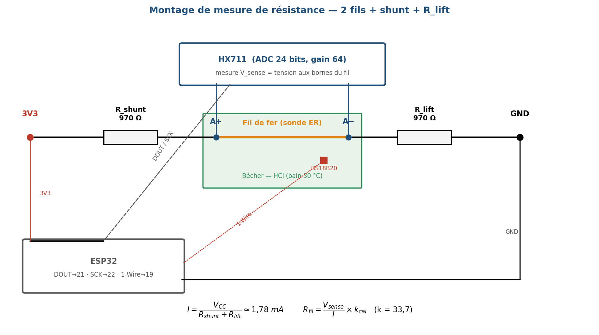{ width=88% }

### II.2.3. Conversion analogique-numérique par HX711

Le **HX711** est un convertisseur sigma-delta 24 bits doté d'un amplificateur différentiel à gain programmable (Adafruit, 2024 ; AVIA Semiconductor, 2017). Initialement destiné aux ponts de jauges, il est utilisé ici comme **voltmètre différentiel de haute résolution** mesurant la tension *V*_sense aux bornes du fil. Le **gain 64** est retenu (pleine échelle ±40 mV, adaptée à un *V*_sense de quelques millivolts) ; sur 24 bits, la résolution d'un LSB est de l'ordre de :

$$\text{Résolution}_{LSB} \approx \frac{80 \text{ mV}}{2^{24}} \approx 5 \text{ nV}$$

soit, au courant d'injection de 1,78 mA, une résolution en résistance de l'ordre du **centième de milliohm** — suffisante pour suivre la corrosion. Le firmware ESP32 reconstitue la résistance du fil par :

$$R_{fil} = \frac{V_{sense}}{I} \times k_{cal}$$

où *k*_cal est un **facteur de calibration empirique** déterminé par substitution du fil par des résistances étalons connues : la chaîne d'amplification sous-estimant le signal d'un facteur constant, ce coefficient le corrige (étalonnage détaillé en §III.1.1). Le HX711 échantillonne à 10 ou 80 Hz ; la cadence d'acquisition effective de 30 s est fixée par le firmware (§II.2.4).

### II.2.4. Système d'acquisition IoT — ESP32 en acquisition continue

L'**ESP32 DevKit V1** est un microcontrôleur bi-cœur Wi-Fi + Bluetooth (Espressif Systems) qui supporte deux modes d'acquisition : un mode **deep sleep pulsé** (~10 µA, adapté à un déploiement terrain longue durée sur batterie) et un mode **acquisition continue** sur alimentation secteur (Espressif, 2024). Dans le cadre de ces essais de corrosion **accélérée** — où la rupture survient en quelques heures à un jour et où la phase d'emballement final est très rapide —, nous retenons le **mode acquisition continue à période de 30 secondes**, qui fournit la résolution temporelle nécessaire pour capturer fidèlement la cinétique de dégradation. Le mode deep sleep demeure l'option privilégiée pour un futur déploiement terrain de longue durée. Le firmware suit le cycle suivant :

1. **Lecture HX711** : moyenne sur 10 échantillons → *R*ₓ ;
2. **Lecture DS18B20** : conversion 12 bits (0,0625 °C) → *T* ;
3. **Connexion Wi-Fi** et **envoi HTTPS POST** vers la base de données **Supabase** (PostgreSQL managé) via son API REST PostgREST, payload JSON ;
4. **Temporisation** de 30 secondes avant le cycle suivant.

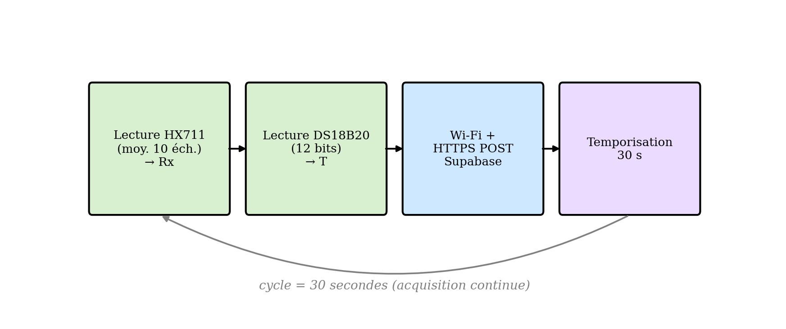{ width=95% }

La **persistance distante** des mesures est assurée côté Supabase dans la table `cr_measurements` (voir Annexe F). En cas d'échec Wi-Fi, la transmission est ré-essayée au cycle suivant. Le **payload JSON** émis est :

```json
{
  "timestamp_s": 1714500000,
  "vdiff_v": -1.23e-6,
  "rx_ohm": 0.132156,
  "temp_c": 26.44,
  "delta_r_per_h": 2.7e-7
}
```

Le **code source du firmware** est versionné sur **GitHub** (dépôt `londola13/predictive-maintenance-corrosion`, répertoire `firmware/`), de même que l'ensemble du pipeline Python ML, le code de l'application Streamlit, les notebooks d'analyse et le présent mémoire — assurant traçabilité, reproductibilité et historisation des évolutions tout au long du projet.

---

## II.3. Matériels mobilisés

### II.3.1. Matériels expérimentaux

Le tableau ci-dessous consolide la totalité des matériels mobilisés dans le cadre de cette recherche.

**Tableau II.2 — Récapitulatif des matériels expérimentaux**

| Élément | Utilité | Outils / Spécifications |
|---|---|---|
| Microcontrôleur | Acquisition, calcul, transmission | ESP32 DevKit V1 (Espressif) |
| Amplificateur ADC | Conversion différentielle 24 bits | HX711, gain 64 |
| Capteur de température | Compensation thermique | DS18B20, bus 1-Wire, résolution 12 bits |
| Fil ER actif | Élément corrodable | Fil de fer recuit, Ø 1,15 mm, *L* ≈ 2 m |
| Résistances de polarisation | Injection du courant + relèvement du mode commun | *R*_shunt = *R*_lift = 970 Ω (1 %) |
| Pull-up DS18B20 | Bus 1-Wire | 4,7 kΩ |
| Cellule de corrosion | Contenant milieu | Récipient en plastique |
| Milieu corrosif | Environnement test | Acide chlorhydrique concentré (HCl), pH ≈ 1 |
| Régulation thermique | Contrôle de la température (in situ) | Chauffe-eau d'aquarium 25 W **étanche**, plage 16–35 °C, immergé directement dans la cellule (phase contrôlée) |
| pH-mètre papier | Vérification pH | Plages 0–14, résolution ±0,5 |
| Câble USB-UART | Liaison ESP32-PC | CP2102 ou CH340 |
| Multimètre numérique | Mesure *R*₀ initiale | Précision 0,1 % |
| Ordinateur portable | Acquisition + ML | i7, 16 Go RAM, Python 3.10 |
| EPI | Sécurité | Lunettes, gants nitrile, blouse |

**Tableau II.3 — Brochage ESP32**

| Signal | Pin ESP32 | Description |
|---|---|---|
| HX711 DOUT | GPIO 21 | Données série HX711 |
| HX711 SCK | GPIO 22 | Horloge HX711 |
| DS18B20 DQ | GPIO 19 | Bus 1-Wire température (pull-up 4,7 kΩ) |
| Alimentation | 3,3 V | Pont + HX711 + DS18B20 |
| Masse | GND | Commun |

### II.3.2. Ressources logicielles

**Tableau II.4 — Logiciels et bibliothèques utilisés**

| Logiciel / Bibliothèque | Version | Rôle |
|---|---|---|
| Arduino IDE | 2.x | Programmation firmware ESP32 |
| Bibliothèque HX711 (bogde) | 0.7.5 | Lecture HX711 |
| Bibliothèque OneWire | 2.3.x | Bus 1-Wire DS18B20 |
| Bibliothèque DallasTemperature | 3.9.x | Lecture DS18B20 |
| Python | 3.10 | Pipeline ML |
| Pandas | 2.x | Manipulation séries temporelles |
| NumPy | 1.26 | Calculs numériques |
| SciPy (savgol_filter) | 1.11 | Lissage Savitzky-Golay |
| XGBoost | 2.0 | Modèle prédictif |
| Scikit-learn | 1.3 | TimeSeriesSplit, métriques |
| SHAP | 0.43 | Interprétabilité |
| Matplotlib / Seaborn | — | Visualisation |
| Joblib | — | Persistance modèle |

---

## II.4. Méthodes d'acquisition et de traitement des données

La méthodologie de traitement des données suit une chaîne en cinq étapes successives, implémentée dans le script Python `corrosion_pipeline.py`.

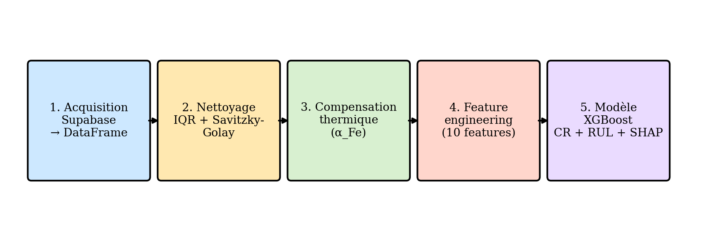{ width=95% }

### II.4.1. Acquisition

Les mesures émises par l'ESP32 sont écrites en temps réel dans la table `cr_measurements` de la base **Supabase** (PostgreSQL managé) via son API REST PostgREST. Chaque mesure est rattachée à un identifiant de run (`run_id`) de la table `cr_runs`. Le pipeline Python charge ensuite ces données par requête paramétrée et les convertit en `DataFrame` Pandas pour traitement. Les colonnes consommées sont : `timestamp_s`, `vdiff_v`, `rx_ohm`, `temp_c`, `delta_r_per_h`.

Une mesure est émise toutes les **30 secondes**, soit environ 120 points par heure. Pour un run de 12 heures, cela représente de l'ordre de 1 400 points de mesure ; pour un run de 20 heures, environ 2 300 points. Cette résolution temporelle fine est nécessaire pour capturer la phase d'emballement final, très rapide. L'historique complet est centralisé sur Supabase et accessible aussi bien à l'application Streamlit qu'aux notebooks d'analyse, sans manipulation manuelle de fichiers.

### II.4.2. Nettoyage du signal

Le nettoyage suit deux étapes successives :

**Étape 1 — Suppression des outliers par méthode IQR (Interquartile Range) :** les points situés hors de l'intervalle [Q5 − 3×IQR ; Q95 + 3×IQR] sont supprimés. Ce seuil large préserve la dynamique de dégradation tout en éliminant les artefacts transitoires du HX711 lors du réveil de l'ESP32 (Tukey, 1977).

**Étape 2 — Lissage Savitzky-Golay :** un filtre polynomial d'ordre 2 sur une fenêtre glissante de 5 points est appliqué (Savitzky et Golay, 1964). Ce filtre préserve mieux les pentes locales que la moyenne mobile simple — propriété essentielle pour le calcul précis de *dr/dt*.

### II.4.3. Compensation thermique

La résistivité électrique du fer varie linéairement avec la température selon la loi de Matthiessen (Pollock, 1991) :

$$\rho_{Fe}(T) = \rho_{Fe}(T_{ref}) \cdot [1 + \alpha_{Fe} \cdot (T - T_{ref})]$$

avec α_Fe = 6,5 × 10⁻³ °C⁻¹ et *T*_ref = 25 °C. La résistance compensée s'obtient par :

$$R_{corr}(t) = \frac{R_{lisse}(t)}{1 + \alpha_{Fe} \cdot (T(t) - T_{ref})}$$

*R*_corr(t) ne dépend plus que de la corrosion, pas de la température ambiante.

### II.4.4. Feature engineering

Dix variables d'entrée sont construites pour le modèle XGBoost à partir de *R*_corr(t), *T*(t) et *t* :

**Tableau II.5 — Variables d'entrée (features) du modèle XGBoost**

| Feature | Définition | Justification physique |
|---|---|---|
| `rx_corr` | Résistance compensée (Ω) | État absolu |
| `delta_R_1h` | Δ*R* sur 1 h (6 points) | Vitesse court terme |
| `delta_R_6h` | Δ*R* sur 6 h (36 points) | Vitesse moyen terme |
| `vitesse_CR_1h` | CR moyen 1 h (mm/an) | Taux instantané lissé |
| `tendance_6h` | Pente linéaire de *R*ₓ sur 6 h | Accélération / décélération |
| `temp_lisse` | Température lissée (°C) | Compensation résiduelle |
| `temp_moy_6h` | Température moyenne 6 h | Effets thermiques lents |
| `temps_immersion_h` | *t* depuis début du run (h) | Stade d'avancement |
| `delta_R_absolu` | *R*ₓ(t) − *R*ₓ(0) (Ω) | Perte cumulée |
| `section_perdue_pct` | 1 − (*r*(t)/*r*(0))² (%) | Fraction de durée de vie consommée |

Les **deux variables cibles** sont :

- **CR_lisse** (mm/an) : taux de corrosion lissé Savitzky-Golay ;
- **RUL_h** (heures) : durée de vie résiduelle.

La cible visée étant la **vitesse de corrosion stable** (et non l'emballement terminal, qui relève de la défaillance — §III.4.1), les valeurs de *CR* de la phase de pré-rupture, fortement non stationnaires, sont **écrêtées à 2 000 µm/an**. Ce plafond est une **convention de prétraitement** documentée, destinée à empêcher les pics aberrants de cette phase de biaiser l'apprentissage du régime stationnaire ; il n'affecte pas la plage de fonctionnement nominale.

### II.4.5. Calcul du RUL

Le critère de fin de vie répond à une question simple : **à partir de quand considère-t-on le fil « mort » ?** À mesure que la corrosion ronge le fil, son rayon *r* diminue ; la section variant comme *r*², elle **chute bien plus vite que le rayon**. On fixe le seuil de fin de vie à *r*_critique = **0,15 × *r*(0)** : lorsqu'il ne reste que **15 % du rayon initial**, il ne subsiste plus qu'environ **2 % de la section** (≈ 98 % de section perdue) — le fil n'a alors quasiment plus de matière porteuse et **sa rupture mécanique est imminente**. On ne retient pas 0 % strict car, en pratique, le fil casse (et la mesure sature) **avant** que la section n'atteigne réellement zéro : 0,15 est donc un **curseur pragmatique placé juste avant la rupture**. Ce seuil est une **convention de laboratoire** — la norme **ISO 13381-1** impose le *principe* d'un « seuil de santé prédéfini » mais pas sa valeur (ISO, 2025) — **réglable**, **validé a posteriori** par sa concordance avec les instants de rupture réellement observés, et assumé **provisoire** (à recaler sur un critère mécanique, contrainte à rupture, en conditions réelles). Pour les **runs RTF complets** (rupture observée), la durée de vie résiduelle est mesurée directement depuis l'instant de rupture :

$$RUL(t) = t_{rupture} - t$$

Pour les **prédictions en cours de run** (rupture non encore atteinte) :

$$RUL(t) = \frac{r(t) - r_{critique}}{|dr/dt|}$$

---

## II.5. Méthodologie d'entraînement du modèle XGBoost

### II.5.1. Stratégie de validation : du *walk-forward* au *leave-one-run-out*

Parmi les stratégies comparées au tableau II.0.6, deux sont pertinentes ici. La validation **walk-forward** (`TimeSeriesSplit`) respecte la **causalité temporelle** au sein d'un même essai — chaque fold entraîne sur le passé et teste sur le futur (Bergmeir et Benítez, 2012) — mais ne renseigne que sur la prédiction *au sein* d'un run déjà observé. Or l'objectif industriel est la **généralisation à un essai nouveau, jamais vu** : nous retenons donc comme stratégie principale la **validation *leave-one-run-out* (LORO)**, où un run complet est retiré de l'entraînement et sert exclusivement de test. Plus exigeante, elle mesure la capacité réelle du modèle à prédire un essai indépendant et constitue le cœur de la démonstration du Chapitre III — sa fiabilité dépendant de la couverture des conditions (notamment thermiques) par les runs d'entraînement.

### II.5.2. Hyperparamètres XGBoost

**Tableau II.6 — Hyperparamètres du modèle XGBoost**

| Hyperparamètre | Valeur | Justification |
|---|---|---|
| `n_estimators` | 500 | Compromis biais-variance |
| `max_depth` | 4 | Contrôle complexité, évite surapprentissage |
| `learning_rate` | 0,05 | Convergence stable avec 500 arbres |
| `reg_alpha` (L1) | 0,1 | Sélection sparse des features |
| `reg_lambda` (L2) | 1,0 | Stabilité numérique |
| `subsample` | 0,8 | Réduction variance |
| `colsample_bytree` | 0,8 | Diversité des arbres |
| `objective` | `reg:squarederror` | Régression standard |

Source : Chen et Guestrin (2016) ; XGBoost (2024).

### II.5.3. Métriques d'évaluation

Trois métriques classiques sont utilisées (Hyndman et Koehler, 2006) :

- **MAE (Mean Absolute Error)** : $\text{MAE} = \frac{1}{n}\sum_i |y_i - \hat{y}_i|$
- **RMSE (Root Mean Square Error)** : $\text{RMSE} = \sqrt{\frac{1}{n}\sum_i (y_i - \hat{y}_i)^2}$
- **R² (coefficient de détermination)** : $R^2 = 1 - \frac{\sum_i (y_i - \hat{y}_i)^2}{\sum_i (y_i - \bar{y})^2}$

Une **baseline naïve** (prédiction = moyenne du training set) sert de comparaison pour vérifier que le modèle apporte effectivement une valeur ajoutée.

### II.5.4. Interprétabilité par SHAP

L'analyse **SHAP (SHapley Additive exPlanations)** est conduite après entraînement pour identifier les variables dominantes (Lundberg et Lee, 2017). Trois visualisations sont produites :

1. **SHAP summary plot (beeswarm)** : distribution des contributions par feature ;
2. **SHAP bar chart** : importance moyenne absolue des features ;
3. **SHAP dependence plot** : interaction entre features.

L'objectif est d'identifier les **3 variables les plus influentes** et de vérifier la cohérence avec la physique du phénomène.

### II.5.5. Module de diagnostic des régimes de corrosion

Au-delà de la prédiction quantitative (CR, RUL), le pipeline implémente un **module de diagnostic** classifiant le régime de corrosion observé, conformément à l'étape *Diagnostic* de la norme ISO 13381-1. Plutôt qu'une classification supervisée ou une détection non-supervisée d'anomalies, nous retenons une **approche par règles métier explicables**, simple à valider et transparente pour le jury comme pour les utilisateurs industriels — les approches ML de classification restant une perspective d'évolution.

Les régimes correspondent aux phases physiques observées sur un essai RTF du fil de fer en milieu HCl :

**Tableau II.7 — Régimes de corrosion diagnostiqués et signatures**

| Régime | Signature dans le signal | Niveau d'alerte |
|---|---|---|
| **Induction** | dR/dt ≈ 0, résistance quasi stable (début d'immersion) | Vert |
| **Croissance** | dR/dt > 0 régulier, tendance_6h positive et stable | Vert |
| **Emballement** | accélération marquée de dR/dt, tendance_6h croissante | Orange |
| **Pré-rupture** | dR/dt diverge ET RUL < 12 h | Rouge |

Les seuils de transition entre régimes sont **calibrés sur les distributions observées** dans les runs de référence, conformément au principe de « seuil de santé prédéfini » de l'**ISO 13381-1** (ISO, 2025). Ils constituent à ce stade une **convention de laboratoire provisoire**, à consolider sur un volume d'essais accru. Le seuil de pré-rupture (*RUL* < 12 h) est un **objectif de conception** — l'horizon d'anticipation visé pour déclencher une intervention — et non une valeur normative.

La fonction `diagnostiquer(features)` du pipeline Python prend en entrée le vecteur de features de l'instant courant et retourne un dictionnaire `{régime: str, confiance: float, signal: dict}` exploité ensuite par le module GMAO (OS4) pour générer les alertes.

---

## II.6. Protocole expérimental run-to-failure

### II.6.1. Justification du protocole RTF

Face aux essais électrochimiques (grandeurs instantanées, mais instrument coûteux) et à la perte de masse (simple, mais réduite à une vitesse moyenne, sans dynamique temporelle ni événement de défaillance), nous retenons le protocole **run-to-failure (RTF)** : seul à constituer un jeu d'apprentissage couvrant l'intégralité du cycle de dégradation — de l'état initial à la rupture — et à fournir un **événement de défaillance réellement observé**, indispensable à l'apprentissage de la durée de vie résiduelle (RUL). Ce choix est conforme à l'esprit de la norme **ISO 13381-1 :2025** sur la maintenance prévisionnelle (ISO, 2025 ; Akash, 2024).

### II.6.2. Plan expérimental

Le plan expérimental ne repose pas sur un nombre figé de runs, mais sur une **série d'essais RTF répétés** dans des conditions nominales identiques (même milieu HCl, même montage), conçue de manière **itérative**. Deux phases structurent la campagne :

- une **phase exploratoire**, à température ambiante *subie* (non régulée), destinée à constituer les premières séries et à identifier les facteurs de variabilité ;
- une **phase contrôlée**, à température *régulée* par un chauffe-eau d'aquarium étanche immergé directement dans la cellule, destinée à isoler l'effet de la température et à démontrer la répétabilité.

**Tableau II.8 — Plan de la série d'essais run-to-failure (campagne en cours)**

| Phase | Essais réalisés à ce stade | Conditions | Rôle |
|---|---|---|---|
| Exploratoire | Run #1, #11, #12, #14 | HCl, température ambiante subie (≈ 29–33 °C) | Entraînement + mise en évidence de l'effet température |
| Contrôlée | Run #16, #17 (+ runs en cours) | HCl, température régulée (consignes 30 °C puis 32 °C) | Démonstration de répétabilité + validation |

La campagne se poursuit : des essais complémentaires aux consignes 30 °C et 32 °C sont en cours afin de consolider la couverture thermique (voir Chapitre III, perspectives). Le détail des essais retenus, écartés et utilisés comme contre-exemples est présenté au Chapitre III.

### II.6.3. Procédure standard par run

Pour chaque run, la procédure suivante est appliquée :

1. **Préparation de la cellule et du fil** : nettoyage du récipient, découpe d'un fil de fer neuf, nettoyage, séchage ; **isolation d'environ 10 cm à chaque extrémité** du fil (vernis/gaine) afin d'exclure la **zone de ligne de flottaison** — siège d'une corrosion par **aération différentielle** (cellule à concentration d'oxygène à l'interface air-liquide) — et de garantir une corrosion **uniforme** sur la seule longueur immergée (Roberge, 2008) ; mesure de *R*₀ au multimètre, vérification du pH ;
2. **Câblage de la sonde** : montage du fil, connexion HX711 → ESP32, vérification de la réception des premiers points dans la table Supabase `cr_measurements` via l'application Streamlit ;
3. **Mise en condition thermique** (phase contrôlée) : le **chauffe-eau d'aquarium étanche** est immergé directement dans la cellule (au même titre que le DS18B20) et porte le milieu à la consigne ; la cellule est **couverte** pour limiter l'évaporation du HCl accélérée par le chauffage ;
4. **Démarrage de l'acquisition** : préparation d'**acide frais** et **immersion immédiate** du fil (sans délai d'exposition de l'acide à l'air, le HCl étant volatil), récipient **couvert** pour limiter l'évaporation ; création du run dans Supabase (`cr_runs.started_at`) et début de l'envoi des mesures ;
5. **Surveillance périodique** : vérification de la continuité de l'acquisition via le dashboard Streamlit ;
6. **Détection de la fin de run** : la rupture du fil est identifiée par un **critère objectif** — saturation de *R*ₓ (circuit ouvert), la valeur se figeant à sa borne haute. Le run est clôturé au premier point de saturation (`cr_runs.ended_at`) ;
7. **Post-run** : photographie du fil corrodé, nettoyage et préparation du run suivant.

> **Note de protocole.** Deux exigences se sont révélées critiques pour la répétabilité (Chapitre III) : (i) la **stabilité thermique** du milieu à la consigne ; (ii) l'**emploi d'acide frais immergé sans délai**, l'exposition prolongée de l'acide à l'air abaissant sa concentration par volatilisation du HCl.

### II.6.4. Seuils d'alerte gradués

Les seuils d'alerte sont définis à partir des deux sorties du modèle (taux de corrosion CR et durée de vie résiduelle RUL), sans recourir à une action chimique corrective (hors périmètre de ce travail).

**Tableau II.9 — Seuils d'alerte gradués**

| Niveau | Condition | Recommandation |
|---|---|---|
| Vert (nominal) | *CR* < 1 mm/an ET *RUL* > 48 h | Surveillance normale |
| Orange (vigilance) | 1 ≤ *CR* < 5 mm/an OU 12 ≤ *RUL* < 48 h | Planifier une inspection / intervention |
| Rouge (critique) | *CR* ≥ 5 mm/an OU *RUL* < 12 h | Inspection immédiate + arrêt préventif |

> **Provenance et statut de ces seuils (important).** Les valeurs de *CR* ci-dessus constituent un **cadre cible industriel illustratif**, destiné à un acier de pipeline ; elles ne sont **ni des bandes normatives NACE, ni les seuils opérationnels du prototype**. À titre de référence normative, la norme **NACE/AMPP SP0775** classe la sévérité de corrosion de l'acier au carbone en bandes faible / modérée / élevée / sévère aux alentours de 0,025 / 0,12 / 0,25 mm/an (AMPP, 2023) — c'est sur ces bandes qu'un déploiement réel devra être recalibré. Le **prototype de laboratoire**, dont le fil de fer en HCl corrode à des vitesses très supérieures à celles d'un pipeline acier (et dont le *CR* est écrêté à 2 mm/an, §II.4.4), n'utilise pas ces seuils absolus : il déclenche ses alertes sur la **section perdue (%)** et le **RUL (h)** (§III.4.3), grandeurs intrinsèques indépendantes de l'échelle de *CR*. Ces seuils opérationnels sont **provisoires**, calibrés sur les essais de référence et à consolider (§III.6.4).

---

## II.7. Boucle décision → action : module GMAO intégré, transposable à un CMMS open-source (OS4)

### II.7.1. Choix d'architecture : module GMAO maison + transposabilité à un CMMS open-source

L'objectif d'OS4 est de structurer la **boucle décision → action** en aval du système prédictif. Deux approches étaient envisageables :

- **(A) Développer un module GMAO maison léger**, intégré à l'application Streamlit (table d'ordres de travail + interface de gestion), couvrant le strict nécessaire : création d'OT sur alerte, assignation, clôture, KPIs ;
- **(B) Réutiliser un CMMS open-source mature** (GLPI, OpenMaint, Snipe-IT…) et y connecter, par API REST, l'application web Streamlit.

L'approche retenue **pour le prototype est (A) — un module GMAO maison**, son architecture étant conçue pour être **directement transposable** à l'approche (B). Justification :

1. **Périmètre suffisant** : la boucle visée (OT générés à partir des alertes + traçabilité + KPIs) est couverte par un module léger, sans imposer le déploiement d'un CMMS complet pour la démonstration ;
2. **Disponibilité de l'API (raison décisive)** : aucune des solutions évaluées (§II.7.2) ne met à disposition une **API exploitable dans une version gratuite ou d'essai** déployable dans le cadre du projet — l'accès programmatique étant réservé aux offres payantes (Fiix, MaintainX) ou conditionné à l'hébergement d'une instance serveur complète (GLPI, OpenMaint), hors périmètre. Le module maison évite cette dépendance et garantit une démonstration de bout en bout reproductible ;
3. **Transposabilité** : le mapping prédiction → ordre de travail (§II.7.5) est défini de façon **générique** et se reporterait sur tout CMMS open-source exposant une API (GLPI, OpenMaint, Snipe-IT) ;
4. **Compatibilité industrielle** : le module maison comme le CMMS open-source sont auto-hébergeables (on-premise), compatibles avec un réseau OT isolé.

### II.7.2. Matrice comparative des CMMS open-source candidats

**Tableau II.10 — Comparaison des CMMS open-source candidats (OS4)**

| CMMS | Maturité | API REST | Modules ticketing | Auto-hébergeable | Communauté | Verdict |
|---|---|---|---|---|---|---|
| **GLPI** | 20 ans, v10 stable | API en auto-hébergement | Tickets / Problems / Changes (ITIL) | ✅ Linux/Docker | Très large (FR + INT) | Instance serveur requise (hors périmètre) |
| OpenMaint (CMDBuild) | 12 ans | ✅ REST + SOAP | Work orders + Assets | ✅ Tomcat | Moyenne (IT) | Alternative crédible |
| Snipe-IT | 10 ans | ✅ REST documenté | Asset-centric (limité OT) | ✅ PHP/Laravel | Large | Trop asset-centric |
| Fiix Free | 15 ans | API limitée free tier | Complet (cloud) | ❌ SaaS uniquement | Commercial | Non-libre |
| MaintainX Free | 6 ans | API limitée free tier | Mobile-first | ❌ SaaS uniquement | Commercial | Non-libre |

Sources : GLPI Project (2024) ; CMMS Wikipedia (2024) ; documentations officielles consultées 2026.

**Conclusion de la comparaison.** Aucune des solutions ne combine une API exploitable **et** un déploiement gratuit/léger compatible avec les contraintes du projet : les offres SaaS gratuites (Fiix, MaintainX) **réservent l'API au plan payant**, tandis que les solutions auto-hébergeables (GLPI, OpenMaint, Snipe-IT) imposent le déploiement et la maintenance d'une instance serveur complète. C'est précisément ce constat qui a motivé le choix d'un **module GMAO maison** (§II.0.5.8), implémentant le périmètre nécessaire (création/suivi d'OT, KPIs) dans l'application Streamlit, tout en restant transposable à l'une de ces solutions si l'opérateur en exploite déjà une.

### II.7.3. Stack technologique de la chaîne intégrée

**Tableau II.11 — Stack technologique du prototype intégré**

| Couche | Technologie | Rôle | Coût |
|---|---|---|---|
| Capteur + acquisition | ESP32 + HX711 + DS18B20 | Mesure ER + température | Matériel ~50 000 FCFA |
| Stockage mesures + prédictions + OT | Supabase (PostgreSQL) | Persistance time-series + sorties ML + ordres de travail | Gratuit (free-tier) |
| Pipeline ML | Python (Pandas, SciPy, XGBoost, SHAP) | CR + RUL + diagnostic + interprétabilité | Gratuit (open-source) |
| Frontend ML / dashboard | **Streamlit** | UI temps réel, courbes, alertes | Gratuit (open-source) |
| Hébergement frontend | **Streamlit Community Cloud** | Déploiement public | Gratuit |
| **Module GMAO** | **Maison** (table `cr_work_orders`, Supabase) | Ordres de travail, assignation, clôture, KPIs | Gratuit |
| Communication app ↔ données | Client / REST **Supabase** (PostgREST) | Lecture-écriture des mesures, prédictions et OT | Gratuit |
| Communication ESP32 → Supabase | HTTPS POST | Ingestion mesures | Gratuit |

Sources : Streamlit (2024) ; Supabase (2024) ; XGBoost Documentation (Chen et Guestrin, 2016).

### II.7.4. Architecture de la boucle complète intégrée

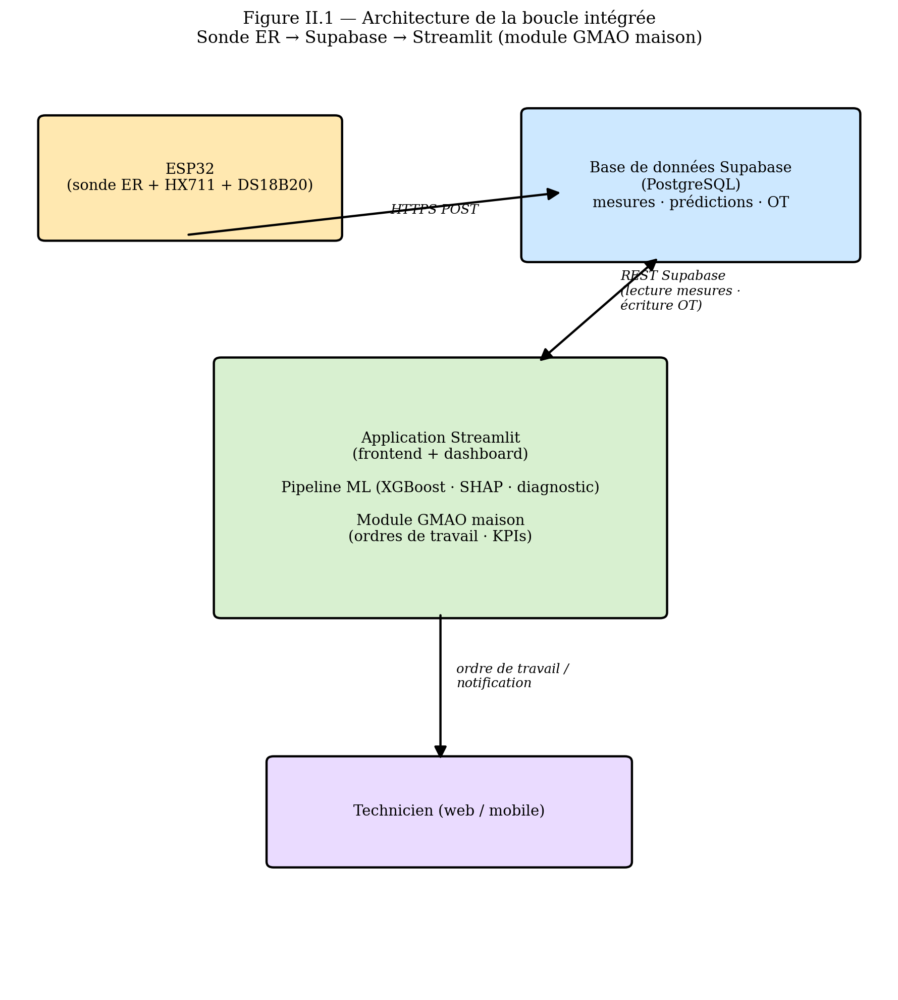{ width=80% }

### II.7.5. Mapping prédiction ML → ordre de travail

Le tableau ci-dessous décrit le mapping entre les sorties du pipeline ML et les champs d'un **ordre de travail**, tel qu'implémenté par le module GMAO maison (les mêmes champs se reporteraient sur un CMMS open-source exposant une API) :

**Tableau II.12 — Mapping des champs prédiction ML → ordre de travail**

| Champ de l'ordre de travail | Source dans la prédiction ML | Exemple |
|---|---|---|
| Titre | `asset` + diagnostic | "Pipeline-Komé-Sect-12 — Corrosion accélérée détectée" |
| Urgence | Niveau d'alerte (vert = 1, orange = 3, rouge = 5) | 5 |
| Impact | Criticité de l'asset (configuration) | 5 |
| Priorité | f(urgence, impact) | "Très haute" |
| Description | Template enrichi : CR_pred, RUL_pred, top-3 SHAP, régime diagnostiqué | "CR=4,2 mm/an ; RUL=18 h ; régime : emballement ; top-3 SHAP : ΔR/Δt, T_avg, Rx_corr. Recommandation : inspection immédiate." |
| Asset | Section surveillée | ID de la section pipeline |
| Catégorie | « Corrosion » | — |
| Assigné à | Technicien d'astreinte (configuration) | ID utilisateur |

En pratique, l'ordre de travail est **écrit dans la table `cr_work_orders` de Supabase** depuis l'application Streamlit — **aucun appel n'est émis vers un CMMS externe**. La seule API REST mobilisée est celle de **Supabase** (PostgREST), via le client Python :

```python
ot = {
    "run_id": run_id, "niveau": alerte.niveau,
    "titre": f"{asset} — {diagnostic}",
    "cr_pred": prediction["CR"], "rul_pred": prediction["RUL"],
    "section_pct": prediction["section"], "statut": "ouvert",
}
supabase.table("cr_work_orders").insert(ot).execute()
```

La transposition vers un CMMS open-source (GLPI…) consisterait simplement à rediriger cette écriture vers l'API du CMMS, **sans changer le mapping** ci-dessus.

### II.7.6. KPIs maintenance calculés à partir de l'historique des ordres de travail

Les KPIs maintenance suivants sont calculés à partir de l'historique des ordres de travail tenu par le module GMAO maison (table `cr_work_orders`) ; ils se calculeraient à l'identique côté CMMS après transposition :

**Tableau II.13 — Indicateurs de performance maintenance (KPIs)**

| KPI | Formule | Source (module OT) | Cible |
|---|---|---|---|
| **MTBF** (Mean Time Between Failures) | Σ temps entre OT corrosion / nb OT | Table `cr_work_orders` | maximiser |
| **MTTR** (Mean Time To Repair) | Σ (`closed_at` − `created_at`) / nb OT | Table `cr_work_orders` | minimiser |
| **Disponibilité** | MTBF / (MTBF + MTTR) | Calculé | > 95 % |
| **Efficacité d'inhibition** | (CR_avant − CR_après) / CR_avant × 100 | Pipeline ML + tags OT | > 90 % |
| **Précision du modèle** | 1 − (alertes annulées / alertes totales) | Champ statut/résolution de l'OT | > 85 % |
| **Taux de fausses alertes** | OT résolus en `false positive` / total | Champ `statut` + résolution | < 15 % |

> *La colonne « Cible » liste des **objectifs de conception** (valeurs usuelles de l'ingénierie de maintenance : p. ex. disponibilité > 95 %), et non des seuils normatifs ; ils servent de référence d'évaluation et seront confrontés aux performances réelles sur un historique d'interventions suffisant (§III.5, §III.6.4).*

---

## II.8. Tableau synoptique de la démarche méthodologique

**Tableau II.14 — Démarche synoptique objectifs / activités / méthodes / résultats attendus**

| Objectif Spécifique | Activités à réaliser | Méthodes / Outils | Justifications / Résultats attendus |
|---|---|---|---|
| **OS1** — Concevoir et valider la sonde ER instrumentée IoT | (i) Montage de la sonde ER ; (ii) Programmation du firmware ESP32 (acquisition 30 s, HX711, DS18B20) ; (iii) Tests de résolution sur résistances étalons ; (iv) Validation de la stabilité en milieu corrosif | Montage de mesure de résistance ; HX711 ; ESP32 acquisition continue 30 s ; Multimètre de précision | Sonde fonctionnelle, résolution suffisante pour quantifier le CR — démonstration de la brique d'acquisition I4.0 |
| **OS2** — Entraîner et valider le modèle XGBoost (CR + RUL) | (i) Collecte d'une série de runs RTF ; (ii) Nettoyage IQR + Savitzky-Golay ; (iii) Compensation thermique ; (iv) Feature engineering ; (v) Validation LORO ; (vi) Entraînement XGBoost ; (vii) MAE/RMSE/R² ; (viii) SHAP | Python : Pandas, SciPy, XGBoost, Scikit-learn, SHAP ; *n*=500, depth=4, lr=0,05, L1=0,1, L2=1,0 | Prédiction CR + RUL ; comparaison aux baselines ; SHAP : variables physiquement plausibles |
| **OS3** — Diagnostic des régimes + facteurs de variabilité + alertes | (i) Diagnostic des régimes (induction, croissance, emballement, pré-rupture) par règles métier ; (ii) Identification et quantification des facteurs de variabilité (température, concentration) par LORO ; (iii) Démonstration du rôle de la répétabilité ; (iv) Calibration des seuils vert/orange/rouge sur CR et RUL | Pipeline Python : `diagnostiquer(features)` ; validation LORO par plage thermique ; analyse des contre-exemples ; calibration empirique | Diagnostic exploitable ; effet température quantifié ; seuils calibrés (CR=1, 5 mm/an ; RUL=12, 48 h) |
| **OS4** — Boucle décision → action : module GMAO intégré, transposable à un CMMS open-source | (i) Application Streamlit (frontend ML + dashboard) ; (ii) Module GMAO maison (table `cr_work_orders` : OT, assignation, clôture) ; (iii) Mapping prédiction ML → ordre de travail ; (iv) Matrice comparative des CMMS open-source (justifiant le module maison, faute d'API en version gratuite) ; (v) Calcul KPIs (MTBF, MTTR, η inhibition) | Streamlit + Streamlit Community Cloud ; module OT Python + Supabase ; transposable à un CMMS open-source ; ISO 14224 codes anomalie | Boucle Sonde → ML → OT démontrée end-to-end ; KPIs calculés ; coût de licence = 0 FCFA |

L'usage des outils suit une chronologie stricte : conception matérielle (OS1) → acquisition expérimentale et modélisation (OS2) → diagnostic des régimes et analyse des facteurs de variabilité (OS3) → intégration applicative GMAO (OS4).

---

## II.9. Conclusion du Chapitre II

Ce chapitre a présenté l'ensemble des outils et de la méthodologie retenus pour répondre aux **quatre objectifs spécifiques** du mémoire. Une **§II.0.5 dédiée à la justification des choix technologiques** a consolidé les arbitrages techniques (microcontrôleur ESP32, amplificateur HX711, capteur DS18B20, méthode ER, algorithme XGBoost, stratégie de validation, frontend Streamlit, GMAO maison) sous forme de matrices de décision. Le prototype de sonde ER (montage de mesure de résistance + HX711 + ESP32 en acquisition continue 30 s) a ensuite été décrit dans son principe physique et son implémentation matérielle. Les matériels électroniques, chimiques et logiciels mobilisés ont été consolidés en tableaux récapitulatifs. Les méthodes d'acquisition, de nettoyage, de compensation thermique, de feature engineering, d'entraînement XGBoost et d'interprétabilité SHAP ont été détaillées, ainsi que le module de diagnostic des régimes de corrosion et la stratégie de validation *leave-one-run-out*. La **boucle décision → action par un module GMAO maison** (Streamlit / Supabase ; la matrice comparative des CMMS open-source motivant le recours à ce module faute d'API exploitable en version gratuite ; mapping prédiction ML → ordre de travail ; KPIs maintenance) a été présentée, son architecture restant transposable à un CMMS open-source. Le protocole expérimental *run-to-failure* en série répétée et le tableau synoptique de la démarche ont été présentés. Le **Chapitre III** présente à présent les résultats issus de la mise en œuvre de cette méthodologie, leur analyse et leur discussion.

\newpage

<!-- ═══════════════════════════════════════════════════════════ -->

# CHAPITRE III : RÉSULTATS ET DISCUSSIONS

**Sommaire du Chapitre III**

- III.0. Introduction
- III.1. Validation métrologique de la sonde ER (OS1)
- III.2. Résultats de la série run-to-failure (OS2)
- III.3. Effet de la température et performance du modèle XGBoost (OS2/OS3)
- III.4. Diagnostic des régimes et facteurs de variabilité (OS3)
- III.5. Intégration au CMMS open-source — démonstration end-to-end et KPIs (OS4)
- III.6. Discussions
- III.7. Conclusion

---

## III.0. Introduction

> **Note d'état.** La campagne expérimentale est **toujours en cours** : les résultats présentés ici correspondent aux essais exploités à la date de rédaction. Ils sont **provisoires et défendables en l'état**, et seront consolidés par les runs complémentaires en cours d'acquisition (voir perspectives, §III.6).

Dans ce chapitre, il sera question de présenter (i) la validation métrologique de la sonde ER (OS1), (ii) les résultats de la série d'essais run-to-failure (OS2), (iii) l'effet de la température et la performance du modèle XGBoost en validation inter-essais (OS2/OS3), (iv) le diagnostic des régimes de corrosion et l'analyse des facteurs de variabilité conditionnant la fiabilité de la prédiction (OS3), (v) la démonstration de l'intégration Streamlit ↔ CMMS open-source (OS4), puis de discuter ces résultats au regard des objectifs initiaux et de la littérature (Chapitre I).

---

## III.1. Validation métrologique de la sonde ER (OS1)

Avant d'exploiter la sonde pour le suivi de corrosion, sa chaîne de mesure doit être validée. Une validation métrologique peut s'appuyer sur plusieurs vérifications : stabilité du signal au repos, étalonnage sur références connues, et maîtrise des grandeurs d'influence (température). Dans le cadre de ce travail, nous retenons ces trois vérifications, présentées ci-dessous.

### III.1.1. Étalonnage sur résistances de référence

La justesse de la mesure de résistance a été vérifiée par **substitution** du fil par des résistances de précision connues. Un **facteur de correction constant** du module HX711 (figure II.2), qui compense l'écart systématique de la chaîne d'amplification, est déterminé sur un premier étalon puis appliqué à toutes les mesures du pipeline. Un second étalon **indépendant** de **4,7 Ω**, lu entre **4,5 et 4,8 Ω** par le système (écart ≤ 4 %), confirme la **justesse** et la **linéarité** de la réponse sur la plage de mesure exploitée. Une caractérisation multipoints plus fine (≥ 5 étalons) est prévue pour consolider la courbe de linéarité.

### III.1.2. Compensation thermique

La résistivité du fer dépendant de la température (§II.4.3), une compensation thermique est appliquée à chaque mesure à partir de la température lue par le DS18B20. L'effet de cette compensation est illustré indirectement dans les essais à température variable : la résistance compensée *R*_corr suit la dégradation réelle du fil sans être polluée par les fluctuations thermiques de courte durée.

### III.1.3. Bilan provisoire

À ce stade, la chaîne d'acquisition est **fonctionnelle et stable** : elle a permis de suivre sans interruption plusieurs essais de 10 à 20 heures (acquisition continue à 30 s), de capturer la phase d'emballement rapide et de détecter la rupture du fil. Le bilan métrologique chiffré (résolution effective, bruit RMS, dérive thermique résiduelle) sera complété par les tests dédiés en cours.

---

## III.2. Résultats de la série run-to-failure (OS2)

Un essai de corrosion peut être suivi par plusieurs grandeurs (perte de masse, courant de corrosion, résistance électrique). Dans ce travail, le suivi repose sur la **résistance électrique compensée** *R*_corr(t) du fil de fer, dont la croissance traduit la perte de section, jusqu'à la rupture. Chaque essai fournit ainsi une courbe complète de dégradation.

### III.2.1. Allure typique d'un essai et phases observées

La figure III.2 présente l'évolution de *R*_corr(t) et de la température T(t) pour les essais retenus. Toutes les courbes partagent la même allure en trois phases : une **induction** (résistance quasi stable en début d'immersion), une **croissance** progressive, puis un **emballement** final rapide aboutissant à la rupture (saturation de la résistance, circuit ouvert). Ce profil, conforme à la dégradation attendue d'un fil corrodé, valide le principe de la mesure.

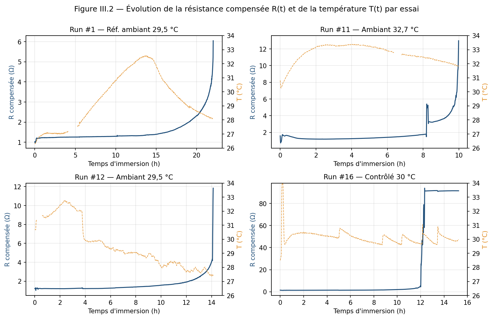{ width=98% }

### III.2.2. Synthèse des essais exploités

À ce stade de la campagne, les essais propres (milieu HCl, montage identique) sont répartis selon leur rôle dans la validation : deux essais forment la **série de test** (Run #12, #16, prédits en aveugle, §III.3), les autres servent d'**auxiliaires** d'entraînement couvrant les conditions (Run #1, #2, #3, #11), auxquels s'ajoute le jumeau 30 °C **Run #20**. Deux essais sont traités à part : **Run #14**, seul à atteindre la rupture mécanique complète, est analysé comme cas-rupture (régime d'emballement terminal, hors série stable) ; **Run #15** et **Run #17** sont des contre-exemples instructifs (§III.4). Un essai supplémentaire (**Run #21**) est en cours d'acquisition. Le tableau III.1 résume les essais à rupture exploités.

**Tableau III.1 — Caractéristiques des essais exploités (campagne en cours)**

| Essai | Rôle | T° moyenne | Durée → rupture | Points | Observation |
|---|---|---|---|---|---|
| Run #1 | Auxiliaire | 29,5 °C | 22,1 h | 2 490 | Référence (ambiant) |
| Run #11 | Auxiliaire | 32,7 °C | 10,0 h | 1 142 | Le plus chaud (canicule) |
| Run #12 | Test (LORO) | 29,5 °C | 14,1 h | 1 643 | Essai propre |
| Run #16 | Test (LORO) | 30,1 °C | 15,2 h | 1 442 | Régulation contrôlée (σ = 0,52 °C) |
| Run #20 | Auxiliaire (jumeau 30 °C) | 30,1 °C | tronqué (coupure WiFi) | 1 005 | Densifie la plage 30 °C |

Deux auxiliaires à cinétique lente (Run #2, biaisé par une rupture par traction ; Run #3, dilué) ne sont pas illustrés mais participent à l'entraînement. La figure III.3 confronte la durée de vie et la température moyenne des essais à rupture complète. Une **tendance se dégage** : les essais les plus chauds rompent le plus vite (Run #11 à 32,7 °C : 10 h), conformément à la dépendance d'Arrhenius (§I.7.7). Une variabilité résiduelle subsiste néanmoins à température comparable (Run #1 et Run #12, tous deux à ≈ 29,5 °C, durent respectivement 22 h et 14 h), ce qui annonce le rôle des facteurs non thermiques analysés en §III.4.

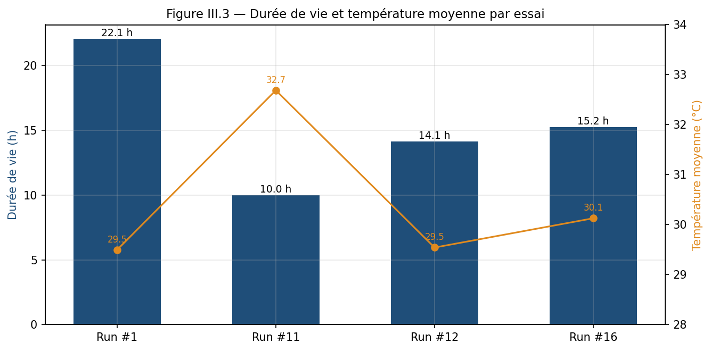{ width=85% }

---

## III.3. Effet de la température et performance du modèle (OS2/OS3)

La température agit sur la cinétique de corrosion selon une loi de type Arrhenius (§I.7.7) : sa variation entre essais est donc une source majeure de variabilité. La question centrale de cette section est la capacité du modèle à **généraliser à un essai jamais vu**, évaluée par la validation *leave-one-run-out* (LORO, §II.5.1).

### III.3.1. Performance en validation inter-essais (LORO)

Le tableau III.2 et la figure III.4 présentent le R² obtenu sur chaque essai testé (le run testé n'étant jamais vu à l'entraînement), pour le modèle XGBoost comparé à deux références : une régression linéaire et une prédiction par la moyenne.

**Tableau III.2 — Performance LORO par essai (taux de corrosion CR)**

| Essai testé | T° | R² XGBoost | R² Régression lin. | R² Moyenne |
|---|---|---|---|---|
| Run #12 | 29,5 °C | **+0,50** | +0,21 | −0,02 |
| Run #16 | 30,1 °C | +0,07 | +0,14 | 0,00 |
| **Moyenne** | — | **+0,29** | +0,17 | < 0 |

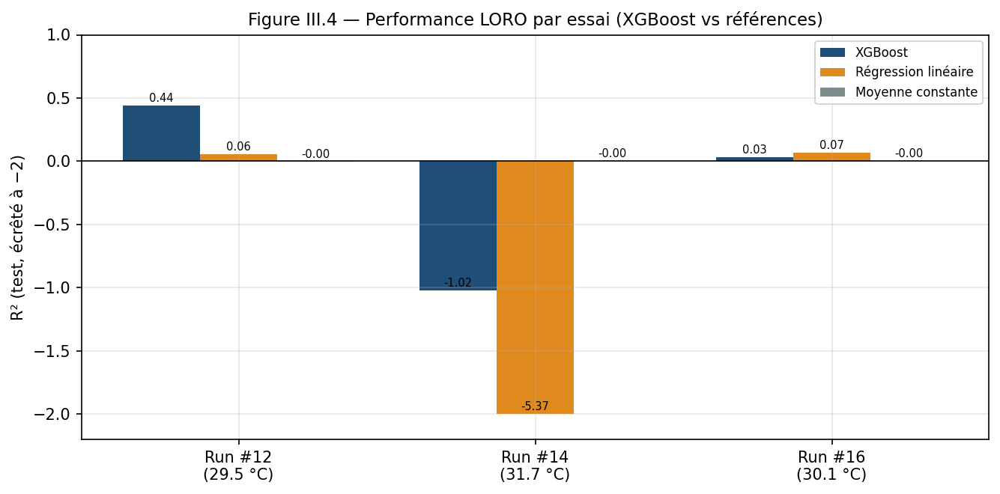{ width=85% }

Sur la plage 30 °C couverte, le modèle obtient une **moyenne positive (R² = +0,29)** et devance les deux références. La domination est nette sur Run #12 (+0,50 contre +0,21) ; sur Run #16, essai plus difficile (voir §III.4), XGBoost reste compétitif avec la régression linéaire. Surtout, les deux modèles structurés battent largement la prédiction par la moyenne (R² ≤ 0), ce qui confirme qu'une information exploitable est bien apprise. Ce résultat positif n'est toutefois pas automatique : il dépend de la **couverture des conditions** par l'entraînement, comme le montre la section suivante.

### III.3.2. Évolution de la performance au fil de la campagne : du LORO initial au LORO actuel

Ce résultat positif (+0,29) n'a pas été obtenu d'emblée : il est l'aboutissement d'une trajectoire que la figure III.5 retrace, du **LORO initial** au **LORO actuel**.

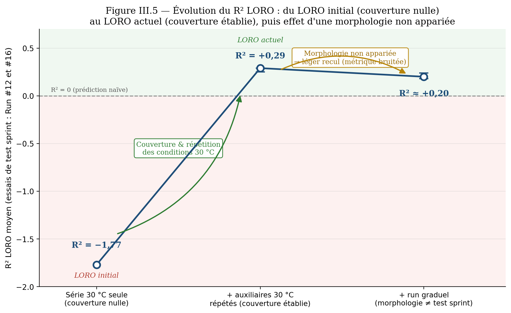{ width=85% }

**Du négatif au positif (couverture).** Entraîné sur la **seule série 30 °C**, sans essai couvrant les conditions du run testé, le modèle échouait lourdement (**R² = −1,77**) : c'est le LORO initial. L'ajout progressif d'**essais auxiliaires couvrant et répétant la plage 30 °C** a redressé la performance jusqu'à **+0,29** (LORO actuel, tableau III.2). Le moteur de ce redressement n'est pas le volume brut de données mais la **couverture et la répétition des conditions**, analysées au paragraphe suivant (§III.3.3).

**Un plateau bruité (morphologie).** Au-delà de ce seuil, ajouter un essai ne garantit plus un gain. L'incorporation d'un essai de morphologie **graduelle** (Run #21, puis Run #22), alors que les essais de test relèvent de la morphologie *induction-emballement* (« sprint »), fait légèrement **reculer** la moyenne, vers **≈ +0,20**. Ce recul appelle la prudence : au vu du faible effectif, la métrique est **bruitée** et doit être citée en **fourchette** plutôt qu'en valeur unique. Mesurée sur quatre tirages aléatoires, la moyenne sprint vaut **≈ +0,26 [+0,25 ; +0,29]** sans le run graduel et **≈ +0,20** avec, soit un écart **Δ ≈ −0,07 [−0,02 ; −0,10]**, négatif sur les quatre tirages mais d'amplitude variable : la **direction** du recul est robuste, sa **magnitude** ne l'est pas.

**Enseignement.** La trajectoire confirme que la fiabilité tient à la **couverture appariée** des conditions — thermiques *et* morphologiques (§III.3.3) — et non au volume de données. Elle fixe aussi le cap des essais complémentaires (§III.6.5) : répéter au sein d'une **même morphologie**, en priorité « sprint », plutôt que d'empiler des essais hétérogènes.

### III.3.3. La couverture des conditions conditionne la fiabilité

L'entraînement peut être enrichi de plusieurs manières : série de test seule, ou ajout d'essais auxiliaires bruts, sous-échantillonnés, ou pondérés. La figure III.6 compare ces quatre variantes (R² moyen LORO sur Run #12 et #16). Le résultat est net :

- entraîner sur la **série 30 °C seule**, sans essais couvrant les conditions, échoue lourdement (**R² = −1,77**) ;
- **ajouter des auxiliaires** couvrant la plage rétablit une prédiction fiable (**+0,29**, variante retenue : auxiliaires sous-échantillonnés à 1 500 points). Le sous-échantillonnage corrige le **déséquilibre ≈ 4,5:1** entre auxiliaires volumineux et série de test, qui sinon « noie » cette dernière — un rééquilibrage du jeu d'entraînement étant une pratique établie de l'apprentissage sur données déséquilibrées (He et Garcia, 2009).

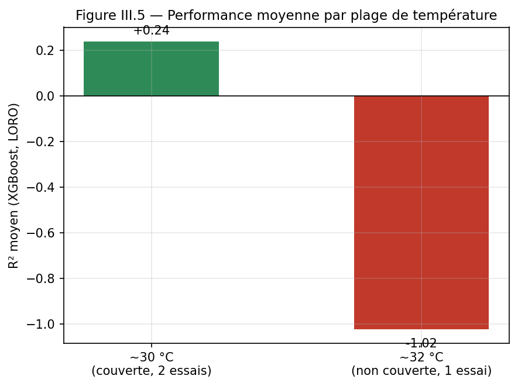{ width=72% }

L'interprétation est directe : **la prédiction est fiable là où les conditions du run testé sont couvertes par l'entraînement, et échoue sinon.** Et ce n'est pas le volume brut de données qui compte, mais la couverture : l'analyse de l'apport de chaque auxiliaire (par retrait successif) le confirme — l'essai le plus volumineux (Run #3, ~10 750 points) n'apporte presque rien, tandis que les essais fondateurs (Run #1, Run #2) sont déterminants et le jumeau 30 °C (Run #20) améliore encore la moyenne. C'est la **répétabilité des conditions** — non le volume de données — qui conditionne la fiabilité. Ce constat fonde directement le plan d'essais complémentaires (§III.6).

Cette couverture comporte une seconde dimension, qualitative : la **morphologie de la dégradation**. Le modèle estime le taux de corrosion *CR* instant par instant à partir de l'état de dégradation et de la température ; il ne restitue donc fidèlement un essai que s'il a été entraîné sur des essais dont la *forme* d'évolution est comparable. Or, même à 30 °C régulé, deux morphologies coexistent (§III.4) : une dégradation **graduelle**, précoce (Run #1), et une dégradation par **induction puis emballement** (Run #12, Run #16). Les essais Run #21 et Run #22 (§III.6.5), tous deux de type graduel, l'illustrent : leur ajout à l'entraînement n'améliore pas la prédiction des deux essais de test — lesquels relèvent de la morphologie *induction-emballement* — et la dégrade même légèrement (R² moyen ramené de +0,29 à ≈ +0,20 ; figure III.5). Loin d'infirmer le modèle, ce résultat en confirme le mécanisme : enrichir l'entraînement n'est profitable que si l'essai ajouté **partage la morphologie** de l'essai à prédire — transposition, au registre de la forme de corrosion, du constat établi pour la couverture thermique. La métrique demeure néanmoins bruitée au vu du faible effectif d'essais (l'écart se chiffre en **fourchette Δ ≈ −0,07 [−0,02 ; −0,10]** selon le tirage, §III.3.2) ; de plus, les trois essais graduels observés restent **hétérogènes** (Run #1 à 22 h contre Run #21 et #22 à ≈ 12–13 h), de sorte que le simple décompte de répétitions ne suffit pas : seule la répétition au sein d'une morphologie **homogène** (§III.6.5) permettra de stabiliser la métrique.

### III.3.4. Variables d'influence

La figure III.7 présente l'importance relative des variables dans le modèle. Les variables traduisant l'**état de dégradation** (ΔR depuis l'origine, résistance compensée) et le **temps d'immersion** ressortent en tête, suivies de la **température** (moyenne sur 6 h et instantanée). Cette hiérarchie est cohérente avec la physique du phénomène — la corrosion est gouvernée par l'état de dégradation cumulé et accélérée par la température — et conforte la validité du modèle.

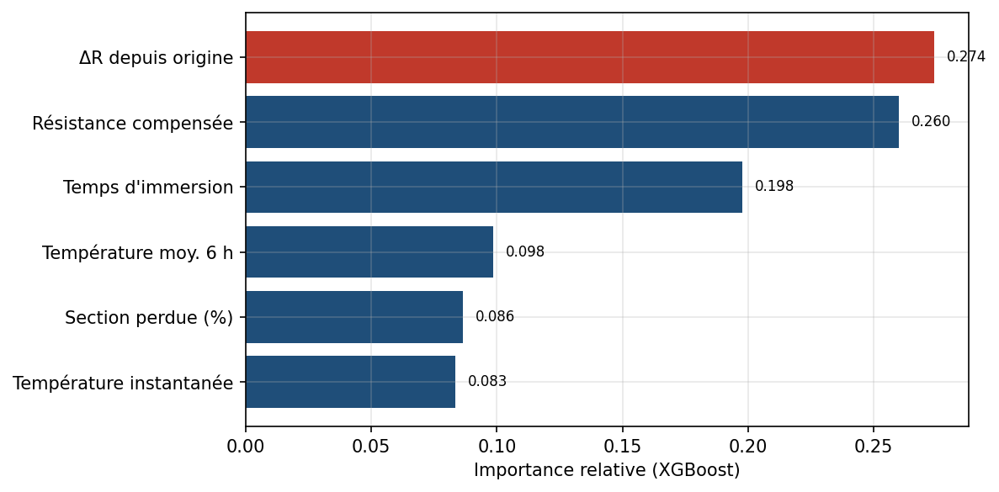{ width=80% }

### III.3.5. Estimateurs complémentaires de durée de vie (alternatives temporaires appliquées)

Tant que la couverture demeure partielle, le R² inter-essais du *taux de corrosion* reste modeste. Pour ne pas faire reposer la décision opérationnelle sur cette seule métrique, **trois estimateurs complémentaires de la durée de vie** (instant de rupture) ont été mis en œuvre et confrontés en supervision temps réel (tableau III.3). De natures différentes, ils se recoupent et permettent de **borner** la prédiction plutôt que de s'en remettre à une valeur unique.

**Tableau III.3 — Les trois estimateurs de durée de vie confrontés en supervision**

| Estimateur | Principe | Estime | Robustesse |
|---|---|---|---|
| **Extrapolation physique** | temps écoulé + RUL mesuré (d'après la vitesse de corrosion instantanée, §II.4) | durée de vie totale | sensible au bruit de la pente, surtout tôt dans l'essai |
| **XGBoost (dérivé)** | même extrapolation, mais avec le *CR* **prédit** par le modèle au lieu du *CR* mesuré | durée de vie totale | suit la qualité du LORO (§III.3.1) |
| **Jumeau / simulateur** | bande [P10–P90] du temps de rupture par mélange des essais donneurs réels | bande de durée de vie | seul estimateur *a priori* ; **interpole** sans extrapoler hors de l'enveloppe observée |

Seul le **jumeau** fournit une prédiction *avant* l'essai ; les deux extrapolations affinent l'estimation *en cours* d'essai à mesure que la pente se stabilise. Confronté aux deux essais graduels réalisés depuis (figure III.15, §III.6.5), le jumeau enregistre **un test réussi et un manqué** : annoncé dans sa bande, Run #21 a rompu à 13,1 h (à l'intérieur), tandis que Run #22 — l'essai le plus rapide de la campagne — a rompu à 11,95 h, **en deçà** de la bande. Cet écart est instructif : il révèle que la bande, qui interpole entre morphologies observées, ne s'**extrapole** pas au-delà de l'enveloppe des donneurs.

**Ce que l'on sait faire, et comment l'améliorer.** À ce stade, la chaîne sait : prédire le *CR* en continu et le situer par rapport aux régimes (OS2/OS3), estimer une durée de vie par trois voies redondantes, et déclencher un ordre de travail enrichi (OS4, §III.5). La consolidation passe par des **démarches** précises : (i) répéter les essais **au sein d'une même morphologie** (en priorité « sprint ») pour stabiliser le LORO du *CR* ; (ii) **élargir la bande synthétique** vers les essais rapides, afin de couvrir l'enveloppe basse révélée par Run #22 ; (iii) **contrôler simultanément** tous les facteurs (température, concentration) ; (iv) adjoindre une **validation gravimétrique** indépendante du *CR* (§III.6.4). Ces axes structurent la suite de la campagne (§III.6.5).

---

## III.4. Diagnostic des régimes et facteurs de variabilité (OS3)

### III.4.1. Diagnostic des régimes de corrosion

Le module de diagnostic (§II.5.5) classe chaque instant dans l'un des régimes physiques observés : induction, croissance, emballement, pré-rupture. Appliqué aux essais, il identifie correctement la succession de ces phases sur les courbes *R*_corr(t) (figure III.2) : une induction initiale, une croissance régulière sur la majeure partie du run, puis un emballement dans les dernières heures précédant la rupture. Cette classification par règles explicables est directement exploitée pour graduer les alertes (§II.6.4).

**Pourquoi l'emballement et la rupture sont simultanés.** L'emballement final n'est pas une accélération de la *réaction* chimique, mais une **divergence géométrique** de la grandeur mesurée. La résistance suivant la loi de Pouillet $R = \rho L / A$ avec une section $A = \pi r^{2}$, une perte d'épaisseur à vitesse à peu près constante ($dr/dt \approx \text{cste}$) entraîne :
$$\frac{dR}{dt} = -\frac{2\rho L}{\pi\, r^{3}}\frac{dr}{dt} \;\propto\; \frac{1}{r^{3}}$$
Plus le fil est mince, plus $R$ croît vite, car retirer la *même* épaisseur ôte une *fraction* de section de plus en plus grande. C'est pourquoi la **rupture mécanique coïncide avec le début de l'emballement** : « section qui tend vers zéro » signifie à la fois l'explosion de $R$ et la perte de tenue mécanique — deux manifestations du même événement, ce qui rejoint l'observation visuelle faite en cours d'essai. La figure III.8 l'illustre sur un essai propre (Run #1) : $R$ reste quasi plate tant que le fil est épais, puis diverge dans la dernière phase, où la section résiduelle tombe à ~1 %. Le fait que le signal **continue de croître alors que le fil est presque entièrement aminci, voire rompu**, s'explique par la **conduction résiduelle** discutée en §III.6.4 (pont électrolytique du HCl et dernier filament métallique), jusqu'à l'ouverture franche du circuit (saturation).

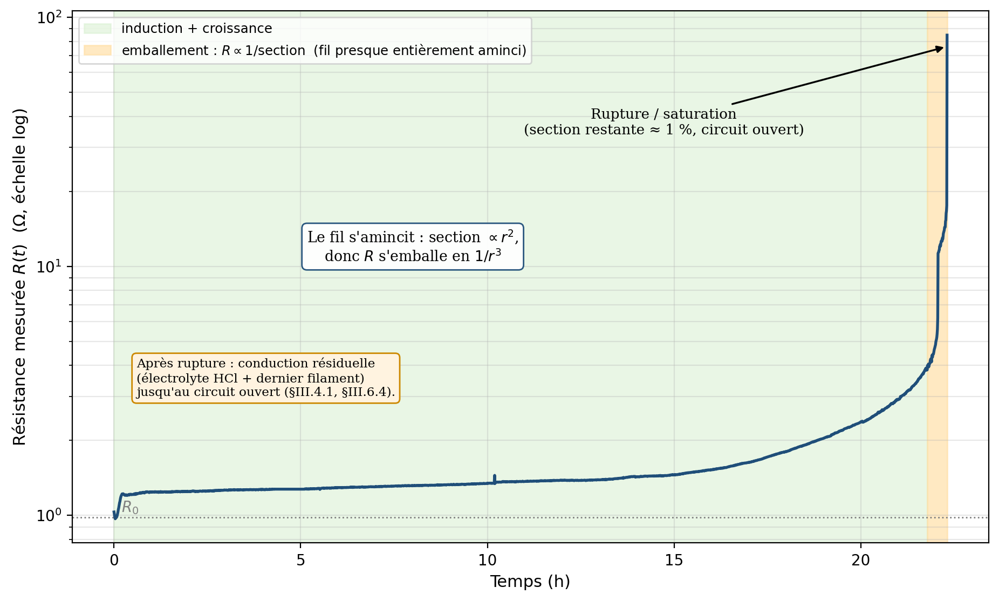{ width=82% }

### III.4.2. Facteurs de variabilité : deux contre-exemples instructifs

Au-delà de la température, deux essais se sont révélés **imprédictibles** par le modèle malgré une plage thermique a priori couverte. Leur analyse, loin d'être un échec, **isole expérimentalement deux facteurs de variabilité** qu'il faut contrôler. Cette démarche relève du **contrôle des variables** propre au plan d'expériences (Montgomery, 2017) : en ne laissant dériver qu'un seul facteur à la fois, chaque contre-exemple en isole l'effet — ce qui fonde la stratégie de « vitrine 30 °C » (conditions maîtrisées et répétées) opposée aux contre-exemples.

La figure III.9 confronte la courbe d'un essai propre (Run #16) à celles de ces deux contre-exemples.

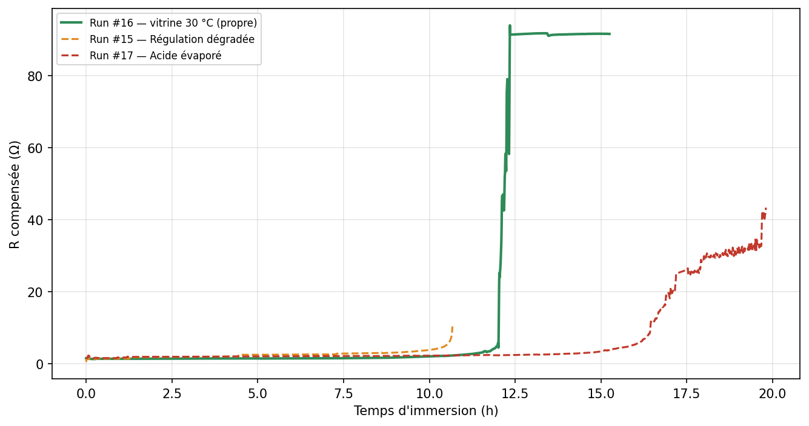{ width=85% }

**Tableau III.4 — Les deux facteurs de variabilité identifiés**

| Essai | Facteur dégradé | Température | Effet observé | R² en test |
|---|---|---|---|---|
| Run #15 | **Régulation thermique** (dérive 31 → 28 °C) | instable (σ = 0,96 °C) | cinétique incohérente | ≪ 0 |
| Run #17 | **Concentration d'acide** (HCl évaporé, acide exposé > 1 h à l'air avant immersion) | parfaite (σ = 0,55 °C) | corrosion ~2× plus lente | ≪ 0 |

Le cas de Run #17 est particulièrement parlant : sa **température était parfaitement régulée**, mais l'acide, laissé exposé à l'air avant immersion, avait perdu une partie de sa concentration par volatilisation du HCl — ralentissant la corrosion et rendant l'essai non comparable aux autres. La vérification que le filtrage des points froids ne « répare » pas Run #15 confirme qu'un essai dont une condition a dérivé est **irrécupérable par post-traitement**.

**Conclusion de l'OS3 :** la fiabilité de la prédiction exige la maîtrise simultanée de **tous** les facteurs expérimentaux — non seulement la couverture thermique (§III.3), mais aussi la **qualité de régulation** (Run #15) et la **constance de la concentration** (Run #17). À cela s'ajoute, même à conditions maîtrisées, une **variabilité intrinsèque de morphologie** : certains essais corrodent de façon graduelle (Run #1), d'autres après une phase d'induction suivie d'un emballement (Run #12, #16) — facteur supplémentaire que seule la répétition permettra de caractériser. Ce constat justifie le protocole acide corrigé (§II.6.3) et le plan d'essais répétés.

### III.4.3. Calibration des seuils d'alerte

Les seuils d'alerte (tableau II.9) sont fixés à partir des distributions de CR et de RUL observées sur les essais de référence. La calibration définitive sera affinée lorsque la couverture thermique sera complétée.

---

## III.5. Boucle décision → action : module GMAO maison — démonstration (OS4)

La boucle décision → action est structurée par un **module GMAO maison** intégré à l'application, dont l'architecture est transposable à un CMMS open-source (§II.7.1). Cette section présente l'état de la démonstration à ce stade.

### III.5.1. Écran de supervision temps réel

Une application web de supervision a été développée (Streamlit). Elle se connecte en temps réel à la base Supabase et affiche, par essai, la résistance compensée, la température, le taux de corrosion et l'état de l'acquisition, dans une interface de type salle de contrôle. Elle détecte automatiquement un run actif et s'actualise en continu.

La page **Synoptique** (figure III.10) donne une vue d'ensemble de la chaîne — sonde ER → ESP32 → Wi-Fi → Supabase → pipeline → XGBoost → supervision — assortie des indicateurs de campagne (nombre d'essais, mesures, heures d'acquisition) et du registre des essais. La page **Supervision Run** restitue, pour un essai sélectionné, le replay de la résistance compensée *R*(t) et de la température, avec les grandeurs clés — durée de vie, *R* initiale/finale, température moyenne (figure III.11) — ainsi que le taux de corrosion instantané *CR*(t) et l'état final de dégradation (section perdue, *CR*) sous forme de jauges (figure III.12).

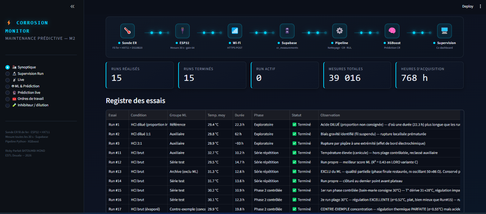{ width=92% }

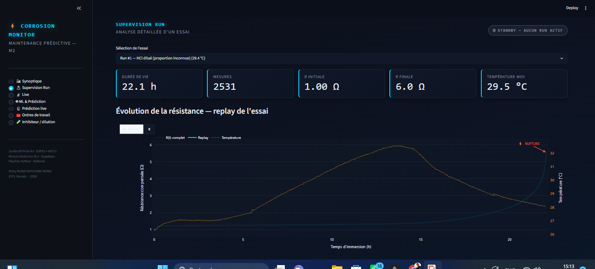{ width=92% }

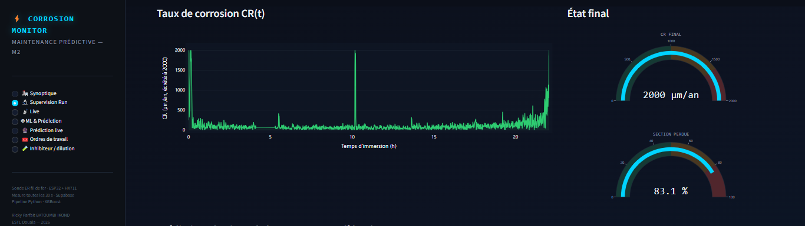{ width=92% }

### III.5.2. Module GMAO maison : génération d'ordres de travail et KPIs

Un **module de gestion des ordres de travail (GMAO maison)** a été développé : il persiste les OT dans une table dédiée (`cr_work_orders`, Supabase) et expose une page « Ordres de travail » dans l'application (création, assignation, clôture ; figure III.13). À chaque dépassement de seuil, une alerte génère automatiquement un **ordre de travail enrichi** (CR, RUL, régime diagnostiqué, section perdue), avec déduplication (un OT ouvert par run et par niveau). Le mapping prédiction → OT (§II.7.5) est défini de façon générique : les mêmes champs se reporteraient sur un **CMMS open-source exposant une API**, transposition restée au stade de **spécification (non déployée)**, l'accès API des solutions gratuites étant restreint. Les KPIs de maintenance (MTBF, MTTR, disponibilité, taux de fausses alertes) sont calculés à partir de l'historique des OT. Toute la chaîne reste à ce stade **interne à Streamlit/Supabase** : aucun appel n'est émis vers un CMMS externe.

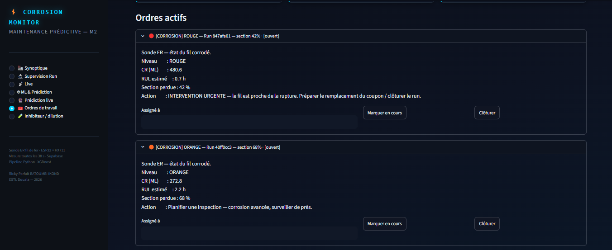{ width=92% }

> **État d'avancement.** L'écran de supervision et le module GMAO maison (génération/clôture d'OT, KPIs) sont **opérationnels** et démontrent la boucle Sonde → ML → OT de bout en bout. L'intégration à un CMMS open-source mature (GLPI) reste au stade de **spécification transposable**. Les KPIs n'auront de valeur statistique que sur un volume d'essais et d'interventions plus important — ils constituent à ce stade une démonstration de la chaîne de calcul.

---

## III.6. Discussions

### III.6.1. Le prototype low-cost face aux sondes commerciales (I3.0 → I4.0)

Les sondes ER commerciales (Cosasco, Emerson Roxar, Permasense) offrent une résolution et un durcissement industriels supérieurs, mais restent coûteuses et exploitées à un niveau Industrie 3.0 (seuils fixes, analyse silotée). Le prototype développé ici, à partir de composants accessibles localement, démontre qu'une **couche prédictive (I4.0) peut être ajoutée pour un coût marginal** : il ne s'agit pas de remplacer les sondes commerciales mais de brancher en aval une chaîne ML — saut essentiellement logiciel.

### III.6.2. Performance du modèle — confrontation à la littérature

La littérature rapporte d'excellentes performances pour les modèles ML de prédiction du taux de corrosion sur de **grands jeux de données homogènes** (Wei et al., 2024 ; Kuang et Long, 2024 ; Hu et al., 2024, avec des R² > 0,96). Nos résultats, plus modestes en valeur absolue, s'expliquent par un nombre d'essais réduit et, surtout, par le caractère **inter-essais** de notre validation (LORO), bien plus exigeante qu'une validation intra-jeu. Le résultat marquant n'est pas tant la valeur du R² que sa **structure** : positif là où les conditions sont couvertes et répétées, négatif sinon. Cette lecture, rarement explicitée dans la littérature, constitue l'apport méthodologique de ce travail.

### III.6.3. Apport d'une boucle GMAO légère et transposable

Structurer la boucle décision → action par un **module GMAO maison léger**, transposable à un CMMS open-source (GLPI) plutôt que par une suite propriétaire, offre un coût total de possession très faible (de l'ordre de quelques dizaines de dollars, contre 50–250 k USD pour SAP PM ou IBM Maximo), ouvrant la maintenance structurée aux PME industrielles africaines. Cette approche reste compatible avec un déploiement on-premise, exigé par les contraintes de sécurité industrielle (cas COTCO).

### III.6.4. Limites du travail

**Limites matérielles :** le fil de fer utilisé n'est pas le matériau des pipelines COTCO (acier API 5L). Les valeurs absolues de *CR* ne sont pas directement transposables — limitation assumée dans une preuve de concept visant à valider la chaîne et la méthode. Par ailleurs, en HCl concentré, l'**électrolyte conducteur shunte partiellement la mesure ER** (un courant parasite circule dans la solution en parallèle du fil), ce qui plafonne la résistance mesurable et peut masquer la rupture des fils épais ; ce phénomène physique impose l'emploi d'un **fil fin** (Ø ≈ 1,15 mm), qui rompt sous le plafond de mesure et rend l'événement de défaillance observable. Ce même couplage explique le **comportement post-rupture** : une fois le fil sectionné, le courant continue de transiter par l'**électrolyte** (et un éventuel dernier filament métallique), si bien que la résistance apparente **reste élevée et croissante** jusqu'à l'ouverture franche du circuit. La portion terminale du signal *R*(t) relève donc d'une **conduction électrolytique, non métallique** : elle ne traduit plus l'état du fil et est, à ce titre, **tronquée au seuil de saturation** (`rx > 100 Ω`) puis exclue de l'apprentissage (§II.4.4). Cette limitation, propre aux sondes ER en milieu très conducteur, est documentée dans la littérature de la mesure de corrosion (Roberge, 2008 ; Mansfeld, 2014).

**Limites du jeu de données :** le nombre d'essais exploités à ce stade reste réduit, ce qui rend les métriques **bruitées** (un même essai peut voir son R² varier sensiblement selon la composition du jeu d'entraînement). La campagne en cours vise précisément à augmenter ce volume.

**Limites de la couverture thermique :** une seule plage (~30 °C) est aujourd'hui couverte par plusieurs essais répétés ; la plage ~32 °C n'est représentée que par un essai unique (Run #11), ce qui interdit encore toute validation croisée à cette température.

**Limites de la validation :** l'absence de coupon gravimétrique parallèle prive ce travail d'une validation indépendante du *CR*. Cette double validation ER + gravimétrie est recommandée pour la suite.

### III.6.5. Perspectives

La campagne se poursuit selon trois axes : (i) **compléter la couverture thermique** par des essais répétés aux consignes 30 °C et 32 °C, afin de transformer la plage 32 °C de « non couverte » à « couverte » ; (ii) **consolider les métriques** sur un volume d'essais accru ; (iii) **finaliser l'automatisation** de la boucle alerte → ticket CMMS et le calcul des KPIs sur historique. La transposition aux conditions industrielles réelles (acier API 5L, conditions de procédé) constitue l'objet du stage en entreprise prévu à la suite de ce mémoire.

Un quatrième axe, exploratoire, vise à **densifier synthétiquement l'espace des conditions**. Plutôt que de multiplier des essais réels coûteux, un jumeau numérique mécaniste — calibré sur les essais réels et décrivant la cinétique de corrosion par une loi sigmoïde d'Avrami (induction puis emballement, Avrami, 1939) — permet de générer des trajectoires synthétiques et d'en déduire, pour un essai à venir, une **bande prédictive de durée de vie** (figure III.14). Cette démarche s'inspire des données *run-to-failure* synthétiques largement utilisées en maintenance prédictive (benchmark NASA C-MAPSS ; Saxena et al., 2008). Une première analyse en *leave-one-run-out* sur ces trajectoires établit qu'**une morphologie de corrosion n'est prédictible qu'à partir du moment où elle a été observée au moins deux fois**, ce qui quantifie le besoin de répétition. Deux essais réels, Run #21 puis Run #22, ont depuis fourni deux tests « prédire-puis-confirmer » à l'issue contrastée et instructive (figure III.15). Pour **Run #21**, la bande annoncée *avant* l'essai (13–20,5 h, médiane 16 h) a été **vérifiée** : rupture à **13,1 h**, à l'intérieur de la bande (borne inférieure). Pour **Run #22**, en revanche, la rupture est survenue à **11,95 h**, **en deçà** de la borne basse : l'essai le plus rapide de toute la campagne tombe **sous l'enveloppe des donneurs**, que le jumeau interpole sans l'extrapoler. Ce **manqué n'infirme pas la démarche** : il en délimite le domaine de validité — la bande devra être élargie vers les essais rapides — et illustre, sur un cas réel, la limite annoncée. Run #21 et Run #22 ajoutent par ailleurs deux représentants de la morphologie graduelle ; mais les trois graduels observés demeurent **hétérogènes** (Run #1 à 22 h contre Run #21 et #22 à ≈ 12–13 h), ce qui montre que le simple décompte de répétitions ne suffit pas : c'est la répétition au sein d'une morphologie **homogène** qui confère la prédictibilité. Il importe enfin de souligner que le jumeau numérique et le modèle XGBoost (§III.3) répondent à deux questions distinctes — le premier estime la **durée de vie** (l'instant de rupture), le second le **taux de corrosion instantané** — et convergent vers un même enseignement : une prédiction n'est fiable qu'au sein d'une morphologie déjà observée et **suffisamment répétée**. Ces travaux, encore préliminaires, seront validés et étendus dans la suite de la campagne.

{ width=80% }

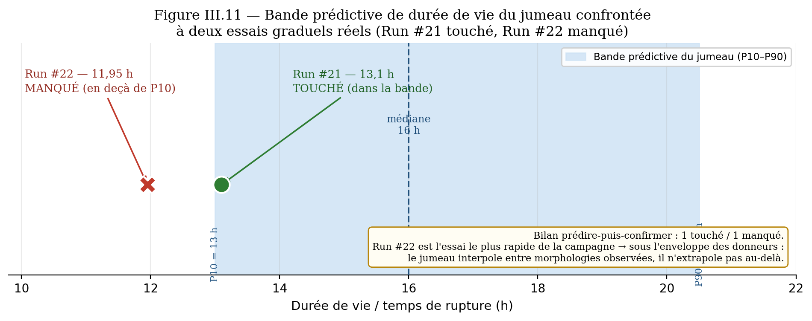{ width=82% }

---

## III.7. Conclusion du Chapitre III

Ce chapitre a présenté les résultats provisoires de la campagne. **OS1** : la chaîne d'acquisition ER est fonctionnelle et a permis de suivre sans interruption une série d'essais run-to-failure complets jusqu'à la rupture. **OS2** : le modèle XGBoost prédit le taux de corrosion et surpasse les méthodes de référence, mais sa performance dépend de la couverture des conditions. **OS3** : l'analyse a établi que la **température est la variable dominante** et que la **répétabilité des conditions** — couverture thermique, qualité de régulation, constance de la concentration — conditionne la fiabilité de la prédiction ; deux contre-exemples (Run #15, Run #17) l'ont démontré expérimentalement. **OS4** : l'écran de supervision et le module GMAO maison (génération automatique d'ordres de travail, KPIs) sont opérationnels et démontrent la boucle Sonde → ML → OT de bout en bout, l'intégration à un CMMS open-source mature (GLPI) restant une spécification transposable. Au regard de l'état d'avancement, les objectifs sont **partiellement atteints et en voie de consolidation** par les essais en cours. La conclusion générale dresse le bilan d'ensemble et les perspectives.

\newpage

<!-- ═══════════════════════════════════════════════════════════ -->

# CONCLUSION GÉNÉRALE

Ce mémoire s'est donné pour objectif de concevoir, développer et valider expérimentalement un **système intégré de maintenance prédictive de la corrosion**, matérialisant une transition **Industrie 3.0 → 4.0** sur l'ensemble de la chaîne *détection → diagnostic → pronostic → décision → action* (ISO 13381-1), et doublement transposable aux opérateurs déjà instrumentés (cas COTCO) comme aux PME industrielles africaines. Au terme du travail, le bilan des quatre objectifs spécifiques peut être dressé.

**OS1 — Détection.** La chaîne d'acquisition ER instrumentée (ESP32, HX711 24 bits, DS18B20) est fonctionnelle : elle suit en continu, au pas de 30 secondes, les variations de résistance d'un fil de fer en milieu acide concentré, et a permis de conduire sans interruption une série d'essais *run-to-failure* complets jusqu'à la rupture. Elle produit un format de données standardisé, exploitable indifféremment par le pipeline ML maison ou par l'export d'une sonde commerciale (QR1).

**OS2 — Pronostic.** Le modèle XGBoost prédit le taux de corrosion et surpasse les références (régression linéaire, prédiction par la moyenne). Sa validation inter-essais *leave-one-run-out* atteint un R² moyen positif (+0,29) sur la plage thermique couverte, mais ce résultat n'est pas automatique : il s'effondre (R² ≈ −1,77) lorsque les conditions de l'essai testé ne sont pas couvertes à l'entraînement. La durée de vie résiduelle est estimée par trois voies complémentaires (extrapolation physique, dérivé XGBoost, jumeau numérique). L'objectif de précision fixé a priori (RMSE < 15 %) n'est pas encore atteint de façon stabilisée, le faible effectif d'essais rendant les métriques bruitées (QR2).

**OS3 — Diagnostic et décision.** Le module de diagnostic identifie correctement la succession des régimes (induction, croissance, emballement, pré-rupture). L'analyse a établi que la **température est la variable dominante** et, surtout, que la **répétabilité des conditions** — couverture thermique, qualité de régulation, constance de la concentration — conditionne la fiabilité de la prédiction ; deux contre-exemples (régulation dégradée, acide évaporé) l'ont démontré expérimentalement, auxquels s'ajoute une variabilité intrinsèque de la morphologie de dégradation. Un système d'alertes graduées (vert / orange / rouge) a été calibré sur les sorties CR et RUL (QR3).

**OS4 — Action.** L'application web Streamlit et le **module GMAO maison** sont opérationnels : ils génèrent et tracent automatiquement les ordres de travail à partir des alertes prédictives, et calculent les KPIs de maintenance (MTBF, MTTR, disponibilité). Le mapping prédiction → ordre de travail est défini de façon générique, transposable par API REST à un CMMS open-source ; cette intégration reste, à ce stade, au statut de spécification (QR4).

**Contributions.** L'apport méthodologique central n'est pas la valeur absolue du R² mais la lecture de sa **structure** : la prédiction inter-essais est fiable là où les conditions sont couvertes et répétées, et échoue sinon — lecture rarement explicitée dans une littérature dominée par les validations intra-jeu. Le travail démontre par ailleurs qu'une **couche prédictive I4.0 peut être ajoutée pour un coût marginal**, en aval d'une instrumentation existante ou de façon autonome, et qu'une boucle décision → action structurée est accessible **sans licence propriétaire**.

**Limites.** Le matériau retenu (fil de fer) n'est pas l'acier API 5L des pipelines : les valeurs absolues de CR ne sont pas directement transposables. Le nombre d'essais reste réduit (métriques bruitées), une seule plage thermique est aujourd'hui couverte par plusieurs répétitions, et l'absence de coupon gravimétrique parallèle prive le travail d'une validation indépendante du CR.

**Recommandations et perspectives.** Pour **COTCO**, le pipeline ML est applicable directement aux flux des sondes ER déjà en place via export DCS, sans remplacement matériel, la chaîne d'acquisition autonome ESP32 constituant une option d'extension pour les sections non câblées. Pour les **PME industrielles africaines**, l'architecture module GMAO ↔ CMMS open-source ouvre une démocratisation effective de la maintenance assistée par ordinateur, sans licence propriétaire. Pour les **travaux futurs**, la campagne se poursuit selon quatre axes : compléter la couverture thermique par des essais répétés **au sein d'une même morphologie**, consolider les métriques sur un volume accru, adjoindre une validation gravimétrique, et finaliser l'automatisation de la boucle alerte → ticket CMMS. La transposition aux conditions industrielles réelles (acier API 5L, conditions de procédé) constitue l'objet du stage en entreprise prévu à la suite de ce mémoire.

En définitive, les objectifs sont **partiellement atteints et en voie de consolidation** : le système intégré est fonctionnel de bout en bout, et le travail établit les conditions méthodologiques — **couverture et répétabilité** — sous lesquelles la maintenance prédictive de la corrosion devient fiable et transposable au contexte industriel africain.

\newpage

<!-- ═══════════════════════════════════════════════════════════ -->

# RÉFÉRENCES BIBLIOGRAPHIQUES

> *Bibliographie en format APA. Le Pr MBOG recommande un minimum de 60 références scientifiques. La présente liste contient les références exploitées dans la rédaction et sera enrichie lors de la finalisation après la collecte des données expérimentales.*

1. Adafruit. (2024). *Adafruit HX711 24-bit ADC for Load Cells / Strain Gauges*. https://learn.adafruit.com/adafruit-hx711-24-bit-adc

2. Akash, S. (2024). *Decoding ISO 13381 Part 1: General Guidelines for Prognostics (RUL Estimation)*. LinkedIn Pulse. https://www.linkedin.com/pulse/decoding-iso-13381-part-1-general-guidelines-rul-akash-shrivastava

3. AMPP. (2023). *NACE SP0775-2023 — Preparation, Installation, Analysis, and Interpretation of Corrosion Coupons in Hydrocarbon Operations*. Association for Materials Protection and Performance.

4. Aniobi, C. C. (2018). Pipeline corrosion control in oil and gas industry: A case study of NNPC/PPMC system 2A pipeline. *Academia.edu*.

5. API. (2024). *API 570 — Piping Inspection Code: In-service Inspection, Rating, Repair, and Alteration of Piping Systems* (5th ed.). American Petroleum Institute.

6. API. (2023). *API RP 580 — Risk-Based Inspection* (4th ed.). American Petroleum Institute.

7. API. (2025). *API RP 581 — Risk-Based Inspection Methodology* (4th ed.). American Petroleum Institute.

8. ASTM International. (2012). *ASTM G31-12a — Standard Guide for Laboratory Immersion Corrosion Testing of Metals*.

9. ASTM International. (2017). *ASTM G1-03 — Standard Practice for Preparing, Cleaning, and Evaluating Corrosion Test Specimens*.

10. ASTM International. (2018). *ASTM G96-90 — Standard Guide for Online Monitoring of Corrosion in Plant Equipment (Electrical and Electrochemical Methods)*.

11. AVIA Semiconductor. (2017). *HX711 — 24-bit Analog-to-Digital Converter (ADC) for Weighing Scales*. Datasheet rev 2.0.

12. Bard, A. J., & Faulkner, L. R. (2001). *Electrochemical Methods: Fundamentals and Applications* (2nd ed.). Wiley.

13. Bergmeir, C., & Benítez, J. M. (2012). On the use of cross-validation for time series predictor evaluation. *Information Sciences*, 191, 192–213.

14. Cameroun, République du. (1996). *Loi-cadre n° 96/12 du 5 août 1996 relative à la gestion de l'environnement*.

15. Cameroun, République du. (2019). *Loi n° 2019/008 du 25 avril 2019 portant Code Pétrolier* (abrogeant la loi n° 99/013 du 22 décembre 1999).

16. Cameroun, République du. (2023). *Décret n° 2023/232 du 4 mai 2023 fixant les modalités d'application de la loi n° 2019/008 du 25 avril 2019 portant Code Pétrolier*.

17. CEN (Comité européen de normalisation). (2017). *EN 13306:2017 — Maintenance — Maintenance terminology*.

18. Chad-Cameroon Petroleum Development and Pipeline Project. (2024). *Wikipedia*. https://en.wikipedia.org/wiki/Chad%E2%80%93Cameroon_Petroleum_Development_and_Pipeline_Project

19. Chen, T., & Guestrin, C. (2016). XGBoost: A scalable tree boosting system. *Proceedings of the 22nd ACM SIGKDD International Conference on Knowledge Discovery and Data Mining*, 785–794. https://doi.org/10.1145/2939672.2939785

21. Coelho, L. B. (2022). Reviewing machine learning of corrosion prediction in a data-oriented perspective. *npj Materials Degradation*, 6, 8. https://doi.org/10.1038/s41529-022-00218-4

22. Cosasco. (2024). *Dual Sensor Electrical Resistance (ER) Temperature Probes*. https://www.cosasco.com/product/dual-sensor-electrical-resistance-er-temperature-probes

23. COTCO. (2024). *Cameroon Oil Transportation Company — COTCO in brief*. https://cotco-sa.cm/en/cotco-in-brief/

24. de Waard, C., & Milliams, D. E. (1975). Carbonic acid corrosion of steel. *Corrosion*, 31(5), 177–181.

25. de Waard, C., Lotz, U., & Milliams, D. E. (1991). Predictive model for CO₂ corrosion engineering in wet natural gas pipelines. *Corrosion*, 47(12), 976–985.

26. Egbule, P. E., et al. (2018). Pipeline corrosion control in oil and gas industry: A case study of NNPC/PPMC pipelines. *Academia.edu*.

27. Espressif Systems. (2024). *ESP32 Datasheet — Version 4.4*. https://www.espressif.com/en/products/socs/esp32

28. ExxonMobil. (2011). *Chad/Cameroon Development Project — Project Update No. 30 — Mid-Year Report 2011*.

29. Faraday, M. (1834). On electrical decomposition. *Philosophical Transactions of the Royal Society*, 124, 77–122.

30. Hassanzadeh, S., et al. (2024). Application of electrical resistance probes for corrosion monitoring and cathodic protection assessment of offshore structures. *Materials and Corrosion (Wiley)*. https://doi.org/10.1002/maco.70138

31. Ma, Y., Qi, W., Yu, M., Huang, N., Li, R., Tan, J., & Zhu, X. (2024). Synthesis of Gemini-type imidazoline quaternary ammonium salt using by-product fatty acid as corrosion inhibitor for Q235 steel. *Scientific Reports*, 14, 13687. https://www.nature.com/articles/s41598-024-64671-8

32. HSPublishing. (2023). *Oil and gas pipeline corrosion monitoring and prevention*. *Journal of Research in Engineering and Computer Sciences*, https://hspublishing.org/JRECS/article/download/114/105

33. Hu, J., et al. (2024). Prediction of the internal corrosion rate for oil and gas pipelines and influence factor analysis with interpretable ensemble learning. *International Journal of Pressure Vessels and Piping*, 212, 105329. https://www.sciencedirect.com/science/article/abs/pii/S0308016124002060

34. Hyndman, R. J., & Koehler, A. B. (2006). Another look at measures of forecast accuracy. *International Journal of Forecasting*, 22(4), 679–688.

35. Inspectioneering. (2016, March 8). NACE study estimates global cost of corrosion at $2.5 trillion annually. *Inspectioneering*. https://inspectioneering.com/news/2016-03-08/5202

36. ISO. (2024). *ISO 8044:2024 — Corrosion of metals and alloys — Vocabulary*.

37. ISO. (2025). *ISO 13381-1:2025 — Condition monitoring and diagnostics of machine systems — Prognostics — Part 1: General guidelines and requirements*.

38. ISO. (2020). *ISO 15156-1:2020 — Petroleum and natural gas industries — Materials for use in H₂S-containing environments in oil and gas production*.

39. Khadom, A. A., Yaro, A. S., Kadhum, A. A. H., AlTaie, A. S., & Musa, A. Y. (2009). The effect of temperature and acid concentration on corrosion of low carbon steel in hydrochloric acid media. *American Journal of Applied Sciences*, 6(8), 1403–1409.

40. Koch, G. H., Brongers, M. P. H., Thompson, N. G., Virmani, Y. P., & Payer, J. H. (2016). *International Measures of Prevention, Application, and Economics of Corrosion Technology (IMPACT) Study*. NACE International. http://impact.nace.org/

40. Zheng, Q., Zhang, H., Liu, H., Xu, H., Xu, B., & Zhu, Z. (2025). Intelligent prediction model for pitting corrosion risk in pipelines using developed ResNet and feature reconstruction with interpretability analysis. *Reliability Engineering & System Safety*, 264, 111347. https://www.sciencedirect.com/science/article/abs/pii/S0951832025005484

41. Liu, Y., et al. (2022). A review: Prediction method for the remaining useful life of the mechanical system. *Journal of Failure Analysis and Prevention*, 22, 2119–2137. https://doi.org/10.1007/s11668-022-01532-4

43. Lundberg, S. M., & Lee, S. I. (2017). A unified approach to interpreting model predictions. *Advances in Neural Information Processing Systems (NeurIPS)*, 30, 4768–4777.

45. Mansfeld, F. (2014). Recent developments in corrosion measurement techniques. *Materials and Corrosion*, 65(7), 631–638.

46. Lasi, H., Fettke, P., Kemper, H. G., Feld, T., et Hoffmann, M. (2014). Industry 4.0. *Business & Information Systems Engineering*, 6(4), 239-242. https://doi.org/10.1007/s12599-014-0334-4

47. Lu, Y. (2017). Industry 4.0: A survey on technologies, applications and open research issues. *Journal of Industrial Information Integration*, 6, 1-10. https://doi.org/10.1016/j.jii.2017.04.005

48. Xu, L. D., Xu, E. L., et Li, L. (2018). Industry 4.0: state of the art and future trends. *International Journal of Production Research*, 56(8), 2941-2962. https://doi.org/10.1080/00207543.2018.1444806

49. GLPI Project. (2024). *GLPI — Free IT and Asset Management Software — REST API documentation*. https://glpi-project.org/

50. Streamlit. (2024). *Streamlit Documentation — A faster way to build and share data apps*. https://docs.streamlit.io/

48. NACE International. (2016). *IMPACT Study Press Release — CORROSION 2016 conference*.

49. Onyebuchi, V., et al. (2018). Internal corrosion behaviour of Nigerian gas pipelines. *Unizik Journal of Engineering and Applied Sciences*.

50. Ossai, C. I., Boswell, B., & Davies, I. J. (2017). Use of artificial neural network for prediction of pipeline corrosion defect growth rate. *Engineering Failure Analysis*, 82, 1–12.

51. Persian Utab. (2023). *Phosphoric acid and iron oxide — passivation mechanism*. https://persianutab.com/en/phosphoric-acid-and-iron-oxide/

52. Pollock, D. D. (1991). *Physical Properties of Materials for Engineers* (2nd ed.). CRC Press.

53. Pumps Africa. (2024). *Advanced pipeline monitoring systems for safer oil & gas operations in Africa*. https://pumps-africa.com/advanced-pipeline-monitoring-systems-for-safer-oil-gas-operations-in-africa/

54. Roberge, P. R. (2008). *Corrosion Engineering: Principles and Practice*. McGraw-Hill.

55. Savitzky, A., & Golay, M. J. E. (1964). Smoothing and differentiation of data by simplified least squares procedures. *Analytical Chemistry*, 36(8), 1627–1639.

56. Schweitzer, P. A. (2010). *Fundamentals of Corrosion: Mechanisms, Causes, and Preventive Methods*. CRC Press.

57. Standards Norway. (2017). *NORSOK M-506 — CO₂ corrosion rate calculation model* (3rd ed.).

58. Tan, L., et al. (2025). Prediction of internal corrosion rate for gas pipeline: A new method based on transformer architecture. *Computers & Chemical Engineering*. https://www.sciencedirect.com/science/article/abs/pii/S0098135425000882

59. Tukey, J. W. (1977). *Exploratory Data Analysis*. Addison-Wesley.

60. Wagner, C., & Traud, W. (1938). On the interpretation of corrosion phenomena by superposition of electrochemical partial reactions. *Zeitschrift für Elektrochemie*, 44(7), 391–402.

61. Wang, Y., et al. (2023). Corrosion inhibition mechanism of water-soluble imidazoline on A572 Gr.65 steel in 3.5 wt % NaCl solution. *Langmuir*, 39(45), 16108–16119. https://doi.org/10.1021/acs.langmuir.3c02781

62. Webster, J. G. (Ed.). (2014). *The Measurement, Instrumentation, and Sensors Handbook* (2nd ed.). CRC Press.

63. Wei, X., et al. (2024). Advanced machine learning techniques for corrosion rate estimation and prediction in industrial cooling water pipelines. *Sensors*, 24(11), 3564. https://doi.org/10.3390/s24113564

65. Kuang, J., & Long, Z. (2024). Prediction model for corrosion rate of low-alloy steels under atmospheric conditions using machine learning algorithms. *International Journal of Minerals, Metallurgy and Materials*, 31(2), 337–350. https://doi.org/10.1007/s12613-023-2679-5

66. XGBoost. (2024). *XGBoost Documentation*. https://xgboost.readthedocs.io/

67. Bagheri, B., Yang, S., Kao, H.-A., & Lee, J. (2015). Cyber-physical systems architecture for self-aware machines in industry 4.0 environment. *IFAC-PapersOnLine*, 48(3), 1622–1627. https://www.sciencedirect.com/science/article/pii/S2405896315005571

68. CMMS Wikipedia. (2024). *Computerized Maintenance Management System*. https://en.wikipedia.org/wiki/Computerized_maintenance_management_system

69. ISO. (2016). *ISO 14224:2016 — Petroleum, petrochemical and natural gas industries — Collection and exchange of reliability and maintenance data for equipment*. International Organization for Standardization.

70. Lopes, I., Senra, P., Vilarinho, S., Sá, V., Teixeira, C., Lopes, J., Alves, A., Oliveira, J. A., & Figueiredo, M. (2016). Requirements specification of a computerized maintenance management system — A case study. *Procedia CIRP*, 52, 268–273.

73. Roda, I., & Macchi, M. (2018). A framework to embed asset management in production companies. *Proceedings of the Institution of Mechanical Engineers, Part O: Journal of Risk and Reliability*, 232(4), 368–378.

74. Supabase. (2024). *Supabase — The Open Source Firebase Alternative*. https://supabase.com/

76. Avrami, M. (1939). Kinetics of phase change. I. General theory. *Journal of Chemical Physics*, 7(12), 1103–1112. https://doi.org/10.1063/1.1750380

77. Saxena, A., Goebel, K., Simon, D., & Eklund, N. (2008). Damage propagation modeling for aircraft engine run-to-failure simulation. *International Conference on Prognostics and Health Management (PHM)*, 1–9. IEEE. https://doi.org/10.1109/PHM.2008.4711414

78. He, H., & Garcia, E. A. (2009). Learning from imbalanced data. *IEEE Transactions on Knowledge and Data Engineering*, 21(9), 1263–1284. https://doi.org/10.1109/TKDE.2008.239

79. Montgomery, D. C. (2017). *Design and Analysis of Experiments* (9th ed.). John Wiley & Sons.

\newpage

<!-- ═══════════════════════════════════════════════════════════ -->

# ANNEXES

## Annexe A — Code source du firmware ESP32 (extrait)

```cpp
// ─────────────────────────────────────────────────────────
// Corrosion Monitor — ESP32 + HX711 + DS18B20
// M2 Maintenance Industrielle — ESTL Douala
// Cycle : mesure → POST Supabase → temporisation 30 s (acquisition continue)
// ─────────────────────────────────────────────────────────

#include "HX711.h"
#include <OneWire.h>
#include <DallasTemperature.h>

#define HX711_DOUT_PIN   21
#define HX711_SCK_PIN    22
#define ONE_WIRE_BUS     19

#define MEASURE_INTERVAL_MS  30000UL   // 30 secondes
#define MESURES_PAR_CYCLE    10

static double last_Rx       = 0.0;
static bool   first_measure = true;
```

*Code complet disponible dans le dépôt GitHub : `firmware/corrosion_monitor.ino`.*

## Annexe B — Pipeline Python — extrait feature engineering

```python
def feature_engineering(df: pd.DataFrame) -> pd.DataFrame:
    df["delta_R_1h"]  = df["rx_corr"].diff(N_1H)   # variation sur ~1 h
    df["delta_R_6h"]  = df["rx_corr"].diff(N_6H)   # variation sur ~6 h
    dt_1h = df["timestamp_h"].diff(6).replace(0, np.nan)
    df["vitesse_CR_1h"] = (np.abs(df["rx_corr"].diff(6) / dt_1h)
                           * HEURES_PAR_AN * 1000.0)
    df["temp_moy_6h"] = df["temp_lisse"].rolling(36, min_periods=1).mean()
    df["temps_immersion_h"] = df["timestamp_h"] - df["timestamp_h"].iloc[0]
    R0 = df["rx_corr"].iloc[0]
    df["delta_R_absolu"] = df["rx_corr"] - R0
    return df
```

*Pipeline complet disponible dans le dépôt GitHub : `pipeline/corrosion_pipeline.py`.*

## Annexe C — Schéma de câblage de la sonde ER

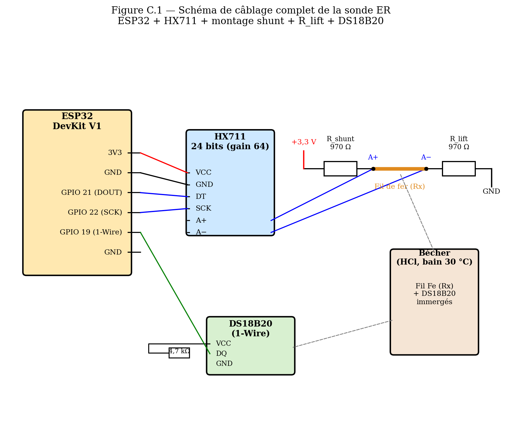{ width=95% }

## Annexe D — Fiche de sécurité du milieu corrosif (acide chlorhydrique)

L'**acide chlorhydrique concentré (HCl)** est classé comme produit corrosif (catégorie 1A pour les acides minéraux) et volatil. Lors des manipulations, les **équipements de protection individuelle (EPI)** suivants sont obligatoires :

- Lunettes de protection étanches aux projections liquides ;
- Gants résistants aux acides (nitrile, épaisseur ≥ 0,5 mm) ;
- Blouse de laboratoire en coton ;
- Hotte ou ventilation forcée à l'ouverture du récipient ;
- Solution de neutralisation (NaHCO₃) à proximité.

En cas de contact cutané : rincer abondamment à l'eau claire pendant au moins 15 minutes et consulter un médecin.

## Annexe E — Dispositif de contrôle de la température (phase contrôlée)

La phase contrôlée de la campagne régule la température du **milieu corrosif directement**, sans bain d'eau intermédiaire :

- **Chauffe-eau d'aquarium étanche** à thermostat intégré, puissance 25 W, plage de consigne 16–35 °C, **immergé directement dans la cellule de corrosion** (au même titre que le capteur DS18B20), son corps scellé assurant l'isolation électrique vis-à-vis du milieu ;
- **Régulation in situ** : le thermostat maintient le milieu à la consigne ; la température réelle est suivie en continu par le capteur DS18B20 du dispositif de mesure ;
- **Cellule couverte** : le récipient est couvert pendant l'essai pour limiter l'évaporation du HCl — accentuée par le chauffage — et stabiliser la concentration (cohérent avec le protocole acide, §II.6.3) ;
- **Limite** : à consigne élevée (≥ 32 °C), la puissance de 25 W impose de bien couvrir la cellule pour atteindre et tenir la consigne au-dessus de la température ambiante de Douala (≈ 28–29 °C) ; la compatibilité chimique du corps étanche avec le HCl reste un point de vigilance pratique.

## Annexe F — Schéma de base de données du prototype GMAO

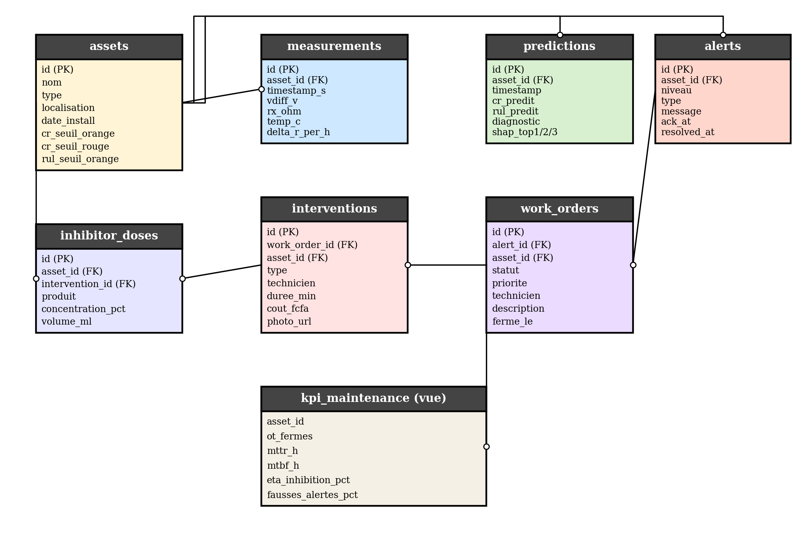{ width=95% }

**Définitions SQL des tables :**

```sql
-- Tables relationnelles du prototype GMAO (Supabase / PostgreSQL)

CREATE TABLE assets (
  id uuid PRIMARY KEY,
  nom text NOT NULL,
  type text,
  localisation text,
  date_installation timestamptz,
  cr_seuil_orange float DEFAULT 1.0,
  cr_seuil_rouge  float DEFAULT 5.0,
  rul_seuil_orange float DEFAULT 48.0,
  rul_seuil_rouge  float DEFAULT 12.0
);

CREATE TABLE measurements (
  id bigserial PRIMARY KEY,
  asset_id uuid REFERENCES assets(id),
  timestamp_s bigint, vdiff_v float, rx_ohm float,
  temp_c float, delta_r_per_h float,
  created_at timestamptz DEFAULT now()
);

CREATE TABLE predictions (
  id bigserial PRIMARY KEY,
  asset_id uuid REFERENCES assets(id),
  timestamp timestamptz,
  cr_predit float, rul_predit float,
  diagnostic text, confiance float,
  shap_top1 text, shap_top2 text, shap_top3 text
);

CREATE TABLE alerts (
  id uuid PRIMARY KEY,
  asset_id uuid REFERENCES assets(id),
  niveau text CHECK (niveau IN ('vert','orange','rouge')),
  type text, message text, recommandation text,
  created_at timestamptz DEFAULT now(),
  acknowledged_at timestamptz, resolved_at timestamptz
);

CREATE TABLE work_orders (
  id uuid PRIMARY KEY,
  alert_id uuid REFERENCES alerts(id),
  asset_id uuid REFERENCES assets(id),
  statut text CHECK (statut IN ('ouvert','en_cours','ferme')),
  priorite text, technicien_assigne text, description text,
  created_at timestamptz DEFAULT now(), ferme_le timestamptz
);

CREATE TABLE interventions (
  id uuid PRIMARY KEY,
  work_order_id uuid REFERENCES work_orders(id),
  asset_id uuid REFERENCES assets(id),
  type text, technicien text,
  duree_min int, cout_fcfa int,
  notes text, photo_url text,
  realise_le timestamptz
);

CREATE VIEW kpi_maintenance AS
SELECT
  asset_id,
  COUNT(DISTINCT wo.id) FILTER (WHERE wo.statut='ferme') AS ot_fermes,
  AVG(EXTRACT(EPOCH FROM (wo.ferme_le - wo.created_at))/3600) AS mttr_h
FROM work_orders wo GROUP BY asset_id;
```

## Annexe G — Liste des fichiers du projet

| Fichier | Rôle |
|---|---|
| `firmware/corrosion_monitor.ino` | Firmware ESP32 + intégration Supabase |
| `pipeline/corrosion_pipeline.py` | Pipeline Python ML + diagnostic |
| `gmao/supabase/migrations/*.sql` | Migrations BDD Supabase |
| `dashboard/supervision.py` | Dashboard Streamlit (supervision + GMAO maison) |
| `src/realtime/predict_loop.py` | Service de prédiction temps réel (CR/RUL, ordres de travail) |
| `memoire/memoire_v4.md` | Mémoire (ce document, source Markdown) |
| `memoire/memoire_v4.docx` | Mémoire (version Word ENSPD) |

Lien GitHub : `londola13/predictive-maintenance-corrosion`

\newpage

## Annexe H — Tableau de traçabilité des choix, seuils et données (matrice de provenance)

En réponse à l'exigence méthodologique de **traçabilité intégrale** — toute donnée, tout seuil, toute méthode et toute décision d'orientation doit découler d'une source identifiable —, le présent tableau récapitule la provenance de chaque élément structurant du mémoire. Quatre types de source sont distingués : **(N)** norme ou standard ; **(R)** référence scientifique ; **(P)** loi physique ; **(E)** provenance expérimentale documentée. Les éléments dépourvus d'ancrage normatif disponible sont explicitement marqués **« convention / objectif de laboratoire — provisoire »** : conformément au principe de rigueur retenu, aucun seuil n'est présenté comme normatif s'il ne l'est pas, et tout choix de valeur sans norme est assumé comme provisoire, à recaler en conditions réelles.

**H.1 — Données, grandeurs et lois physiques**

| Élément | Valeur / formule | Type | Source exacte |
|---|---|---|---|
| Calcul du CR (perte de masse) | CR = f(Δm, ρ, A, t) | N · P | ASTM G1-03 (ASTM, 2017) ; loi de Faraday (1834) |
| Principe de la sonde ER | R = ρL/(π r²) | P · N | loi d'Ohm ; ASTM G96 (ASTM, 2018) |
| Compensation thermique | ρ(T) = ρ₀[1 + α(T−T_ref)], α = 6,5·10⁻³ | P · R | loi de Matthiessen ; Pollock (1991) |
| Calibration HX711 (×33,7) | facteur empirique k_cal | E | étalonnage sur résistances étalons (§III.1.1) |
| Cadence d'acquisition (30 s) | — | E · P | adéquation corrosion lente ; firmware (§II.2.4) |
| Effet de la température | loi d'Arrhenius | P · R | §I.7.7 ; Schweitzer (2010), Roberge (2008) |

**H.2 — Méthodes d'apprentissage et de validation**

| Élément | Choix | Type | Source exacte |
|---|---|---|---|
| Suppression d'outliers (IQR) | [Q5 − 3·IQR ; Q95 + 3·IQR] | R | Tukey (1977) |
| Lissage et dérivation | Savitzky-Golay | R | Savitzky & Golay (1964) |
| Algorithme + hyperparamètres | XGBoost (n=500, depth=4, lr=0,05…) | R | Chen & Guestrin (2016) |
| Stratégie de validation | leave-one-run-out (LORO) | R | Bergmeir & Benítez (2012) |
| Métriques | MAE / RMSE / R² | R | Hyndman & Koehler (2006) |
| Interprétabilité | SHAP (top-3 variables) | R | Lundberg & Lee (2017) |
| Sous-échantillonnage auxiliaires (1 500 pts) | corrige le déséquilibre ≈ 4,5:1 | R · E | He & Garcia (2009) ; mesuré sur les runs |
| Contrôle des variables (vitrine 30 °C / contre-exemples) | un facteur à la fois | R · E | Montgomery (2017) ; Run #15, #17 |

**H.3 — Seuils et conventions (statut explicite)**

| Seuil / valeur | Valeur | Statut | Ancrage / provenance |
|---|---|---|---|
| `r_critique` (fin de vie, RUL) | 0,15·r₀ (≈ 98 % section) | convention labo — **provisoire** | principe ISO 13381-1 (ISO, 2025) ; valeur à recaler (critère mécanique) |
| Écrêtage du CR | 2 000 µm/an | convention de prétraitement | documentée §II.4.4 (exclut l'emballement non stationnaire) |
| Seuils des régimes ; pré-rupture | distributions des runs ; RUL < 12 h | principe normatif + objectif de conception | ISO 13381-1 (seuil de santé) ; **provisoire** |
| Seuils d'alerte CR (Tableau II.9) | 1 / 5 mm/an | cadre cible industriel — **non NACE** | réf. NACE/AMPP SP0775 : bandes 0,025 / 0,12 / 0,25 mm/an (AMPP, 2023) |
| Seuils opérationnels du prototype | section 60 / 85 % ; RUL 5 / 2 h | convention labo — **provisoire** | calibrés sur les runs de référence (§III.4.3) |
| Cible RMSE < 15 % ; KPIs (dispo > 95 %…) | — | **objectifs de conception** | valeurs usuelles, non normatives |

**H.4 — Décisions d'orientation**

| Décision | Justification | Type | Source exacte |
|---|---|---|---|
| Repositionnement Industrie 3.0 → 4.0 | verrou = intelligence applicative, non l'instrumentation | R | Lasi et al. (2014) ; Lu (2017) ; Xu et al. (2018) ; Bagheri et al. (2015) |
| Recours au ML | modèles physiques : 40–60 % d'erreur réelle | R | de Waard & Milliams (1975) ; Coelho (2022) ; NORSOK M-506 |
| ML « preuve de concept » (Option B) | limites = conditions du passage à l'échelle | R | Coelho (2022) ; Wei (2024), Kuang & Long (2024), Hu et al. (2024) |
| Protocole run-to-failure | cycle complet + événement de défaillance observé | N | ISO 13381-1 (ISO, 2025) |
| Module GMAO maison + transposition CMMS open-source | léger, indépendant de l'API tierce, on-premise | N · R | ISO 14224 (ISO, 2016) ; GLPI Project (2024) ; Bagheri et al. (2015) |
| Fil fin obligatoire | l'électrolyte shunte la mesure ER (fils épais masqués) | P · E | conduction de l'électrolyte ; Run #18 (§III.6.4) |
| Jumeau numérique (perspective III.6) | bande prédictive de durée de vie | R | Avrami (1939) ; Saxena et al. (2008) / NASA C-MAPSS |

\newpage

# TABLE DES MATIÈRES

*(générée automatiquement par Word à partir des styles Heading 1 / 2 / 3)*
